# Markt und Staat

#### Literatur

-   Dietmar Wellisch, Finanzwissenschaft I -- Rechtfertigung der
    Staatstätigkeit, Vahlen, München, 1999, Kapitel 2.

## (Ökonomische) Aufgaben des Staates

Einige Themen jüngster (Corona-)Schlagzeilen\
Konjukturpakete -- Kurzarbeitergeld -- Klimawandel -- Lufthansa-Rettung
-- Mehrwertsteuersenkung -- Mietpreisbremse \... → Staat greift mit
Politikmaßnahmen in das Wirtschaftsgeschehen ein Fundamentale Fragen für
Ökonomen

-   Wann **soll** der Staat überhaupt eingreifen?

-   Wie **soll** der Staat eingreifen?\
    **normative** Fragestellungen der klassischen Finanzwissenschaft,
    die einen wohlfahrtsmaximierenden, benevolenten Staat unterstellt,
    z.B. zur Korrektur von Marktfehler

-   Warum greift der Staat tatsächlich ein (**auch wenn er das nicht
    sollte**)?\
    **positive** Fragestellung der „Public Choice"-Schule; Politiker und
    andere Akteure in der politischen Arena verfolgen ihre eigenen
    Interessen, z.B. Politiker maximieren ihr Einkommen oder ihre
    Wählerstimmen

#### Musgravesche Dreiteilung der Staatsaufgaben

-   Richard Musgrave -- einer der Begründer der modernen
    Finanzwissenschaft -- unterscheidet drei Funktionen des öffentlichen
    Sektors:

-   Allokationsfunktion:\
    Staat sorgt für eine effizient Aufteilung der Ressourcen
    Arbeitnehmer auf Berufsfelder, CO$_2$- Emissionen, Klopapier) auf
    die Marktteilnehmer ($\rightarrow$ Firmen und Konsumenten)\
    z.B. Klimawandel

-   Distributionsfunktion: Staat sorgt fur eine gerechte Verteilung von
    Einkommen und Vermögen\
    z.B. Mietpreisbremse

-   Stabilisierungsfunktion: Staat sorgt (durch Politikmaßnahmen) für
    Vollbeschäftigung und Preisniveau.\
    z.B. Konjunkturpakete

\begin{figure}[H]
\begin{center}
\includegraphics{images/musgrave.jpg}
\end{center}
\end{figure}

### Richard A. Musgrave {#richard-a.-musgrave .unnumbered}

* \*   1910 in Königstein\
* †   2007 in Santa Cruz\

>Professor Richard A. Musgrave wurde 1910 in Königstein geboren und
>studierte von 1930 bis 1931 Volkswirtschaftslehre an der
>Ludwigs-Maximilians-Universität München, bevor er im Jahr 1931 nach
>Heidelberg ging, um dort sein Diplom abzuschließen. Ein Stipendium des
>deutschen Austauschdienstes verhalf Musgrave im Jahre 1933 zu einem
>Studienaufenthalt an der Universität Rochester, wo er mit dem Master
>abschloss. Musgrave setzte danach seine Studien in den USA fort und
>erhielt seinen Ph.D. in Harvard im Jahre 1937. Er blieb bis 1941 in
>Harvard und wechselte dann als Forscher an das Federal Reserve System.
>Zwischen 1947 und 1981 lehrte und forschte er an einer Reihe der
>berühmtesten amerikanischen Universitäten: Swarthmore, University of
>Michigan, Johns Hopkins, Princeton, Harvard und Berkeley. Er war während
>seiner Karriere Wirtschaftsberater mehrerer U.S. Regierungen, leitete
>Kommissionen zu Außensteuerfragen und war Herausgeber des renommierten
>Quarterly Journal of Economics. Richard Musgrave darf als Begründer der
>modernen Finanzwissenschaft gelten, wie sie heute in der ganzen Welt
>gelehrt wird. Wegweisend war in dieser Hinsicht vor allem sein im Jahr
>1939 veröffentlichter Aufsatz „Voluntary Exchange Theory of Public
>Economy", der später von Paul Samuelson als Grundlage für dessen
>normative Theorie der öffentlichen Güter verwendet wurde. Einen zweiten
>elementaren Meilenstein im Schaffen Musgraves bildet sein im Jahr 1959
>veröffentlichtes Buch „The Theory of Public Finance", das über mehrere
>Dekaden die Forschungsrichtung in der Finanzwissenschaft prägte. Aus der
>Laudatio zu Musgraves 90. Geburtstag, CESifo, München

-   Überlegen Sie, welche der obigen aktuellen Politikthemen in welchen
    Funktionsbereich fallen.

-   Wir werden uns in dieser Vorlesung im Wesentlichen mit der
    Allokationsfunktion des Staates befassen, und hier insbesondere mit
    der normativen Begründung der Staatstätigkeit: Wann versagen Märkte?
    Wie kann man Marktfehler korrigieren? Welche Vor- und Nachteile
    haben die möglichen Staatseingriffe?

-   Der positive Aspekt des Staatseingriffs (=Warum greift der Staat
    ein, auch wenn er das vielleicht gar nicht sollte?) wird in
    Vorlesungen zu Public Choice behandelt.

-   Die Distributionsfunktion liegt der Veranstaltung
    „Versicherungsökonomie und Sozialstaat" mit dem Buch
    „Versicherungsökonomie" von P. Zweifel/R. Eisen zugrunde.

-   Über die Stabilisierungsfunktion erfahren Sie mehr in
    makroökonomischen Veranstaltungen.

### Vorgehensweise

-   Will man Eingriffe des Staates aus allokativer Sicht rechtfertigen,
    muß man zunächst Marktversagen konstatieren.

-   Daher müssen wir zunächst überlegen, was ein Markt leisten soll (→
    Norm? s. Abschnitt 1.2).

-   Diesen normativen Zustand vergleichen wir dann mit dem Ist-Ergebnis
    der Marktlösung.

-   Kommt es zu einer Abweichung der Istvon der Soll-Lösung, liegt
    Marktversagen vor und der Staat kann (unter Umständen) korrigierend
    eingreifen.

## Die Norm der Allokationseffizienz

-   Woran messen wir, ob ein Markt funktioniert? Wir brauchen eine Norm
    (Soll-Zustand), mit der wir die Ist-Zustände vergleichen können.

## Normative Kriterien {#normative-kriterien .unnumbered}

### Pareto-Kriterium {#pareto-kriterium .unnumbered}

Nach dem Pareto-Kriterium ist eine Situation A besser als B, wenn bei A
kein Individuum schlechter und mindestens ein Individuum besser gestellt
ist als bei B.

\begin{figure}[H]
	\centering
\begin{tabular}{l|ll|llllll}
  & \multicolumn{2}{l}{Pareto-Verbesserung} & \multicolumn{3}{l}{keine Pareto-Verbesserung}\\
	& $P_1$ & $P_2$ & & $P_1$ & $P_2$ \\
	\midrule  
	A & 3 & 5         & A & 3 & 4  \\
	B & 2 & 5         & B & 2 & 5  \\
\end{tabular}
\end{figure}

-   Pareto-Optimum liegt vor, wenn keine weiteren Pareto-Verbesserungen
    mehr möglich sind.

-   Beispiel

    -   Im Hörsaal wird nach dem Zufallsprinzip Geld verteilt. Egal wie
        diese Verteilung aussieht, die dadurch geschaffene Ausstattung
        ist vermutlich paretooptimal. Warum?\
        → man kann niemanden besser stellen oder jemand anderes
        schlechter zu stellen

    -   Werden hingegen Gutscheine für Pizza und Kinobesuche verteilt,
        so wird die Anfangsaufteilung aller Wahrscheinlichkeit nach
        nicht paretooptimal sein. Warum?\
        → persönliche Präferenzen

-   Vorteile des Pareto-Kriteriums:

    -   respektiert individuelle Präferenzen

    -   breite Akzeptanz

-   Probleme: → bei vielen Zuständen der Welt wird ein Individuum besser
    gestellt, dadurch, dass ein anderes schlechter gestellt wird. →
    einfrieren des Status Quo

-   Beispiele:

    -   Umweltpolitik: Kosten von Luftfiltern in Schornsteinen vs.
        Vorteil der Anwohner

    -   Straßenbau: Vorteil des Straßenausbaus für Autofahrer vs.
        Lärmbelästigung der Anwohner

    -   EU-Osterweiterung: Sinkende Löhne der Arbeitnehmer vs. steigende
        Kapitaleinkommen

### Kaldor-Hicks-Kriterium {#kaldor-hicks-kriterium .unnumbered}

Nach dem Kaldor-Hicks-Kriterium ist eine Politikmaßnahme sinnvoll, wenn
sie für mindestens ein Individuum eine Verbesserung bringt und die
Verlierer durch die Zugewinne der Gewinner kompensiert werden
**könnten**. Dabei muß die Kompensation nur theoretisch möglich sein,
aber nicht tatsächlich erfolgen. Wenn sie tatsächlich stattfinden würde,
wäre die Maßnahme sogar eine Verbesserung im Sinne von Pareto.

-   Klare Trennung von Effizienzund Verteilungsüberlegungen Nach dem
    Kaldor-Hicks-Kriterium ist jede Maßnahme allokationseffizient, die
    den Kuchen vergrößert, auch wenn einzelne Stücke am Kuchen kleiner
    werden.

-   Vorteile des Kaldor-Hicks-Kriteriums:

    -   respektiert individuelle Präferenzen

    -   erlaubt klare Trennung von Effizienzund Verteilungsaspekten

    -   ist ein klares Kriterium für Politikmaßnahmen

## Optimum in einem Partialmarkt

Wir wollen nun das Konzept des Pareto-Kriteriums auf einen Partialmarkt
mit einer Nachfragekurve (hier: Grenzzahlungsbereitschaft GZB) und
einer Angebotsfunktion (hier: Grenzkosten der Produktion GK) übertragen.

#### Vorgehen ist also:

1.  Was wäre optimale Lösung (SOLL-Zustand)?

2.  Welche Lösung ergibt sich tatsächlich am Markt (IST-Zustand)?

3.  Vergleich von SOLL mit IST → wenn Abweichung, dann Marktversagen und
    Staatseingriff

### Ad 1.) Normative Lösung (SOLL-Zustand) {#ad-1.-normative-lösung-soll-zustand .unnumbered}

Welche Allokation würde ein allwissender sozialer Planer („benevolenter
Diktator") wählen?

{width="6cm"}

-   Optimale Menge ist $x^{opt}$, die maximal erzielbare Rente lautet:
    $\Delta 0AB$.

-   Regel für die optimale Bereitstellung lautet: $GZB \geq GK$

#### Übungsfrage: Warum misst die Rentensumme die Wohlfahrt nach dem Kaldor-Hicks-Kriterium?

r0.5
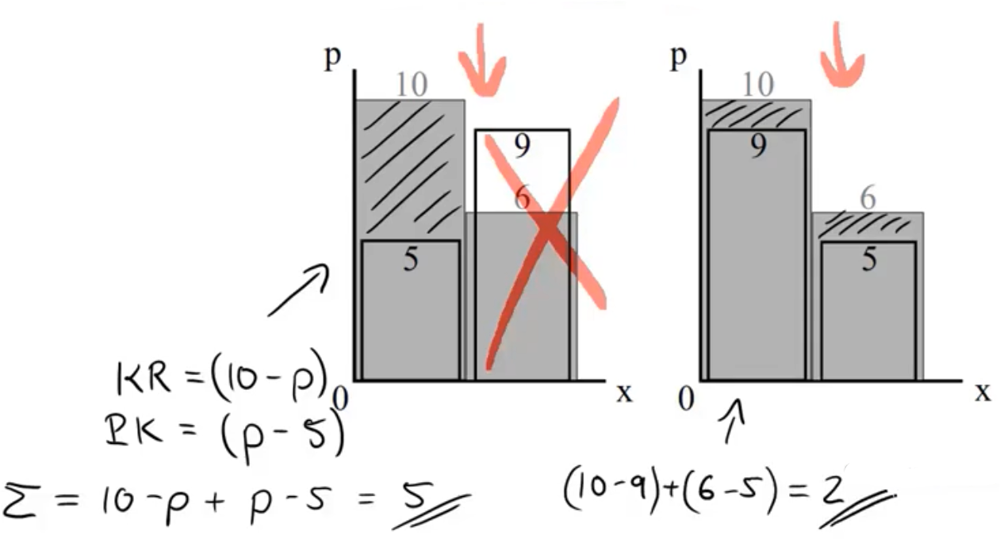{width="\\linewidth"}

Betrachten Sie untenstehende Angebotsund Nachfragesituation. Es gibt
zwei Nachfrager mit Zahlungsbereitschaften 10 und 6. Die Anbieter können
die beiden Einheiten zu Kosten von 5 und 9 erstellen. Nach unserer
bisherigen Argumentation wird bei der optimalen Allokation eine Einheit
produziert und zwar von dem Hersteller mit Kosten von 5 und dieses
Gut wird von dem Haushalt mit der Zahlungsbereitschaft in Höhe von 10
konsumiert (siehe linkes Diagramm). Wäre nicht folgende Allokation
besser? Es werden zwei Einheiten produziert; der Haushalt mit
Zahlungsbereitschaft 10 erhält die zu Kosten von 9 produzierte Einheit
und der Haushalt mit Zahlungsbereitschaft 6 die zu Kosten von 5
produzierte Einheit (siehe rechtes Diagramm). Nun konnten immerhin zwei
Haushalte das Gut konsumieren und bei jeder der beiden Einheiten liegt
die Zahlungsbereitschaft über den Kosten der Erstellung.

-   Mehr zu den Optimalitätsbedingungen in Kapitel 2

### Ad 2.) Marktergebnis (IST-Zustand) {#ad-2.-marktergebnis-ist-zustand .unnumbered}

-   Spoiler: Freier Tausch und freie Preisbildung führen in einem
    perfekten Markt dazu, dass die Wohlfahrt maximiert wird. Das Streben
    des einzelnen Marktteilnehmers, seinen eigenen Vorteil zu
    maximieren, führt auch zu dem kollektiv besten Ergebnis.

-   Der Grund für diese Effizienzeigenschaft der Märkte liegt darin,
    dass alle Aktivitäten und Transaktionen den Kompensationstest
    bestehen, denn:

    -   Wer ein Gut herstellt, wird dies nur tun, wenn ... die
        Produktionskosten der nächsten Einheit kleiner sind als der
        erzielbare Preis.

    -   Wer ein Gut konsumieren will, wird dies nur tun, wenn ... die
        Zahlungsbereitschaft der nächsten Einheit größer ist als der
        Preis.

## Marktergebnis in einem Partialmarkt {#marktergebnis-in-einem-partialmarkt .unnumbered}

#### Positive Lösung: 

Welche Allokation bringt ein Markt mit vollkommenem Wettbewerb (bei
dezentralen Entscheidungen aller Marktteilnehmer) hervor?

{width="6cm"}

-   Bei perfektem Wettbewerb pendelt sich der Preis auf $p^{wett}$ ein.

-   Die Konsumenten wollen die Nachfrage ausdehnen, solange ...
    $GZB \geq p^{wett}$

-   Konsumentenrente ergibt sich somit als $\Delta ABC$

-   Die Produzenten wollen das Angebot ausdehnen, solange ...
    $p^{wett} \geq GK$

-   Produzentenrente ist folglich $CB0$

-   Die Regel für die tatsächliche Bereitstellung im Markt lautet:
    $p^{wett} = GZB = GK$

### Ad 3.) Vergleich von normativer und positiver Lösung {#ad-3.-vergleich-von-normativer-und-positiver-lösung .unnumbered}

$x^{opt} = x^{wett}$\
Die Wettbewerbslösung generiert die wohlfahrtsmaximierende Allokation,
obwohl jeder einzelne Marktteilnehmer nur seine eigenen egoistischen
Ziele (Gewinnbzw. Nutzenmaximierung) verfolgt.

## Mögliche Rechtfertigungen für Staatseingriffe

Wann funktioniert der Markt nicht als perfekter Allokationsmechanismus?

### a) Auseinanderfallen von individueller und kollektiver Rationalität {#a-auseinanderfallen-von-individueller-und-kollektiver-rationalität .unnumbered}

-   Im Prinzip liegt allen Marktfehlern zugrunde, daß die Maximierung
    des individuellen Vorteils nicht mehr mit der Maximierung des
    kollektiven Vorteils übereinstimmt, d.h. individuelle und kollektive
    Rationalität fallen auseinander.

-   Informelles Beispiel: Klimawandel\
    Kollektiv... Wir müssen den CO$_2$-Ausstoß drastisch reduzieren,
    damit...\
    ... vs. individuell Och guck mal, Flüge nach London für 20 Euro

-   Ein klassisches Beispiel für einen solchen Fall stellt das
    Gefangenendilemma dar: Zwei Partner bei einer Straftat werden
    verhaftet und in separaten Räumen verhört. Jeder Gefangene hat die
    Möglichkeit, die Straftat zu gestehen und dabei den Partner mit zu
    belasten oder alles zu leugnen.\

    {width="0.8\\linewidth"}

-   Die Auszahlungsmatrix zeigt das Strafmaß der beiden Gefangenen in
    Abhängigkeit ihrer Handlungen (gestehen / leugnen)

    -   Falls beide leugnen, erhalten sie wegen eines kleinen Vergehens
        nur eine Gefängnisstrafe von einem Jahr (Auszahlung --1)

    -   Falls einer gesteht, wird der andere zu einer Gefängnisstrafe
        von 6 Jahren (Auszahlung --6) verurteilt, der Geständige kommt
        aufgrund der Kronzeugenregelung frei (Auszahlung 0).

    -   Falls beide gestehen, werden sie, da sie geständig waren, zu
        einer Gefängnisstrafe von jeweils 4 Jahren verurteilt
        (Auszahlung --4).

-   Überlegen Sie wie das Gleichgewicht in diesem Spiel aussehen muss.

-   Warum fallen hier individuelle und kollektive Rationalität
    auseinander?

### b) unklare bzw. nicht-durchsetzbare Eigentumsverhältnisse {#b-unklare-bzw.-nicht-durchsetzbare-eigentumsverhältnisse .unnumbered}

-   Thomas Hobbes (1651):

    -   Ohne Staat herrscht Krieg jeder gegen jeden.

    -   Daher könne es für jedes Individuum akzeptabel sein, sich einem
        Souverän („Leviathan") zu unterwerfen, wenn dies die anderen
        Individuen auch tun (Staatsvertrag).

-   Beispiel

    -   Zwei Bauern, von denen jeder selbst produziert, aber auch dem
        Nachbarn einen Teil der Ernte stehlen kann, wenn der Staat die
        Eigentumsrechte nicht schützt.

    -   Stehlen kein Nullsummenspiel, sondern Verbrauch von Ressourcen
        (Bewachung der Ressourcen, Investition in Schlösser und
        Gewehre...).

    -   Wenn keiner stiehlt, ist der gesamte konsumierbare Output am
        höchsten (19 = 10 + 9)

    -   Unabhängig davon, ob der andere stiehlt, ist es jedoch sowohl
        für 1 wie auch für 2 strikt besser selbst zu stehlen.

    -   Gleichgewicht ist („stiehlt", „stiehlt") bzw. (8,8).
        Konsumierbarer Output: 16.

    -   Es lohnt sich in eine Instanz, die den Zustand („stiehlt nicht",
        „stiehlt nicht") durchsetzt, maximal 3 Einheiten zu
        investieren.\
        Zahlungsbereitschaft von Bauer 1: 10 -- 8 = 2.\
        Zahlungsbereitschaft von Bauer 2: 9 -- 8 = 1.

### c) Öffentliche Güter {#c-öffentliche-güter .unnumbered}

-   Eine einfache Anwendung des Gefangenendilemmas stellt der Bereich
    der öffentlichen Güter dar.

-   Reine öffentliche Güter sind durch Nicht-Rivalität im Konsum und
    Nicht-Ausschließbarkeit gekennzeichnet.

-   Güter-Klassifikations-Matrix\

      -- ------ ------------------- --------------------------- -- --
                Ausschließbarkeit                                  
                Ja                  Nein                           
         Ja     Private Güter       Unreine öffentliche Güter      
         Nein   Mautgüter           Reine öffentliche Güter        
      -- ------ ------------------- --------------------------- -- --

-   Was versteht man unter Ausschließbarkeit und Rivalität? (→
    Kapitel 4)

-   Betrachten wir das öffentliche Gut „saubere Luft", das von allen
    Autobesitzern dadurch hergestellt werden kann, dass alle (teure)
    Rußpartikelfilter einbauen lassen. Beschreiben Sie für dieses
    Beispiel die Struktur des Gefangenendilemmas! Wie viel von dem
    öffentlichen Gut würde ohne staatlichen Eingriff bereitgestellt.

-   Aufgabe: Die Getränkeindustrie versuchte, dem drohenden Zwangspfand
    auf Getränke in Einwegbehältern durch eine freiwillige
    Selbstverpflichtung auf ein Mindestmaß an Mehrwegverpackungen zu
    entgehen. Was ist hier das öffentliche Gut? Wo tritt das Problem des
    Gefangenendilemmas auf?

### d) Externe Effekte {#d-externe-effekte .unnumbered}

-   Ein externer Effekt liegt vor, wenn sich die Konsumoder
    Produktionsentscheidung eines Wirtschaftssubjektes auf den Nutzen
    anderer Wirtschaftssubjekte auswirkt.

-   Ein allokatives Problem entsteht hier, wenn „ein solcher externer
    Effekt nicht internalisiert" wird, d.h. nicht in den
    Preisfindungsprozess des Marktes einbezogen wird.

-   Beispiel Umweltverschmutzung

-   Beispiel Überfischung der Meere (Crowding Externality, Allmendegut)

-   Beispiel Arbeitsmarkt: Wenn Sie sich eine Pizza von „Call a Pizza"
    kommen lassen, verursachen Sie dem Lieferanten einen Schaden, denn
    der Lieferant muss nun die Pizza ausfahren, statt eine Runde PS4
    spielen zu können. Liegt hier ein allokativ schädlicher externer
    Effekt vor?

-   Diese Veranstaltung handelt nun also davon, Staatseingriffe aufgrund
    o.g. Marktversagens zu rechtfertigen. Ehe wir uns jedoch den
    konkreten Marktfehlern und ihrer möglichen Korrektur durch
    Staatseingriffe widmen (ab Kapitel 3), wiederholen wir zunächst noch
    einmal die Optimalitätseigenschaften perfekter Märkte (Kapitel 2).

# Die Optimalität der Konkurrenzwirtschaft

#### Literatur

-   Jean Hindricks und Gareth D. Myles. Intermediate Public Economics,
    MIT Press, Cambridge, MA, 2006, Kapitel 2.

-   Dietmar Wellisch, Finanzwissenschaft I -- Rechtfertigung der
    Staatstätigkeit, Vahlen, München, 1999, Kapitel 2.

### Optimale Allokation {#optimale-allokation .unnumbered}

-   In diesem Kapitel sollen einige der wesentlichen Bedingungen für
    eine effiziente Allokation hergeleitet werden. Dabei handelt es sich
    um bekannte mikroökonomische Grundlagen, erweitert um die Frage der
    Tauscheffizienz.

-   Die Fragestellung:

    -   Wie sollten Güter auf die Haushalte verteilt werden? (Kapitel
        2.1)

    -   Wie sollten die Produktionsfaktoren in der Produktion verteilt
        werden? (Kapitel 2.2)

    -   Welche Güter sollten produziert werden? (Kapitel 2.3)

-   Die Vorgehensweise

    -   Wir werden zunächst stets die optimale Allokation herleiten, die
        ein benevolenter Planer vornehmen würde.

    -   Im Anschluss zeigen wir dann, dass ein perfekter Markt dezentral
        genau diese optimale Lösung realisiert.

-   Einige weitere Aspekte der optimalen Allokation, so z.B. die
    optimale intertemporale Allokation (d.h. wie viel Konsum heute, wie
    viel morgen?), die Allokation von Risiken etc., werden hier nicht
    behandelt, finden sich aber in Wellisch, Kapitel 2.

## Die optimale Güterverteilung

Effiziente Allokation: Verteile die exogen gegebenen Gütermengen $X$ und
$Y$ so auf die beiden Haushalte $A$ und $B$, dass es nicht möglich ist,
durch Umverteilung der Güter entweder $A$ oder $B$ besser zu stellen,
ohne gleichzeitig den jeweils anderen schlechter zu stellen. →
Haushaltsmengen jeweils $(x^A,y^A) \text{bzw.} (x^B,y^B)$, aus denen die
Haushalten einen Nutzen $U^i(x^i,y^i)$ ziehen $[u' > 0, u'' < 0]$

### Lösung des Zentralplaners (SOLL) {#lösung-des-zentralplaners-soll .unnumbered}

-   Maximiere den Nutzen des A bei gegebenem Nutzen des
    $\mathrm{B}\left[U^{B}\left(x_{B} ; y_{B}\right) \geq \bar{U}^{B}\right]$
    und halte die Ressourcenbeschränkung
    $\left[x^{A}+x^{B} \leq X \text { und } y^{A}+y^{B} \leq Y\right] \left[x^{A}+x^{B} \leq X\right. \vee \left.y^{A}+y^{B} \leq Y\right]$

-   Da im Optimum keine Güter übrig bleiben (warum?), können wir die
    Ressourcenbeschränkungen mit Gleichheitszeichen verwenden. Der
    Lagrange-Ansatz lautet dann:
    $$\max _{x^{A}, y^{A}} L=U^{A}\left(x^{A} ; y^{A}\right)+\lambda \cdot\left[U^{B}\left(X-x^{A} ; Y-y^{A}\right)-\bar{U}^{B}\right]$$

-   Ableiten nach
    $x^{A}, y^{A} \text { und } \lambda x^{A}, y^{A} \text{ und  } \lambda$
    liefert: $$\begin{aligned}
            \text {(I)} \quad \frac{\partial L}{\partial x_{A}} & =U_{x^{A}}^{A}+\lambda \cdot U_{x^{A}}^{B}(-1)_{1} \doteq 0  \\
            \text{(II)} \quad \frac{\partial L}{\partial y^{A}}&=U_{y^{\mu}}^{A}+\lambda \cdot U_{y_{A}}^{B}(-1) \stackrel{!}{=} 0 \\
            \text {(III)} \quad  \frac{\partial L}{\partial \lambda} & \stackrel{!}{=} 0=U^{B} -\bar{U}^{B} \\
        \end{aligned}$$

    $$GRS^A = \frac{U_{x}^{A}}{U_{y}^{A}}=\frac{U_{x}^{B}}{U_{y}^{B}} = GRS^B \text{ mit gegebem B-Nutzen } U^{B}\left(X-x^{A} ; Y-y^{A}\right)=\bar{U}^{B}$$

    GRS: auf wie viele Einheiten x würde der Haushalt verzichten, um
    eine weiter Einheit y zu bekommen.

    $U_{j}^{i}$ bezeichnet die Ableitung des Nutzens von Person i nach
    der Menge des Gutes
    $j:  U_{j}^{i} \equiv \frac{\partial U^{i}}{\partial j}$\
    EXKURS: GRS ist die negative Steigung der Indifferenzkurve (IDK),
    da\
    $\displaystyle \Delta U = 0 = \frac{\partial U^{A}}{\partial x^{A}} \cdot d x^{A}+\frac{\partial U^{A}}{\partial y^{A}} \cdot d y^{A} \Rightarrow \quad \frac{d y^{A}}{d x^{A}}=-\frac{U_{x^{A}}^{A}}{U_{y^{A}}^{A}}=-G R S^{A}$

-   Bedingung (2.1) besagt: → Im Optimum gleichen sich die Steigung der
    $IDK^A$ und $IDK^B$ zwischen den Haushalten an

-   Die übliche Darstellung in der Edgeworth-Box:\

    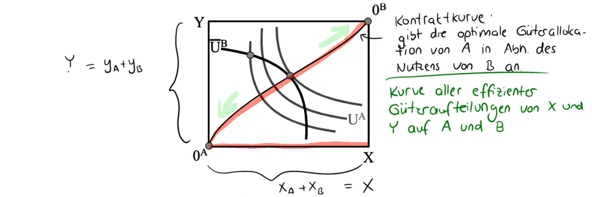{width="\\linewidth"}

-   Inhaltlich: welches Güterbündel $\left(x^{A} ; y^{A}\right)$ liefert
    die höchstmögliche IDK von $A$, die $\bar{U}^{B}$ gerade noch
    berührt?

### Dezentrale Lösung des Marktes (IST) {#dezentrale-lösung-des-marktes-ist .unnumbered}

(unreguliertes Aufeinandertreffen der Konsumenten)

-   Sichert der Markt eine effiziente Güterallokation, wenn die
    Individuen selbst entscheiden?

-   Ja, falls die Individuen Preisnehmer sind und für alle die gleichen
    Güterpreise gelten, denn:

-   Budget des Individuums
    $i: I^{i}=p^{x} \cdot x^{i}+p^{y} \cdot y^{i}$\
    mit $I =$ exogene Einkommen und
    $I^{A}+I^{B}=p^{x} \cdot X+p^{y} \cdot Y$, d.h. Gesamtbudget
    ausreichend, und $p^j =$ Preis des Gutes $j$

-   Das Individuum maximiert seinen Nutzen unter Beachtung der
    Budgetrestriktion
    $$\max _{x^{i}, y^{i}} L=U^{i}\left(x^{i} ; y^{i}\right)+\lambda \cdot\left[I^{i}-p^{x} \cdot x^{i}-p^{y} \cdot y^{i}\right]$$

-   Klassische Mikroökonomik: Das Haushaltsoptimum lautet
    $$\begin{aligned}
            \text { (I) } \frac{\partial L}{\partial x^{\prime}}&=y_{x^{\prime}}-\lambda \cdot p^{\times !}=0 \\
            \text { (II) } \frac{\partial L}{\partial y^{\prime}}&=U_{y^{\prime}}-\lambda \cdot p^{y} \doteq 0 \\
            \text { (III)} \qquad & \text{ Nebenbedingung } \\
            \Rightarrow \frac{U_{x^{\prime}}}{U_{y^{\prime}}}&=\frac{p^{x}}{\rho^{j}} \Leftrightarrow \quad G R S=\text { Preisverhältnis }
        \end{aligned}$$

-   Da sich alle Individuen an dasselbe Preisverhältnis anpassen,
    gleichen sich also auch die Grenzraten der Substitution an.
    $$\frac{U_{x^{A}}^{A}}{U_{y^{A}}^{A}}=\frac{P^{x}}{\rho^{y}}=\frac{U_{x^{0}}^{0}}{U_{y^{B}}^{B}} \Rightarrow GRS^A = GRS^B$$

-   Durch den marktlichen Tausch wird ein Punkt auf der Kontraktkurve
    realisiert,\
    → Welche nach obigem Ansatz die effiziente Güterallokation
    darstellt. $\rightarrow$ vergleiche (2.1) (SOLL) und (2.2) (IST)

-   Ergebnis 1 (1. Hauptsatz der Wohlfahrtstheorie):\
    Die Allokation im Wettbewerbsgleichgewicht ist pareto-effizient.

-   Durch geeignete Umverteilung der Anfangsausstattung (des Einkommens)
    lässt sich jede beliebige effiziente Güterallokation über den Markt
    realisieren.\

    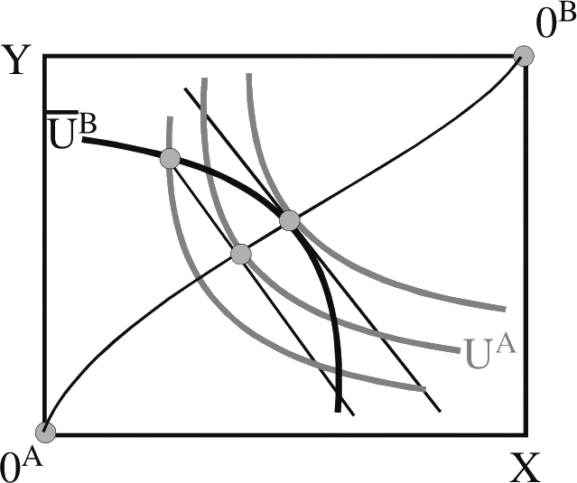{width="6cm"}

-   Ergebnis 2 (2. Hauptsatz der Wohlfahrtstheorie): Bei konvexen
    Präferenzen lässt sich durch geeignete Wahl der Anfangsausstattung
    jede beliebige pareto-effiziente Allokation als kompetitives
    Gleichgewicht erreichen.

## Der optimale Faktoreinsatz

-   Effiziente Allokation: Verteile den exogen gegebenen Faktorbestand
    an Arbeit N und Kapital K so auf die Produktion der beiden Güter x
    und y, dass es nicht möglich ist, durch Umverteilung der Faktoren
    von einem Gut mehr zu produzieren, ohne gleichzeitig von dem anderen
    Gut weniger zu produzieren.

-   Dazu: Produktionsfunktionen
    $x=F^{x}\left(N^{x} ; K^{x}\right) \text { und } y=F^{y}\left(N^{y} ; K^{y}\right)$
    in Abhängigkeit des jeweils eingesetzten Kapitals und der Arbeit

### Lösung des Zentralplaners (SOLL) {#lösung-des-zentralplaners-soll-1 .unnumbered}

-   Maximiere den Output eines Gutes x bei gegebener Produktion des
    anderen Gutes
    $y :\: \left[ F^{y}\left(N^{y} ; K^{y}\right) \geq \bar{y}\right]$
    und halte dabei die Ressourcenbeschränkung für Kapital und
    Arbeitskraft ein:
    $$N \geq N^{x}+N^{y} \text { und } K \geq K^{x}+K^{y} N \geq N^{x}+N^{y} und K \geq K^{x}+K^{y}$$

-   Da im Optimum keine Faktoren übrigbleiben, können wir die
    Ressourcenbeschränkungen mit Gleichheitszeichen verwenden. Der
    Lagrange-Ansatz lautet dann:
    $$\max _{N^{x}, K^{x}} L=F^{x}\left(N^{x} ; K^{x}\right)+\lambda \cdot\left[F^{y}\left(N-N^{x} ; K-K^{x}\right)-\bar{y}\right]$$

-   Ableitennach $N^x, K^x \text{ und } \lambda$ liefert:
    $$\begin{aligned}
    {3}
            \mathbb{I} & \quad \frac{\partial L}{\partial N^{x}}&&=F_{N^{x}}^{x}+\lambda F_{N j^{3}}^{y}(-1) \equiv 0 \\ 
            \mathbb{II} & \quad \frac{\partial L}{\partial k^{x}}&&=F_{k^{x}}^{x}+\lambda \cdot F_{k^{3}}^{y}(-1)=0  \\
            \mathbb{III} & \quad F^{y}&&=\bar{y} \\
            \Rightarrow & \frac{F_{N}^{x}}{F_{K}^{x}} && = \frac{F_{N}^{y}}{F_{K}^{y}}  = GRTS^x = GRTS^y
        \end{aligned}$$
    $$\text{ und bei gegebenem Output } F^{y}\left(N-N^{x} ; K-K^{x}\right)=\bar{y}$$
    GRTS = auf wie viele Arbeitseinheiten N kann ich bei
    glicherbleibender Outputmenge verzichten, wenn ich eine wetiere
    Einheit Kapital verwende ( negative Steigung der Isoquante[^1])\
    Bedingung (2.3) besagt: →

-   Die möglichen effizienten Faktor-Allokationen kann man nun ähnlich
    der Edgeworth-Box in Kapitel 2.1 illustrieren. Alle möglichen
    effizienten Einsatzkombinationen liegen auf der Linie $0^x 0^y$. Je
    weiter wir von links unten nach rechts oben wandern, desto mehr wird
    von Gut x produziert (und entsprechend weniger von Gut y).\

    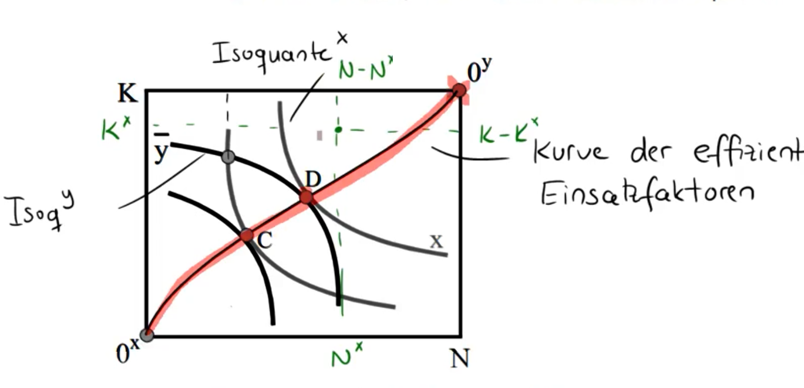{width="11cm"}

-   Die effizienten Outputkombinationen kann man auch durch die
    Produktionsmöglichkeitenkurve (oder Transformationskurve)
    darstellen. Die Steigung dieser Kurve misst die Grenzrate der
    Transformation (GRT)
    $\displaystyle -\frac{d y}{d x}=\frac{F_{N}^{y}}{F_{N}^{x}}$\

    {width="7.5cm"}

-   Überlegen Sie, was Grenzrate der technischen Substitution und
    Grenzrate der Transformation inhaltlich bedeuten.

### Dezentrale Lösung des Marktes (IST) {#dezentrale-lösung-des-marktes-ist-1 .unnumbered}

-   Sichert der Markt eine effiziente Faktorallokation, wenn die
    Produzenten dezentral entscheiden?

-   Die Unternehmen sind Preisnehmer auf den Güterund Faktormärkten,
    d.h. sie nehmen den Lohn $w$, den Zins $r$ und die Güterpreise $p^j$
    als gegeben.

-   Ein Unternehmen maximiert seinen Gewinn durch Wahl der geeigneten
    Faktoreinsatzmengen.
    $$\max _{N^{j}, K^{j}} p^{j} \cdot F^{j}\left(N^{j} ; K^{j}\right)-w \cdot N^{j}-r \cdot K^{j}$$

-   Die Bedingungen erster Ordnung lauten $$\begin{aligned}
    {3}
            \mathbb{I} \quad & \left(\frac{\partial \text{Gewninn}}{\partial N_j}\right)_{}  && = 0 = p^j \cdot F_{N^i}^j - w \Leftrightarrow p^j \cdot F_{N^x}^j = w \\
            & && \rightarrow \text{Wertgrenzproduktion der Arbeit = Lohnsatz} \\
            \mathbb{II} \quad & \left(\frac{\partial G}{\partial K_j}\right)_{}  &&= 0 = \ldots \Leftrightarrow p^j \cdot F_{K^j}^j = r \\
            & && \rightarrow \text{Wertgrenzproduktion des Kapitals = Zinssatz} \\
        \end{aligned}$$

-   Da sich alle Produktionszweige an dieselben Faktorpreise anpassen,
    gilt auch: $$\frac{T_{N^{j}}}{F_{k_{j}}^{j}}=\frac{\omega}{r}$$
    Grenzrate der technischen Substitution (GTRS =
    Faktorpreisverhältnis)
    $$\frac{F_{N^{x}}}{F_{k^{x}}^{x}}=\frac{\omega}{r}=\frac{T_{N^{y}}}{F_{k^{y}}^{y}}$$
    SOLL = IST

-   Ergebnis: Die dezentrale Marktlösung sorgt für eine effiziente
    Güterallokation vergleiche (2.3)

## Die optimale Produktionsstruktur

-   Nun treffen Konsumenten und Produzenten der Güter x und y auf einem
    Markt zusammen.

-   Wir suchen nach der effizienten Gesamtallokation
    $\left(x^{A}, x^{B}, y^{A}, y^{B}, N^{x}, N^{y}, K^{x}, K^{y}\right)$,
    d.h. unter allen Allokationen, die die Bedingungen für Tauschund
    Produktionseffizienz erfüllen, diejenige Allokation, bei der kein
    Individuum mehr besser gestellt werden kann, ohne ein anderes
    schlechter zu stellen.

    {width="10cm"}

    ### Lösung des Zentralplaners (SOLL) {#lösung-des-zentralplaners-soll-2 .unnumbered}

    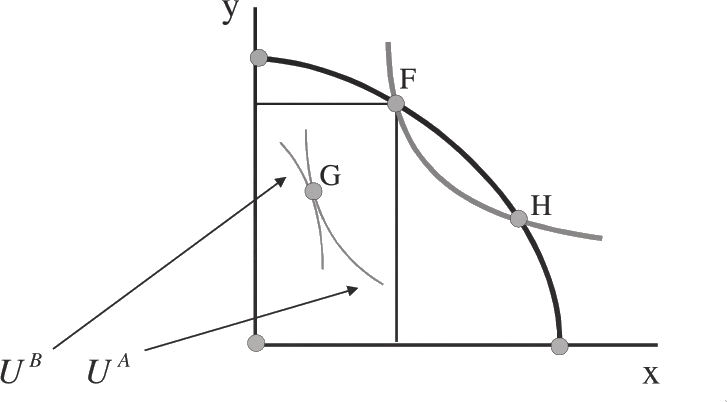{width="6cm"}\

    -   Beginnen wir mit einer beliebigen Allokation, bei der sowohl
        Tauschals auch Produktionseffizienz erfüllt sind:

        -   Punkt F liegt auf der Transformationskurve ($\rightarrow$
            Produktionseffizienz).

        -   Die dort produzierten Güter sind effizient auf die
            Individuen verteilt, da die Grenzraten der

        Substitution im Punkt $G$ gleich sind ($\rightarrow$
        Tauscheffizienz). Allerdings ist diese Kombination in Summe
        nicht pareto-optimal!

    -   Um dies zu sehen, überlegen wir, welche anderen
        Güterkombinationen den beiden Individuen denselben Nutzen wie in
        G liefern würden (d.h. wir verschieben die untere
        Indifferenzkurve B U entlang der oberen A U ). Wir verändern
        also die Güterausstattungen der Privathaushalte, sodass ihr
        Nutzen jedoch gleich bleibt. Die dafür benötigten gesamten
        Gesamtgütermengen X und Y beschreibt der Eckpunkt der
        Edgeworth-Box.

    -   Hierdurch erhalten wir die sogenannte Scitovsky-Indifferenzkurve
        (grau). Sie beschreibt alle Gü- termengen X und Y, mit denen man
        (bei geeigneter Aufteilung) die Individuen auf einem gegebenen
        Nutzenniveau halten kann.

    -   Nun sehen wir auch, warum die ursprüngliche Allokation nicht
        optimal war. Indem wir die Produktion entlang der
        Transformationskurve von F hin zu mehr von Gut x verschieben
        können wir mindestens einen Haushalt besserstellen.

    -   Das Optimum ist erreicht, wenn die Scitovsky-IDK die
        Transformationskurve tangiert. Die Steigung der Scitovsky-IDK
        entspricht der Steigung der individuellen IDKn, es gilt also

        $$\left(\frac{F_{K}^{y}}{F_{K}^{x}}=\frac{F_{N}^{y}}{F_{N}^{x}}\right)=\left(\frac{U_{x}^{A}}{U_{y}^{A}}=\frac{U_{x}^{B}}{U_{y}^{B}}\right)$$
        d.h. die Grenzrate der Transformation muss gleich der Grenzrate
        der Substitution sein.\

        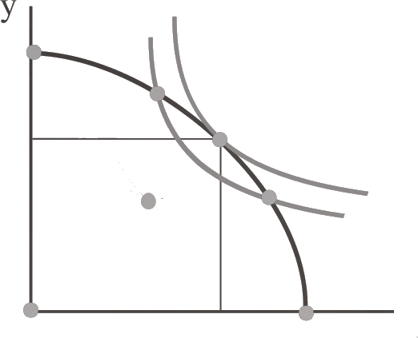{width="9cm"}

    -   Überlegen Sie durch eine marginale Variation der
        Produktionsstruktur, was das inhaltlich bedeutet.
        $$\longrightarrow \left(x^{A}, x^{B}, y^{A}, y^{B}, N^{x}, N^{y}, k^{x}, k^{y}\right)$$

    ### Dezentrale Lösung des Marktes (IST) {#dezentrale-lösung-des-marktes-ist-2 .unnumbered}

-   Sichert der Markt eigenständig eine effiziente Produktionsstruktur,
    wenn die Konsumenten und Produzenten dezentral entscheiden?

-   Da für die Unternehmen in beiden Sektoren dieselben Faktorpreise
    gelten, folgt aus der Gewinnmaximierung die Angleichung der
    Wertgrenzprodukte \[vgl. (2.4)\]:
    $$p^{x} \cdot F_{N}^{x}=w=p^{y} \cdot F_{N}^{y} \text{ sowie } p^{x} \cdot F_{K}^{x}=r=p^{y} \cdot F_{K}^{y}$$

-   Durch Umstellen erhalten wir
    $$\frac{F_{N}^{y}}{F_{N}^{x}}=\frac{p^{x}}{p^{y}}=\frac{F_{K}^{y}}{F_{K}^{x}}$$

    d.h. → GRT = Güterpreisverhältnis

-   Für das Haushaltsoptimum, wissen wir aus (2.2) bereits, dass
    $$\frac{U_{x}^{A}}{U_{y}^{A}}=\frac{p^{x}}{p^{y}}=\frac{U_{x}^{B}}{U_{y}^{B}}$$
    d.h. dass die Grenzrate der Substitution dem Preisverhältnis
    entspricht.

-   Fügen wir die letzten beiden Bedingungen zusammen, ergibt sich
    $$\frac{\overline{+}_{N}^{x}}{\bar{F}_{k}^{x}}=\frac{\bar{F}_{N}^{y}}{\overline{+}_{k}^{y}}=\frac{p^{x}}{p^{y}}=\frac{U_{x}^{A}}{U_{y}^{a}}=\frac{U_{x}^{\beta}}{U_{y}} \Leftrightarrow G R T=P V=G R S$$

-   Da sich sowohl die Produzenten als auch die Konsumenten am selben
    Preisverhältnis orientieren, gleichen sich auch Grenzrate der
    Transformation und Grenzrate der Substitution an.

-   Ergebnis durch Vergleich SOLL mit IST: Die dezentrale Marktlösung
    sorgt für eine effiziente Produktionsstruktur \[vergleiche (2.6)
    und (2.7)\], denn beide Ansätze führen auf die gleichen
    Optimalbedingungen.

## Die kritischen Annahmen

-   Wir haben nun gezeigt, dass die dezentrale Marktlösung (IST), bei
    der jeder einzelne nur die Informationen über die für ihn wichtigen
    Preise braucht, eine Pareto-optimale Allokation erreicht, die auch
    ein allwissender, benevolenter Sozialplaner (SOLL) nicht besser
    machen könnte.

-   Würde dieses Ergebnis stets gelten, bräuchte man keinen Staat. Was
    sind also die wichtigen Annahmen, bei deren Abwesenheit der Markt
    vielleicht nicht mehr so perfekt funktioniert und möglicherweise
    korrigierende Staatseingriffe benötigt?

-   Vollkommener Wettbewerb → Akteure sind Preisnehmern $\Rightarrow$
    Monopol

-   Keine steigenden Skalenerträge\
    → Produktionstechnologien leicht zugänglich

-   Keine externen Effekte\
    → d.h keine Auswirkung auf dritte Persionen

-   Keine öffentlichen Güter\
    → keine privaten Güter

# Zutrittsschranken, Marktmacht und Regulierung

#### Literatur

-   Giacomo Corneo, Öffentliche Finanzen: Ausgabenpolitik, Mohr Siebeck,
    Tübingen, 2003, Kapitel IV.

-   Jean Hindricks und Gareth D. Myles. Intermediate Public Economics,
    MIT Press, Cambridge, MA, 2006, Kapitel 8.

-   Dietmar Wellisch, Finanzwissenschaft I -- Rechtfertigung der
    Staatstätigkeit, Vahlen, München, 1999, Kapitel 6.

## Das Problem der Marktmacht

-   In Kapitel 2 sind wir davon ausgegangen, dass die Unternehmen sich
    als Preisnehmer verhalten, d.h. dass sie keiner Einfluss auf die
    Preise haben, die ihre Produkte am Markt erzielen. Unter dieser
    Annahme konnten wir zeigen, dass Märkte eine pareto-optimale
    Allokation erzeugen. Kein Staatseingriff und kein noch so kluger
    Zentralplaner kann das Ergebnis, das ein dezentraler
    Marktmechanismus hervorbringt, verbessern.

-   Bei einer Reihe von Marktkonstellationen ist es jedoch
    unrealistisch, davon auszugehen, dass das einzelne Unternehmen klein
    ist und den Preis als gegeben hinnimmt.

    {width="10cm"}

-   Wenn die Unternehmen, den Preis strategisch beeinflussen können,
    spricht man von Marktmacht. Solche Marktmacht liegt bei einem
    Monopol (eine Firma → Apple), Kartell (mehrere Firmen, die
    Preisabsprachen treffen → Weihnachtsmarkt, Döner), Oligopol (wenige
    Firmen, die im unvollkommenen Wettbewerb zueinander stehen →
    Tankstellen) vor.

-   Warum lohnt es sich für Firmen, den Preis zu beeinflussen und
    Kartellabsprachen zu treffen? Warum schreitet die Politik dagegen
    ein? (Ist es denn nicht gut, wenn Unternehmen mehr Gewinn erzielen?)

-   Fallen Ihnen andere aktuelle Beispiele ein, wo die Marktmacht eines
    Unternehmens kritisiert wird? Überlegen Sie, wie die Firmen ihre
    Marktmacht ausspielen.

-   Wir wollen hier nur das grundlegende Problem im Wesentlichen anhand
    des Monopols erläutern. Andere Marktformen werden in Veranstaltungen
    wie z.B. Industrieökonomik besprochen; das allokative Problem ist
    jedoch bei allen Formen der Marktmacht ähnlich.

### Das Kalkül des Monopolisten {#das-kalkül-des-monopolisten .unnumbered}

-   Betrachten wir das klassische Monopolproblem.

-   Der Monopolist produziert die Outputmenge x und erhält einen Preis
    p(x) \[hier auch: $GZB(x)$\].

-   Der Gewinn des Monopolisten beträgt $$\pi=p(x) \cdot x-C(x)$$ wobei
    $C(x)$ die Produktionskosten misst.

-   Im Gegensatz zum Preisnehmer muss der Monopolist berücksichtigen,
    dass die Ausdehnung der Menge den Preis des Gutes reduziert; $p$ ist
    nicht fix, sondern hängt von der Outputmenge x ab und ist i.d.R.
    fallend im Preis. Das hat wichtige Implikationen.

### Der Grenzerlös {#der-grenzerlös .unnumbered}

-   Um das Gewinnmaximierungskalkül des Monopolisten verstehen zu
    können, müssen wir uns zunächst das Konzept des Grenzerlöses
    verdeutlichen.

-   Der Monopolist sieht sich einer fallenden Nachfragekurve gegenüber.
    Wenn er die Outputmenge ein wenig erhöht, muß er den Preis ein wenig
    absenken, um die produzierte Menge absetzen zu können.

-   Die Preissenkung (AC im Diagramm) bewirkt:

    -   zum einen einen Erlöszuwachs $\quad DEGF$

    -   zum anderen aber auch eine Erlösminderung $\quad ABDC$

    -   Netto beträgt der Erlöszuwachs $\quad DEGF-ABDC$

    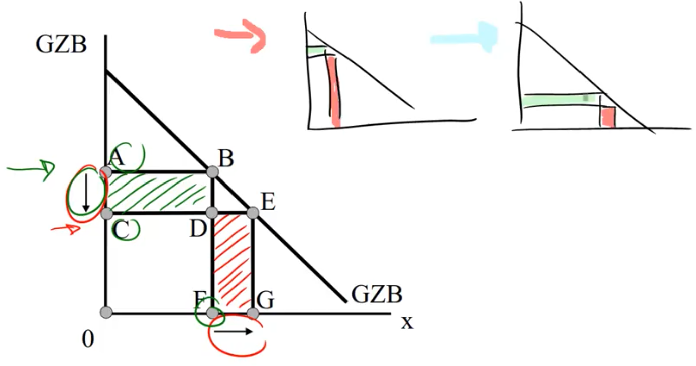{width="12cm"}

-   Bei marginalen Variationen des Outputs bezeichnet man den
    Nettoeffekt dieser gegenläufigen Effekte auf den Erlös als
    Grenzerlös; er mißt den Vorteil einer marginalen Mengenausdehnung.

### Gewinnmaximale Strategie (IST) {#gewinnmaximale-strategie-ist .unnumbered}

-   Der Monopolist dehnt seine Outputmenge aus, bis der Gewinn maximal
    ist.

-   Formal erhalten wir das Gewinnmaximum durch Ableiten und Nullsetzen
    von (3.1)
    $$\frac{d \pi(x)}{d x}=p(x)+p^{\prime}(x) \cdot x-C^{\prime}(x)=0$$
    bzw. $$\begin{aligned}
    \\p(x)+p^{\prime}(x) \cdot x &=C^{\prime}(x) \\\\\text { Grenterlose } &=\text { Grenzkosten }\\\end{aligned}$$
    (3.2)

-   Auf der linken Seite steht der Grenzerlös (Preis für die zusätzliche
    marginale Einheit und Erlösminderung für alle vorgelagerten
    Einheiten), auf der rechten Seite die Grenzkosten $$GE = GK$$

-   Dieses Kalkül ist auch in der folgenden Graphik zu sehen:\

    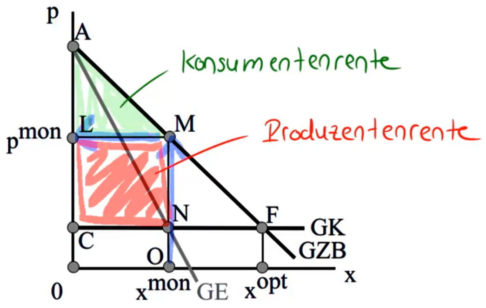{width="9cm"}

-   Wie hoch ist die Produzentenrente?

-   Überlegen Sie, warum die GE-Kurve in der Graphik unter der
    Nachfragekurve verlaufen muß.\
    → bei linearen Nachfragefunktionen immer doppel so steil wie
    Nachfragefunktion selbst

### Lerner-Index und Monopolaufschlag {#lerner-index-und-monopolaufschlag .unnumbered}

-   Unter Verwendung der Nachfrageelastizität [^2]
    $$\eta \equiv \frac{\partial x}{\partial p} \cdot \frac{p(x)}{x}=\frac{1}{p^{\prime}(x)} \cdot \frac{p(x)}{x}<0$$

    können wir Bedingung (3.2) umschreiben zu
    $$p(x)-C^{\prime}(x)=-p^{\prime}(x) \cdot x \Leftrightarrow \quad \frac{p(x)-C^{\prime}(x)}{p(x)} =-p^{\prime}(x) \cdot \frac{x}{p(x)} =-p^{\prime}(x) \cdot \frac{x}{p(x)}=-\frac{1}{\eta}=\frac{1}{|\eta|}$$

-   Interpretation:\
    → prozentualer Gewinnaufschlag auf die Grenzkosten = Kehrwert der
    Nachfrageelastizität

-   Den Ausdruck $$L:=|\eta|^{-1}=\frac{p(x)-C^{\prime}(x)}{p(x)}$$
    bezeichnet man als Lerner-Index.

-   Der Lerner-Index ist ein einfaches Maß der Marktmacht

    -   Der Lerner-Index beträgt $0$, wenn der Monopolist (wie in einem
        kompetitiven Markt) nur Grenzkostenpreise verlangen kann. →
        Konkurrenz drückt den Gleichgewichtspreis in die Nähe der
        Grenzkosten.

    -   Der Lerner-Index konvergiert gegen 1, wenn der Aufschlag gegen
        unendlich geht.

    -   Im Falle eines Oligopols, d.h. z.Bsp. bei n symmetrischen
        Firmen, die sich eine Output-Menge X teilen, reduziert sich der
        individuelle Lerner-Index L zu $\frac{1}{|\eta| \cdot n}$. Der
        Gewinnaufschlag nimmt also mit der Anzahl der Unternahmen ab und
        konvergiert für $n \rightarrow \infty$ gegen vollk. Konkurrenz.

-   Überlegen Sie, warum (für eine innere Lösung) die betragsmäßige
    Nachfrageelastizität über 1 liegen muss!\
    →
    $\displaystyle \text { sonst } \frac{1}{m !}>1 \Rightarrow \frac{p-c^{\prime}}{p}>1 \Rightarrow c^{\prime}<0$\
    → Monopolist arbeitet immer im elastischen Bereich der Nachfrage

## Der Wohlfahrtsverlust durch ein Monopol {#der-wohlfahrtsverlust-durch-ein-monopol .unnumbered}

-   Welche Menge würde der sozialer Planer hingegen anordnen (SOLL)?\
    → Punkt F

-   Aus der Mikroökonomik wissen wir, dass im Wohlfahrtsoptimum GK =
    Preis = GZB gilt.\

-   Die pareto-optimale Outputmenge ist also $x^{opt}$. Die gesamte
    Rente beträgt $AFC$.\

-   Im Monopolfall beträgt die gesamte Rente allerdings nur\
    → $AMNC$

-   Gegenüber der optimalen Allokation entsteht ein Wohlfahrtsverlust in
    Höhe, denn\
    → $MNF$

-   Die Wohlfahrtsverluste des Monopols entstehen aus der verknappten
    Outputmenge. Das Monopol ist also nicht deshalb allokativ schädlich,
    weil es von denen, die das Produkt kaufen, hohe Preise verlangt (das
    ist allenfalls verteilungspolitisch unerwünscht), sondern weil es
    einige Konsumenten ausschließt (d.h. zu Nicht-Käufern macht), obwohl
    ihre Zahlungsbereitschaft über den Grenzkosten liegt.

-   Überlegen Sie noch einmal, warum der Monopolist die Käufer zwischen
    $x^{mon}$ und $x^{opt}$ nicht bedient, obwohl sie ja mehr zahlen
    würden, als den Monopolisten die Produktion weiterer Einheiten
    kostet.\
    → nicht gewinnmaximierend\
    → individuelle Rationalität des Monopilisten $\neq$ kollektive
    Rationalität der Gesellschaft

### Die Verzerrung im Totalmodell {#die-verzerrung-im-totalmodell .unnumbered}

-   Wir wenden uns nun vom Partialmodell kurz ab, um zu sehen, wie die
    Verzerrungen des Monopols im Totalmodell (d.h. inklusive
    Produktionsprozess und weiterem Gut) des letzten Kapitels aussehen.

-   Der Monopolist produziert das Gut
    $x \operatorname{mit} x=F^{x}\left(N^{x} ; K^{x}\right)$, das Gut
    $y$ wird kompetitiv zu Preis=Grenzkosten erstellt.

-   Der Monopolist maximiert seinen Gewinn
    $$\max _{N^{x}, K^{x}} p^{x}\left(F^{x}\left(N^{x} ; K^{x}\right)\right) \cdot F^{x}\left(N^{x} ; K^{x}\right)-w \cdot N^{x}-r \cdot K^{x}$$
    durch Wahl der geeigneten Faktoreinsatzmengen.

-   Die Bedingungen erster Ordnung lauten $$\begin{aligned}
            F_{N}^{x} &\cdot\left[p^{x}+\frac{\partial p^{x}}{\partial x} \cdot x\right]=w \\
            F_{K}^{x} &\cdot\left[p^{x}+\frac{\partial p^{x}}{\partial x} \cdot x\right]=r
        \end{aligned}$$

-   Ergebnis 1: Auch ein Monopolist wählt den optimalen Faktoreinsatz

    -   Division von (3.3) durch (3.4) ergibt:
        $$\frac{F_N^x}{F^x_K} = \frac{w}{r} \Leftrightarrow GRTS = \text{Faktorpreis}$$

    -   Der Monopolist passt die Grenzrate der technischen Substitution
        an das Faktorpreisverhältnis an.

    -   Ein Vergleich mit (2.3) und (2.5) zeigt, dass dies zur optimalen
        Faktoreinsatzrelation führt.

-   Ergebnis 2: Das Monopol verzerrt allerdings die optimale
    Produktionsstruktur

    -   Im kompetitiven Sektor bestimmt sich der Faktoreinsatz durch
        $p^{y} \cdot F_{N}^{y}=w$ \[siehe (2.4)\].

    -   Gleichsetzen mit (3.3) liefert:

        $$\begin{aligned}
            F_{N}^{x} &\cdot\left[p^{x}+\frac{\partial p^{x}}{\partial x} \cdot x\right]=w=p^{y} \cdot F_{N}^{y} \quad \text { bzw. } \\
            \frac{F_{N}^{y}}{F_{N}^{x}} &= \frac{p^{x}+\frac{\partial p^{x}}{\partial x} \cdot x}{p^{y}}\end{aligned}$$

    -   Auf der linken Seite steht die Grenzrate der Transformation
        \[vgl. (2.6)\]. Was steht auf der rechten Seite?

    -   Die Haushalte passen sich in ihrem Konsum an das Preisverhältnis
        an, so dass gilt \[vgl. (2.2)\]:
        $$\frac{U_{x}^{i}}{U_{y}^{i}}=\frac{p^{x}}{p^{y}}$$

    -   Wir erhalten daher:
        $$\frac{F_{N}^{y}}{F_{N}^{x}}=\frac{p^{x}+\frac{\partial p^{x}}{\partial x} \cdot x}{p^{y}}<\frac{p^{x}}{p^{y}}=\frac{U_{x}^{i}}{U_{y}^{i}}$$

        d.h. die Grenzrate der Transformation ist kleiner als die
        Grenzrate der Substitution. Dies ist der IST-Zustand, der sich
        ohne Eingreifen in den Markt ergibt.

    -   Im sozialen Optimum (SOLL) hingegen herrscht aber Gleichheit. Da
        beide Optimalbedingungen nun nicht mehr übereinstimmen, ergeben
        sich unterschiedliche Allokationen.

    -   Die nachfolgende Graphik zeigt die resultierende Verzerrung.
        Statt der optimalen Produktionsstruktur I, wird die
        Produktionsstruktur in F gewählt, denn die Scitovsky-IDK
        schneidet die Transformationskurve in F (IST), optimalerweise
        würde sie aber in I tangieren (SOLL).

        {width="6cm"}

    -   Ergo: Es wird zu wenig von Gut x und zu viel von Gut y
        angeboten.

### Marktzutrittsschranken {#marktzutrittsschranken .unnumbered}

-   Woher kommt nun die Monopolstellung einer Firma (oder das Oligopol
    weniger Firmen)? y F I x

-   Da ein Monopolist in seinem Markt Gewinne erzielt, besteht der
    Anreiz für andere Unternehmen, in diesen Markt einzutreten, um einen
    Teil der Gewinne zu bekommen. Langfristig würde durch solchen
    Marktzutritt aber mehr Wettbewerb entstehen und die Gewinne würden
    wegkonkurriert (siehe Lerner-Index: Gewinnaufschlag sinkt mit
    Anzahl Konkurrenten).

-   Selbst-Übung: In einem Markt sei die Nachfragefunktion durch
    $p = a - x$ gegeben.

    -   Anfänglich bietet das Produkt nur ein Monopolist an. Die
        Produktionskosten betragen $0.5 x^2$. Berechnen Sie die Lösung
        für den Monopolisten.\

        Monopollösung\
        Monopolist maximiest Gewinn $$\begin{aligned}
                    & \pi(x)=p(x) \cdot x-C(x) \\
                    & \rightarrow \frac{d}{d x}\left[(a-x) \cdot x-0,5 x^{2}\right]=a-2 x-x ! 0 \\
                    & \Leftrightarrow x_{m 0 n}=\frac{a}{3}  \\
                    & \text{zu Preis } p_{mon} =\rho\left(x_{mon}\right)=a-\frac{a}{3}=\frac{2 a}{3}
                    \end{aligned}$$

    -   Nun treten weitere Unternehmen in den Markt ein. Der
        Marktzutritt kostet jedes Unternehmen $\bar{C}$. (Die
        Produktionskosten sind für jedes Unternehmen dieselben wie für
        den ursprünglichen Monopolisten.) Die Zahl der Unternehmen
        sei n. Wie viele Unternehmen n gibt es im Gleichgewicht am
        Markt?

        Nun Wettbewerbsmarkt Konkurrenz drückt den Verkaufspreis und
        erhöht die Menge, denn Preis $p$ nun fix und die Unternehmen
        maximieren. $$\begin{aligned}
                    &\pi(x)=p \cdot x-C(x) \\
                    &\frac{d}{d x} \pi(x)=p-x=0 \quad \Leftrightarrow \quad p=x \\
                    &\text { mit Gewinn } \pi(p)=0,5 p^{2}-\bar{c} \\
                \end{aligned}$$ Markt aus aggregierter Perspektive:
        $$x^{\text {Angebof }}=n \cdot x=n \cdot p x^{\text {Angebof }}=n \cdot x=n \cdot p$$
        Daher ergibt sich als Gleichgewichtspreis unter Wettbewerb
        $$\begin{aligned}
                    x^{\text {Angebot }}=x^{\text {Nachfrage }} & \Leftrightarrow n \cdot p=a-p \\
                    & \Leftrightarrow \quad p=\frac{a}{n+1},\\
                    \end{aligned}$$ d.h. je mehr Unternehmen n, desto
        geringer der Preis.\
        → Unternehmen werden solange in den Markt eintreten, wie
        $\pi \geq 0$: $$\begin{aligned}
                    \pi&=0,5 p^{2}-\bar{c}=0 \\
                    &\Leftrightarrow \quad 0,5 \cdot\left(\frac{a}{n+1}\right)^{2}-\bar{c}=0 \quad \Leftrightarrow \quad \ldots \quad \Leftrightarrow \quad n=\frac{a}{\sqrt{2 \bar{c}}}-1
                \end{aligned}$$ **→ je höher die Marktzutrittskosten,
        desto weniger Unterhemen treten ein.**

-   Ein dauerhaftes Monopol benötigt also, dass solcher Marktzutritt
    verhindert wird, z.B. durch

    -   spezifisches Know-How

    -   patent-geschütztes Know-How

    -   (staatliche) Lizenzen

## Politikmaßnahmen

-   Wie kann die Politik die Verzerrungen des Monopols beseitigen oder
    mildern?

### Zerschlagung des Monopols {#zerschlagung-des-monopols .unnumbered}

-   Da das Problem aus der Monopolstellung der Firma entstanden ist,
    besteht die einfachste Lösung darin, genau diese Monopolstellung
    aufzubrechen und Wettbewerb zu schaffen.

-   Im obigen Beispiel ist die Schaffung von Wettbewerb prinzipiell
    möglich, da das Unternehmen unter konstanten Grenzkosten operiert
    und keine Fixkosten vorliegen.

-   Wie das genau geschieht (Deregulierung, Abbau von
    Marktzutrittsschranken, Fusionskontrolle, Strafen bei
    Kartellabsprachen, Zerschlagung von Monopolen etc.), ist Thema der
    Veranstaltungen zur Wettbewerbspolitik und soll hier nicht
    vertieft werden.

### Preisobergrenzen {#preisobergrenzen .unnumbered}

-   Wenn die Zerschlagung des Monopols nicht möglich ist, kann der Staat
    das Monopol auch regulieren, z.B. indem er Preisobergrenzen für
    das vom Monopolisten bereitgestellte Gut festlegt. Solche
    Preisregulierungen sehen wir z.B. in Stromund
    Telekommunikationsmärkten.

{width="6cm"}

-   Um die erstbeste Lösung (SOLL) zu erreichen, müsste der Staat den
    Preis auf Grenzkostenniveau festlegen $(\bar{p})$.

-   Problem: Harter politischer Eingriff und der Staat muss die
    Grenzkostenkurve der Unternehmen beobachten können.

-   Realiter lassen sich also maximal willkürliche Preisobergrenzen
    festsetzen.

    ### Gewinnregulierung {#gewinnregulierung .unnumbered}

-   Statt den Preis zu regulieren, kann man auch direkt den Gewinn des
    Monopolisten beschränken.

-   Die nachfolgende Graphik zeigt Erlöse und Kosten eines Monopolisten
    in Abhängigkeit der Ausbringungsmenge.

-   Verlangt man z.B. Nullgewinn vom Monopolisten, wird die optimale
    Ausbringungsmenge erreicht.

-   Oft wird bei solchen Gewinnregulierungen den Monopolisten jedoch ein
    positiver Gewinn zugestanden, z.B. als Kompensation für frühere
    Investitionen in F&E. Entsprechend fällt die Outputmenge unter das
    erstbeste Niveau.

-   Weiterhin steigt der Anreiz des Monopol zur X-Ineffizienz[^3] (s.
    später)

{width="6cm"}

### Renditeregulierung {#renditeregulierung .unnumbered}

-   In der Praxis legt man nicht den Gewinn selbst fest, sondern
    definiert für die Regulierung meist eine zulässige Kapitalrendite
    des Monopolisten.

-   Der Monopolist produziert wie bisher mittels Kapital und Arbeit
    $x = F^x(N;K)$ und erzielt den Erlös $R(x) = p(x) * x$.

-   Der Regulierer erlaubt dem Monopolisten eine durchschnittliche
    Kapitalrendite von $s$,\
    d.h. $\frac{R(x) - w \cdot N}{K} \leq s$. Typischerweise wird diese
    zulässige Kapitalrendite über dem Marktzins r liegen.

-   Unter dieser Regulierungsrestriktion maximiert der Monopolist nun
    seinen Gewinn:
    $$L=R(x)-w \cdot N-r \cdot K+\lambda \cdot[s \cdot K-\{R(x)-w \cdot N\}]$$

-   Falls die Nebenbedingung bindend ist, gilt $0 > \lambda$ und die
    relevanten Bedingungen erster Ordnung lauten: $$\begin{aligned}
            & \frac{\partial L}{\partial N}=R_{x} \cdot F_{N}^{x}-w+\lambda \cdot\left[-R_{x} \cdot F_{N}^{x}+w\right]=0 \\
        &\frac{\partial L}{\partial K}=R_{x} \cdot F_{K}^{x}-r+\lambda \cdot\left[s-R_{x} \cdot F_{K}^{x}\right]=0\\
        &\text { bzw. }\\
        &R_{x} \cdot F_{N}^{x} \cdot(1-\lambda)=w \cdot(1-\lambda) \\
        &R_{x} \cdot F_{K}^{x} \cdot(1-\lambda)=r-\lambda \cdot s \\
        \end{aligned}$$

-   Division der beiden Bedingungen und Erweitern des Nenners ergibt:
    $$\frac{F_{N}^{x}}{F_{K}^{x}}=\frac{w \cdot(1-\lambda)}{r \cdot(1-\lambda)+\lambda \cdot(r-s)}$$

-   Durch die Bedingungen 2. Ordnung muss $\lambda < 1$ gelten und wir
    erhalten folgende Ergebnisse:

    -   Der Faktoreinsatz des Monopolisten wird durch die
        Renditeregulierung verzerrt: d.h. Grenzrate der technischen
        Substitution entspricht nicht dem Faktorpreisverhältnis
        $$\frac{F_{N}^{x}}{F_{K}^{x}} \neq \frac{w}{r}$$

    -   Da die Regulierung dem Monopolisten mehr als die Marktverzinsung
        lässt $(s>r)$, kommt es zu einer Substitution von Arbeit durch
        Kapital
        $$\frac{F_{N}^{x}}{F_{K}^{x}}=\frac{w \cdot(1-\lambda)}{r \cdot(1-\lambda)+\lambda \cdot(r-s)}>\frac{w}{r}$$

-   Der übermäßige Einsatz von Kapital entsteht, weil die Erzielung der
    übernormalen Rendite $s-r$ an den Einsatz von Kapital gekoppelt
    wird.

-   Ob der Output durch die Regulierung steigt oder sinkt, hängt von der
    jeweiligen Produktionsfunktion ab.

-   Dies ist der sogenannte Averch-Johnson-Effekt.[^4]

-   Die Renditeregulierung erweist sich als ungeeignete Antwort auf das
    Monopolproblem. Allerdings kann man diesen Defekt durch komplexere
    Regulierungen der Renditen korrigieren, selbst wenn eine direkte
    Regulierung der echten ökonomischen Gewinne nicht möglich ist.

### Subventionierung {#subventionierung .unnumbered}

-   Statt das Monopol zu regulieren, könnte die Regierung auch den
    Konsum des Gutes subventionieren, entweder durch Subvention an die
    Firma selbst oder durch Subventionierung der Haushalte.

-   Die folgende Graphik zeigt eine Subvention, die den Monopolisten zur
    optimalen Outputmenge induziert.

    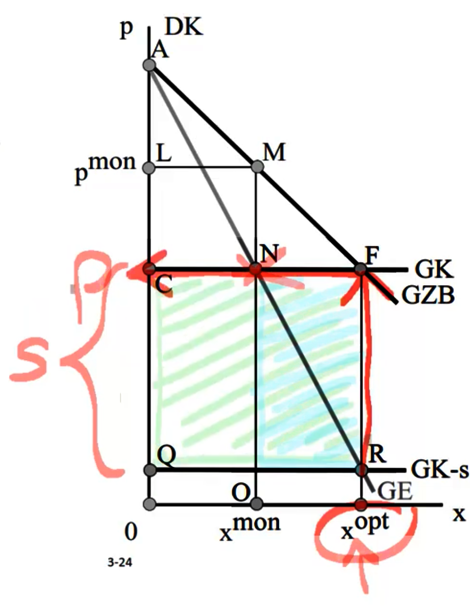{width="8cm"}

    -   Auf jede Outputeinheit zahlt der Staat eine Subvention von s.

    -   Für die Firma lohnt es sich nun, den Output auszudehnen, bis
        ...\
        → $x^{opt}$

    -   Der Staat erreicht die erwünschte Allokation $x^{opt}$, muss
        allerdings einen Subventionsbetrag von $CFRQ \quad$ aufbringen.

-   Der Nachteil dieser Politik liegt in den beträchtlichen fiskalischen
    Kosten. Der Staat muss möglicherweise ein großes Subventionsbudget
    durch Besteuerung aufbringen, was Wohlfahrtsverluste an anderer
    Stelle nach sich zieht.

-   Überlegen Sie, wie man den Nachteil des großen Subventionsbudgets
    mindern kann und trotzdem die Anreizwirkung der Subventionslösung
    aufrechterhalten kann.

    ## Fallende Durchschnittskosten

-   Fallende Durchschnittskosten liegen vor, wenn die Grenzkosten unter
    den Durchschnittskosten liegen. Denn dann kostet eine weitere
    Outputeinheit weniger als alle bisherigen Outputeinheiten im Mittel
    -- die Produktion einer weiteren Einheit senkt also die
    durchschnittlichen Kosten.

-   Fallende Durchschnittskosten sind von Bedeutung, wenn die Fixkosten
    hoch und die Grenzkosten der Produktion relativ niedrig sind.

-   Beispiel: Bahn\
    Die Bundesbahn hat mit dem Bau und Unterhalt des Schienennetzes hohe
    Fixkosten. Dagegen sind die Grenzkosten eines weiteren Zuges oder
    eines weiteren Passagiers eher gering.

-   Das Problem der fallenden Durchschnittskosten tritt besonders dann
    auf, wenn -- wie im Fall der Bahn -- eine umfangreiche Infrastruktur
    als Input benötigt wird (Wasserund Stromversorgung,
    Telekommunikationsnetze, Kabel-TV\...).

-   Beispiel: Flughäfen\
    Die unteren Abbildungen zeigen einen aus europäischen Daten
    geschätzten Verlauf der Durchschnittskosten. WLU = Work Load Unit
    (Anzahl Passagiere + Frachtverkehr in 100kg). Für einige
    exemplarische deutsche Flughäfen ist die WLU des Jahres 1994
    angegeben. Die nachfolgende Tabelle fasst zudem die Ergebnisse
    verschiedener weiterer Studien zusammen.

\begin{figure}[H] \centering \begin{tabular}{l|l} Studie & Ergebnisse \\ \toprule Doganis/Thompson (1973) & sinkende LDK bis 3 Mio. WLU \\\\ Tolofari et al. (1990) & sinkende LDK bis 20,3 Mio. WLU \\\\ Salazar de la Cruz (1999) & 3,5-12,5 Mio. Passagiere: konstante LDK, \\ & >12,5 Mio. Passagiere: steigende LDK \\\\ Pels (2000) & kleine Flughäfen i. d. R. sinkende LDK, \\ & große Flughäfen i. d. R. konstante oder leicht steigende LDK \\\\ Pels et al. (2003a) & durchschnittlicher europ. Flughafen i. d. R. konstante LDK bei Flugbewegungen, \\ & sinkende LDK bei Passagieren \\\\ Main et al. (2003) & stark fallende LDK bis 4 Mio. PAX bzw. 5 Mio. WLU, \\ & fallende LDK bis 64 Mio. PAX bzw. 90 Mio. WLU \\\\ Jeong (2005) & sinkende LDK bis 2,5 Mio. Passagiere bzw. 3 Mio. WLU \\\\ Vogel (2005) & sinkende LDK bis knapp unter 4 Mio. Passagiere, \\ & danach ansteigende LDK \\\\ Wing Chow/Fung (2009) & konstante LDK; Verbundvorteile zwischen Passagier- und Frachtverkehr \\\\ Martin et al. (2011) & LDK noch bei über 23 Mio. PAX \\\\ Martin/Voltes-Dorta (2011) & sinkende LDK noch bei über 40 Mio. PAX \\\\ \midrule \multicolumn{2}{l}{WLU = Work Load Units (1 Terminal Passagier bzw. 100 kg Fracht)} \\ \multicolumn{2}{l}{PAX = Persons Approximately} \\ \multicolumn{2}{l}{LDK = langfristige Durchschnittskosten }\\ \bottomrule \end{tabular} \caption{Quelle: Kratzsch, Uwe, 2013. „Eine industrieökonomische Analyse der Entgeltregulierung von Flughäfen“ Verlag Dr. Kovač, Hamburg.} \end{figure}

{width="10cm"}

### Optimale Produktion bei fallenden Durchschnittskosten {#optimale-produktion-bei-fallenden-durchschnittskosten .unnumbered}

-   Das Diagramm zeigt einen Markt (z.B. für Telefongespräche), bei dem
    die Grenzkosten eines Telefongesprächs konstant sind, aber hohe
    Fixkosten für das Festoder Funknetz zu fallenden
    Durchschnittskosten führen.\

    {width="6cm"}

-   Welcher Output sollte (aus sozialer Sicht) produziert werden (SOLL)?
    $$x^{opt}$$

-   Zweistufige Produktionsentscheidung (IST):

    -   Marginalbedingung (sog. Intensive Margin $\rightarrow$ wie viel
        sollte produziert werden?) $$GZB \geq GK \rightarrow F$$

    -   Totalbedingung (sog. Extensive Margin $\rightarrow$ gegeben
        $x^*$ -- lohnt sich Produktion überhaupt?)\
        → Unternehmer darf keinen Verlust machen! d.h. Gesamtvorteil der
        Produktion \> Gesamtkosten

### Implikationen fallender Durchschnittskosten in Märkten {#implikationen-fallender-durchschnittskosten-in-märkten .unnumbered}

-   Was würde passieren, wenn die Telekommunikationsfirma den Preis wie
    in perfekten Wettbewerbsmärkten auf Grenzkostenniveau festlegt?\

    {width="12cm"}

-   Was würde passieren, wenn die Telekommunikationsfirma den Preis auf
    ein kostendeckendes Durchschnittskostenniveau festlegt?\

    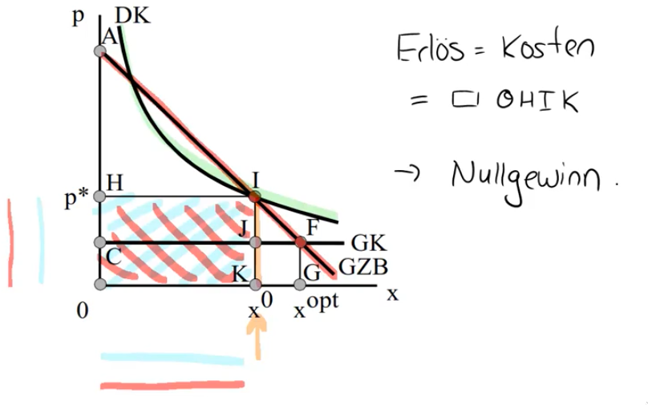{width="10cm"}

### Natürliches Monopol {#natürliches-monopol .unnumbered}

-   Das entscheidende Problem fallender Durchschnittskosten haben wir
    noch gar nicht angesprochen: Effektiver Wettbewerb zwischen mehreren
    Unternehmen funktioniert hier nicht, denn die Effizienz der
    Produktion beruht ja gerade auf der Größe der Unternehmung. Jedes
    Unternehmen würde also versuchen die Größenvorteile (niedrigere
    Durchschnittskosten) auszunutzen, um die Konkurrenten zu unterbieten
    („ruinöser Wettbewerb").

-   Am Ende bleibt nur ein Unternehmen übrig; wir sprechen von einem
    natürlichen Monopol.[^5]

-   Aus allokativer Sicht ist es zwar wünschenswert, dass die hohen
    Fixkosten nur einmal getätigt werden. (So wären z.B. Investitionen
    in ein zweites Schienennetz für Eisenbahnen ineffizient, wenn das
    vorhandene erste Netz noch gar nicht ausgelastet ist.) Unerwünscht
    ist jedoch die exzessiv hohe Preissetzung durch die Marktmacht des
    natürlichen Monopolisten. 3

### Das Kalkül des natürlichen Monopolisten {#das-kalkül-des-natürlichen-monopolisten .unnumbered}

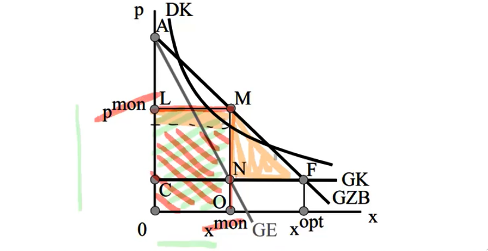{width="10cm"}

-   Der Monopolist dehnt seine Outputmenge aus, bis der Gewinn maximal
    ist. Wie beim Monopolfall in Kapitel 3.1 wird der Vorteil einer
    Mengenausdehnung durch den Grenzerlös GE gemessen, der Nachteil
    durch die Grenzkosten GK.

-   Grenzerlös und Grenzkosten sind bei $x^{mon}$ gleich. Diese Menge
    kann der Monopolist zum Preis $p^{mon}$ absetzen. Seine
    Produzentenrente (Bruttogewinn ohne Berücksichtigung der Fixkosten)
    beträgt LMNC.

-   Auch beim Monopolisten müssen wir neben der Marginalbedingung auf
    die Totalbedingung achten: Macht der Monopolist überhaupt Gewinn,
    d.h. kann der Monopolist mit seinen Erlösen variable und fixe Kosten
    abdecken? Wo können Sie in der Graphik die Fixkosten ablesen? Woran
    erkennen Sie, ob der Monopolist einen positiven Gewinn erzielt?

-   Der Wohlfahrtsverlust durch ein natürliches Monopol:\
    → $MNF$

## Politikmaßnahmen bei natürlichen Monopolen

-   Fallende Durchschnittskosten können als (normative) Begründung für
    Staatseingriffe dienen, da in diesem Fall das freie Spiel der
    Marktkräfte versagt.

-   Denn auch durch „Zerschlagung" des Monopols, Fusionskontrolle etc.
    lässt sich im Fall des natürlichen Monopols kein funktionierender
    Wettbewerb schaffen.

-   Was kann der Staat gegen das Problem natürlicher Monopole
    unternehmen?

    -   Produktion selbst Übernehmen (öffentliche Unternehmen)

    -   Privates Unternehmen regulieren (Preisobergrenzen)

    -   Produktion subventionieren

    Die letzten beiden Politikmaßnahmen hatten wir bereits für den
    Standardfall des Monopols untersucht. Wir werden hier nur
    überprüfen, ob die Maßnahmen auch bei natürlichen Monopolen greifen.

### Staatliche Produktion {#staatliche-produktion .unnumbered}

-   Der Staat übernimmt selbst die Produktion des Gutes und betreibt ein
    öffentliches Unternehmen (ehem. Fernmeldewesen, Öffentlicher
    Personen-Nahverkehr etc.).

-   Damit kann der Staat sicherstellen, dass die effiziente Menge xopt
    produziert wird. Der Wohlfahrtsverlust, der wegen der zu geringen
    Outputmenge beim natürlichen Monopol entsteht, kann vermieden
    werden.

-   Damit die effiziente Menge auch abgesetzt wird, muß der Staat Preise
    in Höhe der Grenzkosten verlangen. Wegen der Fixkosten entsteht ein
    Verlust, den der Staat durch Zuschüsse an das Staatsunternehmen
    abdecken muß. (Siehe Fläche BEFC in der ersten Graphik von Kapitel
    3.3; wegen der konstanten Grenzkosten entspricht der Verlust in
    seiner Höhe den Fixkosten.)

-   Welche Probleme können bei staatlicher Produktion auftreten?

-   Problem 1: Kosten der Steuererhebung Der Staat muß die Verluste des
    Unternehmens über Steuern finanzieren. Die staatliche Produktion
    eliminiert dann zwar den Wohlfahrtsverlust des natürlichen Monopols,
    aber dafür entstehen Wohlfahrtsverluste aus der verzerrenden
    Besteuerung (Excess Burden).\

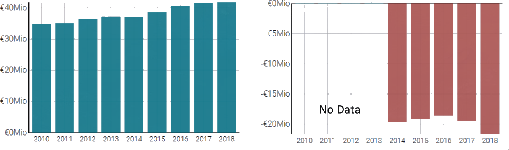{width="11cm"}\

Quelle: https://www.northdata.de/Braunschweiger+Verkehrs-GmbH,+Braunschweig/HRB+654

-   Problem 2: Totalbedingung verletzt

    -   Oft ist noch relativ leicht zu ermitteln, welche Grenzkosten
        eine Produktionsausdehnung verursacht. Setzt man den Preis in
        Höhe der Grenzkosten fest, ist die Marginalbedingung stets
        erfüllt, da nur diejenigen Konsumenten das Gut nutzen, deren
        Zahlungsbereitschaft über dem Preis liegt.

    -   Ob die Totalbedingung (Konsumentenrente $\geq$ Fixkosten)
        erfüllt ist, ist viel schwieriger zu ermitteln. Denn dafür müßte
        man den gesamten Verlauf der Nachfragekurve kennen.

    -   Polit-ökonomisches Problem: Gerade wenn Politiker nicht nur das
        Wohlergehen der Bürger, sondern auch eigene Ziele wie Prestige
        oder Macht verfolgen, kann dies zu „Weiße Elefanten"-Projekten
        führen. Obwohl die Totalbedingung verletzt ist (was aber für
        Außenseiter schwer festzustellen ist), werden gigantische
        Projekte verfolgt, weil deren Realisierung dem Politiker mehr
        Prestige einbringt als viele kleine Projekte (Berliner
        Flughafen, Elbphilharmie...)

-   Problem 3: X-Ineffizienz

    -   Mit X-Ineffizienz bezeichnet man die exzessiv teure Produktion
        in Bürokratien oder staatlichen Unternehmen.

    -   Die ineffiziente Produktion in öffentlichen Unternehmen
        entsteht, weil staatliche Institutionen eine ungenügende
        Unternehmenskontrolle ausüben. Da die Manager des Unternehmens
        wissen, dass sie entstehende Verluste vom Staat ausgeglichen
        bekommen, haben sie weniger Anreize, die Kosten niedrig zu
        halten. Unter Umständen erhöhen sie sogar die Kosten, um so
        ihren privaten Vorteil zu erhöhen (Dienstwagen, Dienstreisen,
        luxuriöse Büros\...).

### X-Ineffizienz in der EBRD {#x-ineffizienz-in-der-ebrd .unnumbered}

„The idea of an Eastern development bank was conceived by a brilliant
French intellectual, Jacques Attali, after the 1989 fall of the Berlin
Wall. Attali \"sold\" the idea to the late President Francois Mitterrand
who, in turn, persuaded Western governments to provide funding. (\...)
In a reported behind-the-scenes trade-off between France and Britain,
the job of president was given to a Frenchman -- Attali himself -- while
London won the prize of its headquarters. (\...) Attali proved to be a
\"high-profile\" president who was widely credited for his perceptive
analyses of the problems facing the former communist countries. But he
and the bank became the focus of unfavorable publicity when it emerged
in 1993 -- three years after its foundation -- that the EBRD had spent
twice as much on its running costs and offices as on loans and

investments to the east. Attali was forced to resign in June 1993 after
revelations of over-spending, including the chartering of private jets
and lavish staff parties." Stuart Parrott, Europe: After A Slow Start,
The EBRD Builds Market Economies, Radio Free Europe/Radio Liberty,
London, 11 November 1997

-   Ergebnis

    -   Fallende Durchschnittskosten können eine allokative
        Rechtfertigung für das Betreiben öffentlicher Unternehmen sein.

    -   Die Tatsache, dass ein Unternehmen tatsächlich vom Staat
        betrieben wird, ist noch kein Indiz dafür, dass diese Aktivität
        allokativ notwendig ist; wie z.B. der Streit zwischen der EU und
        den deutschen Ländern um die Landesbanken zeigt. Oft ist der
        Grund für öffentliche Unternehmen eher politökonomischer Natur
        (Macht, Politiker will Kontrolle über möglichst viele Ressourcen
        \...); mit dieser **positiven** Analyse staatlicher Unternehmen
        werden wir uns hier nur am Rande beschäftigen.

    -   Um staatliche Unternehmen aus allokativen (**normativen**)
        Gründen rechtfertigen zu können, muß man erstens zeigen, dass
        beim Wettbewerb der privaten Firmen ein Marktversagen (fallende
        Durchschnittskosten) vorliegt, und zweitens überlegen, ob die
        Produktion in öffentlichen Unternehmen ein geeignetes
        wirtschaftspolitisches Heilmittel für das Marktversagen
        darstellt.

### Preisobergrenzen {#preisobergrenzen-1 .unnumbered}

-   Im Idealfall würde der Staat den Preis auf Grenzkostenniveau
    festlegen. Allerdings entstünden dem Unternehmen dann Verluste.

-   Der Staat müsste die Verluste durch Zuschüsse, z.B. eine
    Stücksubvention, abdecken. Überlegen Sie, wie hoch diese Subvention
    sein müsste?

-   Oft will man eine solche Bezuschussung aus denselben Gründen wie bei
    der staatlichen Produktion vermeiden (Kosten der Steuererhebung,
    Anreizwirkung auf Kostensenkung\...). Man sucht daher einen
    kostendeckenden Preis.

    {width="6cm"}

    -   Lösung ist hier gegeben durch$\ldots$
        $$D K=G Z B \quad-D I \text { mit } x^{\max } \text { und Preis } p^{\max }$$

    -   Gegenüber der Monopollösung$\ldots$
        $$\mathrm{GK}=\mathrm{GE} \rightarrow \mathrm{L} \text { mit } x^{\operatorname{mon}} \text { und Preis } \mathrm{P}^{\operatorname{mon}}$$

    -   Gegenüber der erstbesten Lösung$\ldots$
        $$G K=G Z B \rightarrow F \text { mit } x^{opt} \text { mit Preis } p=G K$$

-   Die Preisregulierung lässt sich also nur eingeschränkt bei
    natürlichen Monopolen anwenden.

-   Weitere Probleme der Preisregulierung

    -   Ähnlich wie bei der staatlichen Produktion kann hier die
        Produktion verzerrt werden. Wenn der Staat stets die
        Durchschnittskosten als Preis genehmigt, besteht ein Anreiz,
        Gewinne als „Kosten" zu verstecken (z.B. Firmenwagen$\ldots$).

    -   Schwankende Inputkosten: Das Unternehmen sieht sich
        möglicherweise schwankenden Inputkosten (z.B. für Öl oder
        Strom) gegenüber, ist aber auf dem Outputmarkt preisreguliert.
        Wenn bei anfänglichen Nullgewinnen die Grenzkosten z.B. infolge
        eines Ölpreisschocks steigen, kann die Firma die erhöhten Kosten
        wegen der Preisregulierung nicht an die Kunden weitergeben. Die
        Folgen schwankender Inputkosten bei preisregulierten Unternehmen
        waren 2001 in Kalifornien zu beobachten.

    ### Hunderttausende in Kalifornien ohne Strom {#hunderttausende-in-kalifornien-ohne-strom .unnumbered}

    Die seit Monaten andauernde Stromkrise im US-Bundesstaat Kalifornien
    hat sich verschärft. Zum ersten Mal mussten die Energieunternehmen
    gezielt Strom abschalten. Teile von San Francisco, Sacramento, San
    Jose und dem Silicon Valley waren für Stunden vom Strom
    abgeschnitten. Größere Probleme gab es aber nicht. Vor allem der
    Norden Kaliforniens war betroffen. Im Rotationsverfahren wurde für
    jeweils eine Stunde in bestimmten Bezirken der Strom abgeschaltet,
    um Energie zu sparen. Nur Los Angeles war von den Abschaltungen
    nicht betroffen. Die Stadt hat eigene Energieversorger. In den
    vergangenen Wochen spitzte sich die Energiekrise weiter zu.
    Zahlreiche Betreiber stehen kurz vor der Pleite. Energieversorger
    außerhalb des Staates verkaufen aus diesem Grund keinen Strom mehr
    an die vor dem Konkurs stehenden Unternehmen. Gestern nun stand zum
    ersten Mal nicht genügend Energie zur Verfügung. Hintergrund der
    Energiekrise ist die misslungene Liberalisierung des Strommarktes.
    Das Deregulierungsgesetz von 1996 sollte durch die Freigabe des
    Marktes zu niedrigeren Preisen führen. Die staatlichen Unternehmen
    mussten seit 1998 ihren Strom auf dem freien Markt kaufen. Durch die
    explodierenden Energiepreise verursachte dieses Prinzip Kosten in
    Milliardenhöhe. Zahlreiche Kraftwerke mussten verkauft werden, da
    die Energieunternehmen wegen festgelegter Höchstpreise die hohen
    Kosten nicht an die Verbraucher weitergeben konnten. n-tv
    online, 19. Januar 2001

### Subventionierung {#subventionierung-1 .unnumbered}

-   Die Subventionslösung lässt sich -- im Gegensatz zur
    Preisregulierung -- problemlos auf den Fall des natürlichen Monopols
    übertragen.

-   Die folgende Graphik zeigt eine Subvention, die den natürlichen
    Monopolisten zur optimalen Outputmenge induziert. (Abgesehen von der
    DK-Kurve ist die Graphik identisch mit der Abbildung in Kapitel
    3.2.)

    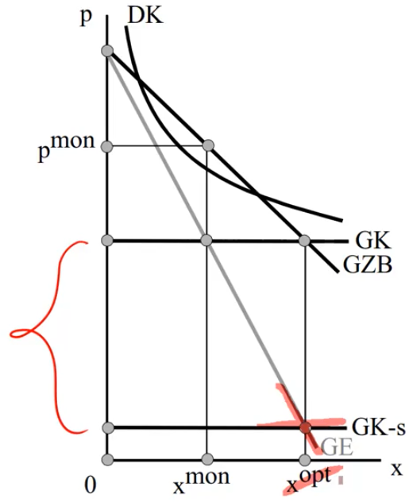{width="6cm"}

### Exkurs: Das Double Marginalization Problem in der Industrieökonomik {#exkurs-das-double-marginalization-problem-in-der-industrieökonomik .unnumbered}

-   Hintereinandergeschaltete (vertikale) Monopole treten häufig auf.
    Beispiele: Mautstationen entlang des Rheins im 13. Jahrhundert,
    Bestechungszahlungen für den Erwerb von Importoder Exportlizenzen,
    etc.)

-   Das Problem kann leicht anhand eines einfachen Beispiels aus der
    Industrieökonomik erläutert werden, bei dem ein Produkt an den
    Endkunden durch einen Monopolisten (Retailer) verkauft wird, welches
    wiederum von einem Monopolisten bezogen werden muss (Wholesaler).

-   Nehmen wir zunächst an, dass das Gut zu konstanten Grenzkosten
    produziert bzw. eingekauft wird.

-   In einem integrierten Monopol ist das Gewinnmaximum durch
    $GE^{ret} =GK$ gegeben, die Menge $x^{mon}$ wird zum Preis $p^{mon}$
    verkauft. Der Wohlfahrtsverlust im Vergleich zu sozial optimalen
    Lösung beträgt ABC.\

    {width="8cm"}

-   Nun nehmen wird an, dass der Retailer das Produkt vom Wholesaler,
    der ebenfalls Monopolmacht besitzt, beziehen muss.

-   Der Wholesaler weiß, dass der Retailer nach der Regel $GE^{ret} =GK$
    seinen Gewinn maximiert, sodass die Grenzerlöse des Retailers die
    Nachfragefunktion des Wholesalers ist; $GE^{ret} =GZB^{ws}$ .

-   Die Grenzerlöse des Wholesaler sind damit durch $GE^{ws}$ gegeben.
    Das Gewinnmaximum des Wholesalers ergibt sich damit durch
    $GE^{ws} =GK$ (Punkt D in Abbildung). Der gewinnmaximale
    Verkaufspreis aus Sicht des Wholesaler ist $p^{ws}$ und es wird die
    Menge $x^{dm}$ abgesetzt.

-   Der Einkaufspreis $p^{ws}$ entspricht nun den Grenzkosten des
    Retailer $GK^{ret}$ .

-   Das Gewinnmaximum des retailers ergibt sich wiederum aus
    $GK^{ret} =GE^{ret}$ (Punkt E).

-   Die Nachfragen müssen den Preis $p^{dm}$ bezahlen.

-   Der Wohlfahrtsverlust steigt auf FCD. Implikation: Der
    Wohlfahrtsverlust steigt in der Zahl der vertikal angeordneten
    Monopolisten. Lösungsansätze: Vertikale Integration (Fusion oder
    Kartellbildung); Franchise-Gebühr; nicht-lineare Preissetzung
    (Stückpreis abhängig von Verkaufsmenge); Preisbindung der zweiten
    Hand

# Öffentliche Güter

-   Kenneth S. Chan, Rob Godby, Stuart Mestelman und R. Andrew Muller,
    „Crowding-out Voluntary Contributions to Public Goods", Journal of
    Economic Behavior and Organization 48, 2002, 305-317.

-   Giacomo Corneo, Öffentliche Finanzen: Ausgabenpolitik, Mohr Siebeck,
    Tübingen, 2003, Kap. II und XIII.

-   Jean Hindricks und Gareth D. Myles. Intermediate Public Economics,
    MIT Press, Cambridge, MA, 2006, Kapitel 5.

-   T. Nicolaus Tideman und Gordon Tullock, „A New and Superior Process
    for Making Social Choices", Journal of Political Economy 84, 1976,
    1145-1159.

-   Dietmar Wellisch, Finanzwissenschaft I -- Rechtfertigung der
    Staatstätigkeit, Vahlen, München, 1999, Kapitel 3.1 und 5.

## Eine Klassifikation der Güter

-   Bei der Diskussion perfekter Märkte sind wir implizit davon
    ausgegangen, dass der Konsum eines Gutes nur dem Käufer zugute
    kommt.

    -   Wenn ein Konsument einen Apfel kauft (und isst), dann kommt nur
        er in den Genuss des Apfels; kein anderer Konsument hat einen
        Vorteil aus dem Konsum dieses Apfels.

    -   Diese Eigenschaft eines Gutes bezeichnet man als Rivalität: „Ein
        Gut besitzt die Eigenschaft der Rivalität (im Konsum), wenn der
        Konsum des Gutes durch die gleichzeitige Nutzung dieses Gutes
        durch einen anderen Konsumenten beeinträchtigt wird."
        (Wellisch, S. 56)

-   Dies ist nicht bei allen Gütern so. Viele Güter weisen
    Nicht-Rivalität im Konsum auf.

    -   Beispiel: Deich\
        → dahinter sind alle gleichmäßig geschützt

    -   Andere Beispiele für nicht-rivale Güter:\
        → Landesverteidigung, Radio, Sonnenlich

    -   Anders formuliert: Bei Gütern mit Nicht-Rivalität kann/muss
        jeder die gleiche Menge oder Qualität konsumieren; z.B. beim
        Deich kann nicht ein Haushalt einen größeren Schutz (höheren
        Deich) konsumieren als ein anderer Haushalt.

-   Neben dem Kriterium der Rivalität verwendet man das Kriterium der
    **Ausschließbarkeit** zur Klassifizierung von Gütern.

    -   „Ein Gut besitzt die Eigenschaft der Ausschließbarkeit (im
        Konsum), wenn ein potentieller Nutzer von dem Konsum des Gutes
        ausgeschlossen werden kann." (Wellisch, S. 55)

    -   Der Preis ist ein Ausschluß-Mechanismus. Nur wer den Preis für
        einen Apfel bezahlt, kann das Gut „Apfel" konsumieren. Den Preis
        als Ausschlußmechanismus hatten wir in Kapitel 1 untersucht.

-   Bei einigen Gütern wird kein Ausschluß praktiziert. Das kann daran
    liegen, dass der Ausschluss nicht möglich, bzw. zu teuer wäre (z.B.
    saubere Luft, Landesverteidigung, Schutz vor Wasser durch einen
    Deich) oder dass ein Ausschluss einfach nicht durchgesetzt wird
    (Schloßpark, kunsthistorisch interessante Kirchen). Dazu später
    mehr.

    ### Ausschluss bei der Feuerwehr {#ausschluss-bei-der-feuerwehr .unnumbered}

    Am 29. September entdeckte Cranick ein Feuer in seinem Garten,
    sofort rief er die Feuerwehr. Doch der alte Mann bekam keine
    Antwort. Verzweifelt griff Cranick zum Gartenschlauch. Erst als die
    Flammen nach mehreren Stunden auf das Grundstück des Nachbarn
    übergriffen, rückte ein Löschtrupp an. Cranicks Zuhause war da schon
    niedergebrannt. Die Feuerwehr rechtfertigte sich so: Cranick habe
    seine Gebühren nicht gezahlt und habe daher keinen Anspruch auf ihre
    Dienste. Moritz Koch, "Flammende Argumente", Süddeutsche Zeitung Nr.
    232, 7.10.2010, S.17

-   Güter-Klassifikation\

      -- ------ ------------------- --------------------------- -- --
                Ausschließbarkeit                                  
                Ja                  Nein                           
         Ja     Private Güter       Unreine öffentliche Güter      
         Nein   Mautgüter           Reine öffentliche Güter        
      -- ------ ------------------- --------------------------- -- --

    Oft fällt ein Gut nicht generell in eine der vier Kategorien,
    sondern es hängt von den Umständen ab, um welche Art von Gut es sich
    handelt.\

      Beispiel: Straße Eine Straße ist ein$\ldots$   $\ldots$, wenn sie$\ldots$ $\ldots$ ist.
      ---------------------------------------------- ------------------------------------------
      reines öffentliches Gut                        breit genug und konstenlos nutzbar
      Mautgut                                        breit genug, aber gebührepflichtig
      unreines öffentliches Gut (Allmendegut)[^6]    kostenfrei, aber zu schmal
      privates Gut                                   kostenpflichtig und zu schmal

## Optimale Nutzung und Bereitstellung öffentlicher Güter

-   Wir wenden uns nun zunächst den normativen Fragen zu. Erstens, wie
    sollte ein bereits produziertes öffentliches Gut genutzt werden?
    Zweitens, sollte ein öffentliches Gut überhaupt bereitgestellt
    werden und in welcher Qualität?

-   Danach wollen wir untersuchen, warum eine Politik des Laissez-faire
    hier nicht funktioniert (Kapitel 4.3) und wie der Staat die
    geeignete Bereitstellung öffentlicher Güter erreichen kann (Kapitel 4.4).

### Die effiziente Nutzung eines reinen öffentlichen Gutes {#die-effiziente-nutzung-eines-reinen-öffentlichen-gutes .unnumbered}

-   Eine neue Brücke über die Donau ist fertiggestellt worden. Die
    Kapazität dieser Brücke (Zahl der Fahrspuren) ist hinreichend groß,
    so dass es keine Rivalität in der Nutzung zwischen Autofahrern gibt.

-   Die Graphik zeigt die Nachfrage x der potentiellen Nutzer der
    Brücke.

-   Wie viele Fahrzeuge sollten die Brücke befahren, wenn die Wohlfahrt
    maximiert werden soll?\

    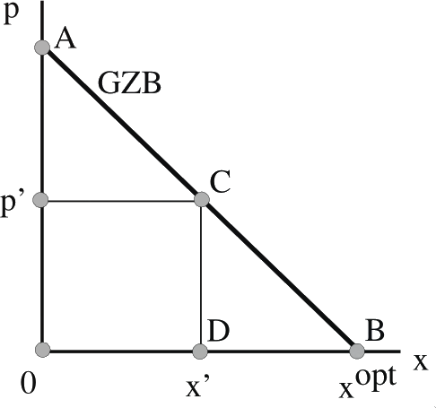{width="6cm"}

-   Wie hoch sind die Grenzkosten einer zusätzlichen Nutzung des
    öffentlichen Gutes?\
    → Null, kostet nicht

-   Wie weit sollte die Nutzung ausgedehnt werden?\
    → Solagen $GZB \leq 0 = GK → x^{opt}$

-   Wie hoch ist die maximal mögliche Rente aus der Nutzung der Brücke?\
    → $\Delta 0AB$

-   Für die Nutzung der Brücke sollte kein (positiver) Preis verlangt
    werden. Würde z.B. eine Mautgebühr von $p´$ erhoben, $\ldots$\
    → so werden nur noch $x' < x^{opt}$ Nutzer die Brücke passieren.
    Alle weitern nutzer werden abgehlaten → $WFV \quad \Delta CBD$

-   Mautgüter (so wie hier die Brücke) sollten durch allgemeine Steuern
    finanziert werden, um den Nutzungspreis auf Null zu senken
    ($\rightarrow$ reine öffentliche Güter)

-   Ergebnis: Liegt keine Rivalität in der Nutzung vor, sollte auch kein
    Ausschluß betrieben werden.

### Die effiziente Bereitstellung eines reinen öffentlichen Gutes {#die-effiziente-bereitstellung-eines-reinen-öffentlichen-gutes .unnumbered}

-   Ehe wir uns der (schwierigeren) Frage der optimalen Qualität eines
    öffentlichen Gutes zuwenden, betrachten wir zunächst den einfachen
    Fall einer **diskreten Entscheidung**: Entweder das öffentliche Gut
    wird bereitgestellt oder nicht.

-   Beispiel: Donaubrücke zwischen Buda und Pest

-   Das Diagramm zeigt die aggregierte Grenzzahlungsbereitschaften der
    Bewohner von Buda und Pest für die Nutzung der Elbbrücke.

    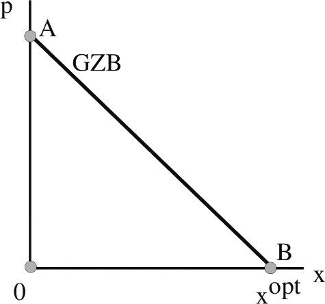{width="6cm"}

-   Wann sollte die Brücke gebaut werden?\
    → Falls Baukosten \< Rente $\Delta 0AB$

-   Wenn die Summe der Zahlungsbereitschaften die Kosten übersteigt, so
    existiert eine Kostenaufteilung, bei der alle Nutzer durch die
    Bereitstellung des öffentlichen Gutes besser gestellt werden können
    (Pareto-Verbesserung). \[zum Beispiel: Rente Buda = 7, Rente Pest =
    5, Kosten = 10 und Kosten 50:50 oder 70:50 verteilen\]

-   Ergebnis:\
    Ein diskretes öffentliches Gut sollte genau dann bereitgestellt
    werden, wenn die Kosten kleiner sind als die Summe der
    Zahlungsbereitschaften aller Nutzer.

-   Nun wenden wir uns der allgemeineren Frage zu, in welcher **Qualität
    oder Menge** ein öffentliches Gut angeboten werden sollte. Im
    Gegensatz zum vorherigen Fall betrachten wir nun nicht die diskrete
    Entscheidung, ob das öffentliche Gut angeboten werden sollte,
    sondern die Entscheidung, in welchem Umfang ein **stetiges
    öffentliches** Gut bereitgestellt werden sollte.

-   Beispiele

    -   Wie viele Spuren soll die Brücke zwischen Buda und Pest haben?

    -   Wie groß soll ein öffentlicher Park gebaut werden?

    -   Wie sauber soll die Luft sein (oder umgekehrt: wie viel
        Verschmutzung soll toleriert werden)?

-   Betrachten wir den allgemeinen Fall einer Ökonomie, die mit ihrem
    Ressourcenbestand ein privates Gut mit der Menge $x$ und ein
    öffentliches Gut der Größe G erstellen kann. Die Transformationsfunktion $H(x;G)=0$ beschreibt die effizienten
    Produktionsmöglichkeiten.

-   Es gibt zwei Individuen $(i = A, B)$ mit der Nutzenfunktion
    $U^{i}\left(x_{i} ; G\right)$ . Beim privaten Gut müssen sich die
    beiden Haushalte die produzierte Menge teilen
    $\left(x=x_{A}+x_{B}\right)$ , bei dem öffentlichen Gut können sie
    wegen der Nicht-Rivalität dagegen dieselbe Menge G konsumieren (was
    nicht heißt, dass sie die bereitgestellte Menge gleichermaßen
    schätzen).

-   Der benevolente, soziale Planer maximiert den Nutzen eines
    Individuums bei gegebenem Nutzen des anderen Individuums
    ($\lambda_1$) und unter Beachtung von $H(x;G)=0$ ($\lambda_2$) und
    $x=x_{A}+x_{B}\left(\lambda_{3}\right)$
    $$\max _{x_{a}, x_{B}, x, G} \quad L=U^{A}\left(x_{A} ; G\right)+\lambda_{1} \cdot\left[U^{B}\left(x_{B} ; G\right)-\bar{U}^{B}\right]+\lambda_{2} \cdot H(x ; G)+\lambda_{3} \cdot\left[x-x_{A}-x_{B}\right]$$

-   Die Bedingungen erster Ordnung lauten: $$\begin{aligned}
    {3}
            &\frac{\partial L}{\partial G}&&=U_{G}^{A}+\lambda_{1} U_{G}^{B}+\lambda_{2} \cdot H_{G}&&=0 \\
            & \frac{\partial L}{\partial x_{A}}&&=U_{X_{A}}^{A}+\lambda_{3}(-1)&&=0 \\
            & \frac{\partial L}{\partial x_{B}}&&=\lambda_{1} \cdot U_{x_{B}}^{B}+\lambda_{3}(-1)&&=0 \\
            & \frac{\partial L}{\partial x}&&=\lambda_{2} \cdot H_{x}+\lambda_{3}&&=0
        \end{aligned}$$

    und die drei Ableitungen nach $\lambda_1$, $\lambda_2$ und
    $\lambda_3$ liefern die ursprünglichen Nebenbedingungen
    $$U^{B}\left(x-x_{A} ; G\right)-\bar{U}^{B}=0, \quad x=x_{A}+x_{B} \quad \text { und } \quad H(x ; G)=0$$

-   Aus (4.2) und (4.3) bekommen wir
    $$\lambda_{1}=\frac{U_{x_{A}}^{A}}{U_{X_{B}}^{B}}$$ Einsetzen in
    (4.1) ergibt:
    $$U_{G}^{A}+\left(\frac{U_{X} A}{U_{x_{B}}^{B}}\right) U_{G}^{B}+\lambda_{2} \cdot H_{G}=0$$
    (4.1')

-   Einsetzen von (4.2) in (4.4) ergibt
    $$\lambda_{2} \cdot H_{x}+U_{x_{A}}^{A}=0 \quad \Leftrightarrow \quad \lambda_{2}=-\frac{U_{x_{A}}^{A}}{H_{x}}$$

-   Einsetzen in (4.1') und Division durch A U liefert:
    $$0=U_{G}^{A}+\frac{U_{x_{A}}^{A}}{U_{x_{B}}^{B}} U_{G}^{B}-\frac{U_{x_{A}}^{A}}{H_{x}} \cdot H_{G} \Leftrightarrow  \frac{U_{G}^{A}}{U_{x_{A}}^{A}}+\frac{U_{G}^{B}}{U_{x_{B}}^{B}}=\frac{H_{G}}{H_{x}}$$

-   Auf der linken Seite
    $$\frac{U_{G}}{U_{x_{A}}}=G R S_{A} \longrightarrow \sum_{i=A, B} \text { GRS }_{i}$$

-   Auf der rechten Seite
    $$GRT \quad \rightarrow \text{Grenrate d. Transformation}$$

-   **Samuelson-Regel** für die optimale Bereitstellung öffentlicher
    Güter: $\displaystyle\Sigma \mathrm{GRS}=\mathrm{GRT}$

-   Die Summe der GRS gibt an, wie viel alle Individuen zusammen bereit
    sind, an dem privaten Gut aufzugeben, um eine weitere marginale
    Einheit des öffentlichen Gutes zu bekommen (das sie ja nicht-rival
    konsumieren können). Die GRT gibt an, auf wie viel Produktion des
    privaten Gutes man verzichten muss, um eine marginale Einheit des
    öffentlichen Gutes mehr zu produzieren. (Das sind die
    Opportunitätskosten.)

-   Vergleichen Sie die Optimalitätsbedingung mit der Optimalität bei
    privaten Gütern in Kapitel 2. $$G R S_{A}=G R S_{B}=G R T$$

-   Intuitiv etwas eingängiger wird die Samuelson-Regel, wenn wir die
    Vorund Nachteile der Produktionsausdehnung des öffentlichen
    Gutes in den vertrauten (monetären) Größen der Grenzzahlungsbereitschaft
    und der Grenzkosten ausdrücken:

    -   Sei G die Größe des öffentlichen Parks in $m^2$.

    -   Die Kosten, einen zusätzlichen Quadratmeter des Parks zu bauen,
        sind konstant (konstante Grenzkosten der Bereitstellung).
        $\quad = \bar{c}$

    -   Wenn wir von Einkommenseffekten abstrahieren (d.h. durch
        Investition in öff. Gut ist weniger Geld für den Konsum privater
        Güter zur Verfügung), können wir die Präferenzen der potentiellen
        Parknutzer durch Grenzzahlungsbereitschaften (GZB) und die
        Nachteile der Produktionsausdehnung durch Grenzkosten (GK) --
        also in Geldeinheiten -- ausdrücken.

-   Die folgende Graphik illustriert die Entscheidung über die optimale
    Größe des öffentlichen Gutes:\

    {width="6cm"}

    -   $GK$ gibt die konstanten Grenzkosten der Bereitstellung an.

    -   $\Sigma GZB$ misst die Summe der Grenzzahlungsbereitschaften der
        beiden Nutzer. Dazu aggregiert man vertikal die beiden
        Grenzzahlungsbereitschaftskurven, die jeweils angeben, wieviel
        ein Nutzer für eine Ausweitung des Parks um eine marginale
        Einheit zu zahlen bereit wäre. Inhaltlich: wieviel ist die
        Gemeinschaft als Einzelperson bereit für den nächsten $m^2$ zu
        geben?

-   Wir können nun das Kalkül, das wir bei der Bereitstellung des
    diskreten öffentlichen Gutes angestellt haben, nun auf das stetige
    öffentliche Gut anwenden, indem wir überlegen, ob jeweils eine
    weitere marginale Einheit bereitgestellt werden sollte.

    - Sollte der erste Quadratmeter des Parks bereitgestellt werden (genauer:
      die erste marginale Einheit)?\
        $$\text{Ja, falls} \quad GK(0) < \sum GZB(0)$$
    
    — Diese Frage können wir nun auch bei der nächsten marginalen Einheit stellen. Und bei der
      nächsten... und der nächsten...
    
    — Ab wann ist eine weitere Vergrößerung des Parks nicht mehr sinnvoll?
    
      $$\text { Sobuld } \mathrm{Gk}>\sum \mathrm{C}_{2} \mathrm{~B} Sobuld \mathrm{Gk}>\sum \mathrm{C}_{2} \mathrm{~B}$$
    
    — Die optimale Größe des öffentlichen Gutes beträgt $G^{opt}$ ; die volkswirtschaftliche Rente, aus
      der Bereitstellung des Gutes lässt sich am Dreieck ABC ablesen.

-   Ergebnis (Samuelson-Regel): Die Menge eines öffentlichen Gutes
    sollte solange ausgedehnt werden, bis die Summe der 
    Grenzzahlungsbereitschaften für das öffentliche Gut gleich den
    Grenzkosten der letzten bereitgestellten Einheit ist:

    $$\sum GZB = GK$$

-   Die Samuelson-Regel beschreibt nun also normative Bereitstellung
    eines öffentlichen Gutes. Diesen SOLL-Zustand werden wir nächsten
    Kapitel mit der tatsächlichen Bereitstellung des öffentlichen
    Gutes (IST) vergleichen und unsere Schlussfolgerungen daraus ziehen.

### Samuelson, Paul Anthony {#samuelson-paul-anthony .unnumbered}
{width="6cm"}

\* 15. Mai 1915, Gary, Ind., U.S.\
† 13. Dezember 2009 in Belmont\

>American economist awarded the Nobel Prize for Economics in 1970 for his
>fundamental contributions to nearly all branches of economic theory.
>Samuelson was educated at the University of Chicago (B.A., 1935) and at
>Harvard, where he obtained his Ph.D. in 1941. He was professor of
>economics at the Massachusetts Institute of Technology from 1940.
>Samuelson also served as a government economic adviser on several
>occasions. Samuelson was considered an economic theorist of outstanding
>calibre. He made contributions to many areas of economic theory
>through the employment of a powerful mathematical technique, using it
>essentially as a puzzle-solving device. Samuelson's Foundations of
>Economic Analysis (1947) provides the foundation for a basic theme of
>his work, the universal nature of consumer behaviour as the key to
>economic theory. Samuelson studied such diverse fields as the dynamics
>and stability of economic systems, the incorporation of the theory of
>international trade into that of general economic equilibrium, the
>analysis of public goods, capital theory, welfare economics, and public
>expenditure. Of particular influence has been his mathematical
>formulation of the interaction of multiplier and accelerator effects
>and, in consumption analysis, his development of the theory of
>revealed preference. [Encyclopaedia Britannica](http://www.britannica.com)

## Marktversagen bei reinen öffentlichen Gütern

-   Kann man wie bei privaten Gütern darauf hoffen, dass ein
    Laissez-faire des Staates zur privaten Bereitstellung öffentlicher
    Güter im effizienten Umfang führt? Nein, wegen des
    Trittbrettfahrer-Problems führt die private Bereitstellung zu einer
    Unterversorgung mit öffentlichen Gütern.

-   Wie tritt hier das Trittbrettfahrer-Problem in Erscheinung?

### Ein einfaches Beispiel {#ein-einfaches-beispiel .unnumbered}

-   Kehren wir zur Illustration des Problems zu unserem Beispiel der
    Donaubrücke zwischen Buda und Pest zurück.

-   Die beiden Städte überlegen unabhängig voneinander, ob sie eine
    Brücke über die Donau errichten sollen. Da die Autofahrer in
    beiden Gemeinden gleichermaßen von der Brücke profitieren würden,
    handelt es sich um ein öffentliches Gut.

-   Der Vorteil der Bürger jeder Gemeinde aus der neuen Brücke beträgt 3
    Mio. Euro.

-   Die Kosten für die Errichtung der Brücke betragen 4 Mio. Euro.

-   Sollte die Brücke aus normativer Sicht gebaut werden?\
    → Ja, da der Nutzen = $2 \times 3$ Mio € \> 4 Mio € = Baukosten

-   Wird das öffentliche Gut Elbbrücke nun tatsächlich bereitgestellt,
    wenn jede Gemeinde nur im Interesse ihrer Bürger entscheidet?

-   Die nachfolgende Matrix zeigt die Auszahlungen der beiden Spieler,
    wenn beide Städte gleichzeitig darüber abstimmen, ob sie die
    Brücke bauen wollen. Wenn beide Städte dafür stimmen, teilen sie
    sich die Kosten; stimmt nur eine Stadt dafür, muss sie auch die
    Kosten alleine tragen. Die erste Zahl in jeder Zelle gibt jeweils
    die Auszahlung für Buda an, die zweite jene von Pest.

      -- ------ ------ ------ -- --
                Pest             
                Ja     Nein      
         Ja     1;1    -1;3      
         Nein   3;-1   0;0       
      -- ------ ------ ------ -- --

-   Wo liegt hier das Nash-Gleichgewicht?

-   Egal wie sich die jeweils andere Gemeinde votiert, die beste
    Entscheidung ist stets, mit „Nein" zu stimmen (dominante Strategie).

-   Bei der privaten Bereitstellung des öffentlichen Gutes ist eine
    typische Gefangenendilemma-Situation aufgetreten. Kollektiv rational
    wäre es, das Feld links oben zu wählen (Brücke bauen), jeder
    einzelne Spieler hat aber einen Anreiz, das Feld rechts unten
    (Brücke wird nicht gebaut) zu wählen. Kollektive und individuelle
    Rationalität fallen auseinander. Private Bereitstellung stetiger
    öffentlicher Güter

-   Betrachten wir nun den allgemeinen Fall, bei dem mehrere Individuen
    zur Bereitstellung eines stetigen öffentlichen Gutes beitragen
    \[siehe Chan et al. (2002)\]

-   Notation\

      ---------- ------------------------------------------------------------
      -- $G$     Privat bereitgestellte Menge des öffentlichen Gutes
      -- $g_i$   (freiwilliger) Beitrag von Person $i$ zum öffentlichen Gut
      -- $x_i$   Konsum des privaten Gutes durch Person $i$
      -- $w_i$   Einkommen von Person $i$
      ---------- ------------------------------------------------------------

-   Der Haushalt maximiert den Nutzen
    $$\max _{x_{i}, g_{i}} u_{i}\left(x_{i} ; G\right)=x_{i} \cdot G$$
    unter den Nebenbedingungen:

    -   $w_{i}=x_{i}+g_{i} \quad$ Budgetgeschränkung

    -   $G=g_{i}+G_{-i}, \quad \text { wobei } G_{-i}=\text { Beiträge aller anderen außer }
        i \quad \displaystyle \sum_{j=1 \atop j \neq i}^{n} g_{i}=G_{-i}$
    
    -   $g_{i} \geq 0 \quad \text { [Nicht-Negativitäts-Beschränkung] }$

-   Bei $n \geq 2$ identischen Personen beträgt die sozial optimale
    Größe des öffentlichen Gutes $G^{o p t}=n \cdot w_{i} / 2$=
    (**SOLL**). Denn: alle leisten denselben Beitrag und der soziale
    Planer maximiert\

	$$\begin{array}{l}\\\text { entweder Lagrange mit } L=x \cdot G^{\prime}+\lambda \cdot\left(w-x-\frac{G}{n}\right) \\\\\text { oder } u=x \cdot G \text { mit } x=w-\frac{G}{n} \\\\\frac{\partial u}{\partial G}=\frac{d}{d G}\left(w-\frac{G}{n}\right) \cdot G=w-2 \cdot \frac{G}{n}=0 \quad \Leftrightarrow \quad G=\frac{n \cdot w}{2}\\\end{array} $$

    Bei privater Bereitstellung (**IST**) maximiert die einzelne Person
    ihren Nutzen
    $$u_{i}=x_{i} \cdot G=\left(w_{i}-g_{i}\right) \cdot\left(G_{-i}+g_{i}\right)$$
    über ihren persönlichen Beitrag $g_i$ und erhält als
    Reaktionsfunktion $$\begin{aligned}
        \frac{\partial u_i}{\partial g_i} &= -G_{-i} + g) + (w_i -g_i) = w_i - G_{-i} - 2g = 0 \\
        \Rightarrow g_i &= \frac{w_i - G_{-i}}{2} \text{bzw} \quad g_i = max\left\{\frac{w_i-G_{-i}}{2};0\right\}\end{aligned}$$

-   Für hinreichend großes $G_{i}$ bzw. niedriges $w_i$ greift die
    Nicht-Negativitätsbeschränkung $g_i \geq 0$ und die Person trägt
    nichts zum öffentlichen Gut bei.

-   Im symmetrischen Gleichgewicht trägt jede Person
    $$g_{i}^{\text {priv}}=\frac{w_{i}}{n+1}$$ zum öffentlichen Gut bei.

-   Ergebnis

    -   Der individuelle Beitrag nimmt mit der Gruppengröße n ab.

    -   Die gleichgewichtige Größe des öffentlichen Gutes nimmt mit der
        Gruppengröße zu. $$G^{priv}=\frac{n}{n+1} \cdot w_{i}$$

    -   Trotzdem ist Gpriv (IST) im Vergleich zu Gopt (SOLL) deutlich zu
        gering und es wird eine zu kleine Menge des öffentlichen Gutes
        bereitgestellt.

### Crowding Out {#crowding-out .unnumbered}

-   Wie wirkt sich nun die Bereitstellung öffentlicher Güter durch den
    Staat auf die private Bereitstellung aus, wenn zur Finanzierung
    neben der freiwilligen Beteiligung auch eine verpflichtende
    Steuerabgabe hinzukommt?

-   Notation

      --------------------------------------------------------------------------------------------------------- --
      -- $t_i \quad$ Steuer für Person $i$                                                    
      -- $T_{-i} \quad$ Steuer auf alle anderen Personen $\sum_{j=1 \atop j = i}^{n} t_{j}$
      -- $T \quad$ Steueraufkommen = staatlich bereitgestellte Menge des öffentlichen Gutes $T=T_{-t}+t_{i}$ 
      --------------------------------------------------------------------------------------------------------- --

-   Der einzelne Haushalt nimmt die Steuer als gegeben und maximiert:

    $$U_{i}=x_{i} \cdot(G+T)=\left(w_{i}-g_{i}-t_{i}\right)\left(G_{-i}+g_{i}+T_{-i}+t_{i}\right)$$

    durch Wahl des privaten Beitrags $g_i$.
    $$\frac{\partial v_{i}}{\partial g_{1}}=\cdot = 0 \quad \Rightarrow \quad g_{i}=\frac{w_{i}-G_{-i}-T_{-i}}{2}-t_{i}$$

-   Als Reaktionsfunktion erhält man und als gleichgewichtigen Beitrag
    $$g_{i}=\max \left\{\frac{\omega_{i}-G_{i i}-T_{i}}{2}-t_{i} ; 0\right\}$$
    $G_{-i}=(n-1) \cdot g ; \quad \text { und } \quad T-i=(n-1) \cdot t_{i}$
    im **symmetrischen** Gleichgewicht (IST-Zustand)\
    $$g_{1}^{\text {crowd }}=\ldots=\frac{\omega_{i}}{n+1}-t_{i}=g_{i}^{p r i v}-t_{i} g_{1}^{\text {crowd }}=\ldots=\frac{\omega_{i}}{n+1}-t_{i}=g_{i}^{p r i v}-t_{i}$$

-   So lange die privaten Beiträge noch positiv sind, führt eine
    Erhöhung der staatlichen Bereitstellung zu einem vollständigen
    Crowding Out bei der privaten Bereitstellung
    $\left(\partial g_{i}^{\text {crowd}} / \partial t_{i}=-1\right)$\
    → Staat verdrängt nur private Investitionen in öffentliche Güter

### Warm Glow {#warm-glow .unnumbered}

-   In Experimenten und empirischen Studien hat man beobachtet, dass das
    oben beschriebene vollständige Crowding Out häufig nicht zustande
    kommt. Wenn die öffentliche Bereitstellung erhöht wird, reduziert
    sich die private Bereitstellung zwar, aber um weniger als durch die
    öffentliche Bereitstellung hinzukam.

-   Eine Erklärung liefert der „Warm Glow"-Ansatz.[^7] Die Individuen
    ziehen nicht nur Nutzen aus dem öffentlichen Gut, sondern steigern
    ihren Nutzen auch, weil sie durch die individuelle Bereitstellung
    etwas Gutes getan haben. Beispiel: Spende für den guten Zweck.

-   Notation

    -   $f(g_i) \quad$ „Warm Glow"-Nutzen $f^{\prime}>0, f^{\prime \prime}<0, f(0)=0$

-   Der einzelne Haushalt maximiert nun durch Wahl des privaten Beitrags
    $g_i$. $$\begin{aligned}
     u_{i} &=x_{i} \cdot(G+T)+f\left(g_{i}\right)=\\ &=\left(w_{i}-g_{i}-t_{i}\right) \cdot\left(G_{-i}+g_{i}+T_{-i}+t_{i}\right)+f\left(g_{i}\right) \end{aligned}$$

-   Im symmetrischen Gleichgewicht muss gelten:
    $$g_{i}^{w a r m}-\frac{w_{i}}{n+1}+t_{i}-\frac{f^{\prime}\left(g_{i}^{w a r m}\right)}{n+1}=0$$

-   Wie stark ist nun der Crowding Out-Effekt, wenn der Staat eine
    weitere Einheit des öffentlichen Gutes über Steuerfinanzierung
    bereitstellt?
    $$\frac{d g_{i}^{\text {warm}}}{d t_{i}}=-\frac{1}{1-\frac{f^{\prime \prime}\left(g_{i}\right)}{n+1}}$$
    Der Ausdruck ist negativ, aber betragsmäßig kleiner als 1.

-   Durch den „Warm Glow"-Effekt kommt es zwar immer noch zum
    (partiellen) Crowding Out der privaten Bereitstellung, der
    Verdrängungseffekt ist aber kleiner als die zusätzliche Menge an
    öffentlicher Bereitstellung. In Summe würde also mehr öff. Gut
    bereitgestellt, als das konservative Modell auf den Folien (4-27
    und 4-28) voraussagt.

### Einkommensumverteilung {#einkommensumverteilung .unnumbered}

-   Ändert sich die private Bereitstellung öffentlicher Güter, wenn wir
    die Einkommensverteilung der Haushalte verändern?

-   Dazu kehren wir zum Grundmodell (Private Bereitstellung öffentlicher
    Güter) zurück und betrachten nur innere Lösungen $(g > 0)$.

-   Wir geben Haushalt $i$ zusätzliches Einkommen in Höhe $\Delta w_i$
    und verringern das Einkommen der übrigen Akteure um $\Delta _i$
    (Umverteilung).

-   Ergebnis:\
    Im Gleichgewicht erhöht i seine Ausgaben für das öffentliche Gut um
    i w und alle übrigen reduzieren die Ausgaben um $\Delta w_i$ . Die
    Größe des öffentlichen Gutes wird von der Einkommensumverteilung
    nicht verändert.

-   Implikationen\

    -   Solange die Gruppe der Haushalte mit positivem Beitrag
        unverändert bleibt, haben Einkommensumverteilungen keine
        Auswirkung auf die Größe des öffentlichen Gutes.

### Andere Anwendungsgebiete {#andere-anwendungsgebiete .unnumbered}

-   Private Bereitstellung öffentlicher Güter gab es auch in der Antike.

-   Beispiel 1: Feuerwehren im Römischen Reich

    ### Feuerwehren im Römischen Reich {#feuerwehren-im-römischen-reich .unnumbered}

    In der Römischen Republik gab es anfänglich keine Feuerwehr. $…$\
    Die immer weiter auswuchernde Metropole Rom hingegen wurde für
    verheerende Brände immer anfälliger, was vor allem an den tausenden
    insulae, den mehrstöckigen Mietshäusern für die niedrigeren
    Schichten, lag, da jene meist eher schlecht als recht gebaut waren .
    Darum wurden von reichen Römern private Feuerwehren gebildet. Diese
    jedoch konnten sich nie einer größeren Popularität erfreuen, da
    manche Reiche ihr Vermögen durch diese Dienste noch zu vergrößern
    suchten: Nach Ausbruch eines Brandes forderten sie im Gegenzug für
    einen Einsatz einen Spottpreis vom Hausbesitzer für den Verkauf des
    Hauses. Weigerte er sich, so zog die Feuerwehr wieder unverrichteter
    Dinge ab. Crassus z. B. ließ seine Privatfeuerwehr in Stärke von 500
    Mann nur ausrücken und löschen, falls die Hausbesitzer der
    brennenden bzw. vom angrenzenden Brand gefährdeten Häuser diese zu
    Spottpreisen an ihn verkauften (Plutarch, Crassus 2, 4)

    [Wikipedia](http:\/\/de.wikipedia.org\/wiki\/Feuerwehren\_im\_R\%C3\%B6mischen_Reich)

-   Beispiele für öffentliche Güter finden wir auch in anderen Bereichen
    als der klassischen Infrastruktur.

-   Beispiel 2: Profitcenter und Unternehmensorganisation

    ### Profit Centers vs. Cost Centers - Business QuickStudy, Computerworld 08/02/99 {#profit-centers-vs.-cost-centers---business-quickstudy-computerworld-080299 .unnumbered}

    By Thomas Hoffman\
    In business, an operating unit is either making money or it's
    detracting from a company's profits. (\...) Conceptually, a business
    unit is considered a profit center when "it's set up as a small
    business -- it has its own revenue and profit targets," says Haim
    Mendelson, the James Irvin Miller professor of information systems
    and management at the Stanford Business School in Stanford, Calif.

    Wenn Sie Ihr eigenes Unternehmen in Profitcenter organisieren
    wollen, worauf müssen Sie achten? Wo tritt hier möglicherweise das
    Problem öffentlicher Güter auf?

## Öffentliche Bereitstellung bei reinen öffentlichen Gütern

-   Wie kann das Trittbrettfahrer-Problem überwunden werden? Da die
    private Bereitstellung bei öffentlichen Gütern nicht funktioniert
    (s. Analyse in Kap 4.3), muss unter Umständen der Staat diesen
    Marktfehler korrigieren und selbst für die Bereitstellung
    öffentlicher Güter sorgen.

-   Problem: Den benevolenten, allwissenden Zentralplaner, den wir in
    der normativen Analyse unterstellt haben, gibt es so nicht.
    Typischerweise hat der Staat a priori nicht die gesamte Information
    über die Wünsche der Bürger, um tatsächlich die effiziente
    Menge eines öffentlichen Gutes nach der Samuelson-Regel
    bereitzustellen. Weiterhin werden wohl kaum Bürger ihre wahren
    Präferenzen offen kundgeben, wenn Sie später anhand jener mit einer
    durchsetzbaren Kostenbeteiligung an der Bereitstellung belastet
    werden.

-   Mögliche Lösungsmöglichkeiten für das staatliche
    Informationsproblem:

    -   Befragung

    -   Abstimmungsverfahren

    -   Benefit-Pricing und Lindahl-Lösung

    -   Clarke-Groves-Mechanismus

### Befragung {#befragung .unnumbered}

-   Dieser simple Mechanismus funktioniert nicht, da jeder einzelne
    Bürger stets einen Anreiz hätte „zu lügen".

-   Wissend, dass man seinen Angaben entsprechend zahlen muss, würde man
    seine Wünsche für das öffentliche Gut stets untertreiben (und
    hoffen, dass die anderen dafür zahlen; siehe das Beispiel der
    Donaubrücke).

-   Gibt es keinen (direkten) Zusammenhang zwischen der gewünschten
    Größe des öffentlichen Gutes und den eigenen Zahlungen, würde man
    seine Präferenz stets übertreiben. Bei einem Kontinuum an
    Steuerzahlern sind die eigenen, subjektiven Grenzkosten
    vernachlässigbar. Deshalb wird das Individuum jene diejenige Menge
    xind wählen, für die die eigene Grenzzahlungsbereitschaft
    $GZB(x_{ind}) = GK_{ind} = 0$ wird.

### Abstimmungsverfahren {#abstimmungsverfahren .unnumbered}

-   Kehren wir zu unserem Beispiel des Parks zurück, über dessen Größe
    per Abstimmung entschieden wird.

-   Es gibt drei Wähler -- je einer mit hoher, mittlerer und niedriger
    Wertschätzung für den Park (bzw. seine Vergrößerung).

-   In der Abbildung sind neben den Grenzzahlungsbereitschaften (GZB)
    der drei Wähler auch die Grenzkosten pro Kopf (GK/3) abgetragen.\

    {width="7cm"}

-   Die effiziente Lösung wird durch die Samuelson-Bedingung
    beschrieben: $\sum GZB = GK$ oder -- der einfacheren Darstellung im
    Diagramm wegen -- bei Division durch drei: $(\sum GZB)/3 = GK/3$.
    Die optimale Größe des öffentlichen Gutes ist G\*.

-   Welche Größe des Parks wird gewählt, wenn durch Mehrheitswahl
    entscheiden wird?
    → G, denn man trifft sich in der politischen Mitte

-   Es ist leicht zu erkennen, dass sich am Ergebnis nichts ändern
    würde, wenn wir die Wählerschaft so vergrößern würden, dass links
    und rechts von der Idealposition des Wählers in der Mite jeweils
    gleich viele Wähler hinzukämen.

-   In einer Mehrheitswahl setzt sich die mittlere Position im
    Wählerspektrum durch, eben der Medianwähler (Medianwählertheorem).

-   Die Idealposition des Medianwählers fällt aber höchstens zufällig
    mit der effizienten Lösung zusammen. Über das Wahlverfahren kann
    man also keine Realisierung der Samuelson-Lösung sicherstellen.

-   Zur ausführlichen Diskussion des Abstimmungsverfahrens siehe
    Vorlesungen zur „Ökonomische Theorie der Politik".

### Benefit-Pricing und Lindahl-Lösung {#benefit-pricing-und-lindahl-lösung .unnumbered}

-   Der schwedische Ökonom Erik Lindahl hat bereits 1919 ein Verfahren
    zur Finanzierung öffentlicher Güter vorgeschlagen, das einer
    Marktlösung sehr ähnlich sieht.

-   Wie in der normativen Analyse unterstellen wir zur Vereinfachung
    konstante Grenzkosten und beschränken uns wieder auf zwei Haushalte.

-   Beim Lindahl-Verfahren weist der Staat den beiden Haushalten
    zunächst arbiträre Kostenanteile an der Finanzierung des
    öffentlichen Gutes zu. Der Kostenanteil für Haushalt 1 sei $\alpha$
    und $\beta$ für Haushalt 2. Die einzige Restriktion für die
    Kostenanteile ist, dass damit das öffentliche Gut finanziert
    werden kann, also $\alpha + \beta = 1$. In der Graphik wurden den
    beiden Haushalte die anfänglichen Kostenanteile
    $\alpha+ \beta = \frac{1}{2}$ zugewiesen.

    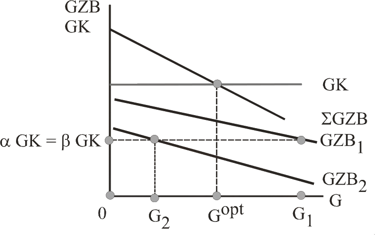{width="6cm"}

-   Pro Einheit des öffentlichen Gutes muss Haushalt 1 nun $\alpha MC$
    bezahlen. Haushalt 1 möchte daher die Menge des öffentlichen Gutes
    bis $G1$ ausdehnen, wo die individuellen Grenzkosten $(\alpha GK)$
    der Grenzzahlungsbereitschaft $(GZB1)$ entsprechen.

-   Entsprechend möchte Haushalt 2 die Menge $G2$. Da bei öffentlichen
    Gütern alle dieselbe Menge konsumieren müssen, sind die Pläne der
    beiden Haushalte nicht miteinander kompatibel $(G1 \neq G2)$.

-   Nun passt der Staat die Kostenanteile an. Er erhöht den Kostenanteil
    des Haushalts 1, der die größere Menge wünscht, und senkt den
    Kostenanteil von Haushalt 2, der die niedrigere Menge präferiert.

-   Diese Anpassungen der Kostenanteile werden so lange vorgenommen, bis
    beide Haushalte dieselbe Menge des öffentlichen Gutes wünschen.

-   Die Lösung hat daher zwei schöne Eigenschaften:

    -   Erstens kann das öffentliche Gut vollständig durch die staatlich
        festgelegten Kostenpreise finanziert werden.

    -   Zweitens wird die optimale Lösung der Samuelson-Regel erreicht,
        wenn jeder Haushalt ehrlich seine Nachfrage bekundet.

-   Wo ist der Haken bei dieser Lösung? Warum nutzt der Staat dieses
    Verfahren nicht zur Bereitstellung

-   Das Problem dieses Verfahren besteht darin, dass es -- ebenso wie
    die direkte Befragung -- nicht anreizkompatibel ist, d.h. jeder
    einzelne Haushalt hat einen Anreiz zur falschen Bekundung seiner
    Präferenzen.

-   Um Lindahl Gerechtigkeit widerfahren zu lassen, sollte allerdings
    betont werden, dass Lindahls Interesse nicht darin lag, einen
    anreizkompatiblen Mechanismus zu kreieren. Er wollte vielmehr die
    Finanzierung staatlicher Aktivitäten an den Vorteilen der Nutzer
    ausrichten: Wer mehr von einem öffentlichen Gut profitiert, bezahlt
    auch mehr (Äquivalenzprinzip, Benefit Principle).

### Lindahl, Erik Robert {#lindahl-erik-robert .unnumbered}

{width=6cm}

* \* Nov. 21, 1891, Stockholm
* † Jan. 6, 1960

>Swedish economist who was one of the members of the famous
>\"Stockholm school\" of economics that developed, during the late
>1920s and early 1930s, from the macroeconomic theory of Knut
>Wicksell. Lindahl held positions at the universities of Lund,
>Gothenburg, and Uppsala (1942-60). His main work in English is
>Studies in the Theory of Money and Capital (1939). One of his most
>important achievements was the development of the sequence analysis
>in economics, which influenced Gunnar Myrdal's concepts of saving
>and investment. Lindahl and the Swedish economists Myrdal and Bertil
>Ohlin developed Wicksell's monetary theory, applying it to
>conditions other than full employment. Lindahl developed the benefit
>principle in taxation, described in his book Die Gerechtigkeit der
>Besteuerung (1919; \"The Justness of Taxation\"). Lindahl also
>carried on Wicksell's development of the Austrian economic school
>theory of capital. He was interested in the development of economic
>accounting systems that would have general validity, and he made
>statistical studies of income and prices. [Encyclopaedia Britannica](http://www.britannica.com)

### Clarke-Groves-Mechanismus {#clarke-groves-mechanismus .unnumbered}

-   Um die optimale Bereitstellung öffentlicher Güter sicherzustellen,
    wäre ein Mechanismus ideal, bei dem jedes Individuum einen Anreiz
    hat, seine wahren Präferenzen zu offenbaren. Diese Möglichkeit
    bietet der Clarke-Groves(-Ledyard) Mechanismus.

-   Eine einfache und gut verständliche Darstellung des
    Clarke-Groves-Mechanismus findet sich in Tideman und Tullock (1976).

-   Ein einfaches Beispiel

    -   Um die Funktionsweise des Mechanismus besser zu verstehen,
        beginnen wir mit einem einfachen Beispiel, bei dem es nur um
        eine diskrete Entscheidung über das öffentliche Gut geht.

    -   Der Park kann entweder als englische (E) oder als
        französische (F) Gartenanlage gestaltet werden. (Die Kosten sind
        gleich.)

    -   Die Tabelle zeigt, wie hoch die Zahlungsbereitschaft jedes
        Wählers dafür ist, dass die bevorzugte Gartengestaltung gewählt
        wird. Wähler 1 beispielsweise ist bereit 30 Euro zu zahlen, um
        die französische statt die englische Gartenanlage zu bekommen.

              Wähler 1   Wähler 2   Wähler 3   $\displaystyle \sum$   
          --- ---------- ---------- ---------- ---------------------- --
          E              40                    40                     
          F   30                    20         50                     

    -   Im ersten Schritt wird jeder Wähler nach dem Vorteil gefragt,
        den er aus dem Sieg seiner präferierten Alternative hätte. Die
        Alternative mit der höchsten (Netto-)Wertschätzung wird gewählt.
        Hier gewinnt also F (50) gegen E (40).

    -   Im zweiten Schritt wird für jeden Wähler, die von ihm zu
        bezahlende Steuer errechnet, und zwar folgendermaßen. Man
        summiert zuerst die Zahlungsbereitschaften aller Wähler außer
        der betrachteten Person und bestimmt das Abstimmungsergebnis.
        Dann zählt man die Zahlungsbereitschaft der betrachteten
        Person hinzu. Ändert sich das Abstimmungsergebnis dadurch nicht,
        zahlt die Person keine Steuer. Ändert sich das
        Abstimmungsergebnis, muss die Person eine Steuer zahlen, jedoch
        nicht in der Höhe der Zahlungsbereitschaft, sondern nur in Höhe
        des Betrags der nötig ist, um zur Summe der
        Zahlungsbereitschaften der Alternative aufzuschließen.\

          ---------------------  --------------------- --------------------- -- -- --
          Steuer für Wähler 1    Steuer für Wähler 2   Steuer für Wähler 3         
          kippt die Entscheidung kann Entsch. nicht    kippt das Ergebnis
          $t_1 = 40-20=20$       beinflussen $t_2=0$   $t_3=40-30=10$
          ---------------------  --------------------- --------------------- -- -- --

    -   Warum ist dieser Mechanismus anreizkompatibel?

        -   Falls Wähler 1 weniger als 20 angibt,\
            → dann wird engl. Park gebaut und das will er ja mit 30 verhindern.

        -   Falls er einen Betrag zwischen 20 und 30 Euro angibt, \
            → bleibt Wahlergebnis erhalten, Clark-Steuer aber auch

        -   Falls er mehr als seine tatsächliche Zahlungsbereitschaft 30
            angibt, \
            → passiert nichts.

→ Falls Individuen ihre Zahlungsbereitschaft systematisch übertreiben , so risieren sie, dass sie das Ergebnis kippen und mit einer höheren Clark-Steuer belegt werden  als ihre Zahlungsbereitschaft hergibt.

-   Es ist also tatsächlich die beste Strategie, seine wahre
    Zahlungsbereitschaft zu offenbaren. Die Steuer, die zur
    Anreizkompatibilität gesetzt wird, nennt man Clarke-Steuer.

-   Statt der Entweder-Oder-Entscheidung betrachten wir nun den
    (allgemeineren) Fall, in dem über die Größe eines öffentlichen Gutes
    (Größe des Parks) abgestimmt werden soll.

-   Die Grenzkosten der Bereitstellung einer Einheit des öffentlichen
    Gutes seien C.

-   Zur Finanzierung wird jedem Bürger eine Steuer (pro qm Park) von
    $T_j$ zugewiesen, so dass $\sum_{j=1}^{n} T_{j}=C$. (Dieser Teil der
    Steuer dient der Finanzierung, darüber hinaus gibt es dann noch als
    zweites Element die Clarke-Steuer tj, die der Anreizkompatibilität
    dient.)

-   Jeder Bürger muss seine Zahlungsbereitschaft für das öffentliche Gut
    angeben und zwar für jede mögliche Menge, d.h. er nennt seine
    gesamte $GZB-$Kurve $D_j$.

-   Man berechnet die aggregierte $GZB$-Kurve $D$ und die
    Grenzzahlungsbereitschaften ohne Individuum $i: D – D_i$.

-   Ohne die Wünsche des $i$ würde die Gemeinschaft die Menge des
    öffentlichen Gutes solange ausdehnen, bis die
    Grenzzahlungsbereitschaft aller übrigen $(D – D_i)$ den Grenzkosten
    für diese Gruppe $(C – T_i.)$ entspricht. Es würde die Menge $A$
    bereitgestellt.

-   Inklusive der Wünsche des $i$ wird die Menge B gewählt $(D = C)$.\

    {width="6cm"}

-   Durch die Reduktion der Menge bürdet $i$ allen anderen einen
    Nachteil im Umfang der grauen Fläche auf. Der Vorteil der Ausdehnung
    von $B$ nach $A$ ist das Integral unter der $(D – D_i)$-Kurve. Der
    Nachteil für alle übrigen Individuen ist das Integral unter der
    $(C – T_{i_{.}})$-Kurve. Die Differenz beider Flächen misst den
    Nachteil aller übrigen durch das Hinzukommen von $i$. Die
    Clarke-Steuer, die i bezahlen muss, entspricht dann dem Nachteil,
    der der übrigen Gesellschaft durch das Eintreten seiner Person in
    das Geschehen auftritt. Hier das Dreieck JLN.

### Probleme des Clarke-Groves-Mechanismus {#probleme-des-clarke-groves-mechanismus .unnumbered}

-   Problem I: Komplexität und Verwaltungsaufwand

-   Problem II: Koalitionen Falls sich in unserem Ausgangsbeispiel
    Wähler 1 und 3 einigen einen so hohen Betrag zu nennen, dass auch
    jeder von ihnen alleine die Abstimmung für „F" entscheiden würde,
    zahlen sie beide keine Steuer und haben trotzdem das gewünschte
    Ergebnis. Dieses Problem kann in kleinen Gruppen zwar auftreten, ist
    aber für Abstimmungen in großen Gruppen unwahrscheinlich. Falls
    man fürchtet, dass mit einer gewissen Wahrscheinlichkeit die
    Koalition nicht stabil ist und man dann tatsächlich mehr als die
    eigene Zahlungsbereitschaft aufwenden muss, wird man nur seine wahre
    Zahlungsbereitschaft angeben und darauf hoffen, dass die übrigen
    Koalitionsmitglieder das gewünschte Ergebnis erzeugen. Da aber alle
    sich so verhalten, sind diese Koalitionen inhärent instabil.

-   Problem III: Effizienzund Verteilungsgerechtigkeit Auch wenn der
    Mechanismus effizient ist, so mag er doch undemokratisch wirken, da
    ein einzelnes Individuum mit einer hohen Zahlungsbereitschaft (z.B.
    weil jemand sehr reich ist) eine Entscheidung gegen den Rest der
    Gesellschaft durchsetzen kann.

# Externalitäten und Eigentumsrechte

### Literatur {#literatur-4 .unnumbered}

-   Giacomo Corneo, Öffentliche Finanzen: Ausgabenpolitik, Mohr Siebeck,
    Tübingen, 2003, Kapitel III.

-   Edeltraud Günther, „Rechnungslegung von Emissionsrechten", KoR
    10/2003, 432-443.

-   Jean Hindricks und Gareth D. Myles. Intermediate Public Economics,
    MIT Press, Cambridge, MA, 2006, Kapitel 7.

-   Dietmar Wellisch, Finanzwissenschaft I -- Rechtfertigung der
    Staatstätigkeit, Vahlen, München, 1999, Kapitel 4. \[\*\]

## Einführung und Klassifikation

-   Definition\
    Ein externer Effekt liegt vor, wenn sich die Konsumoder
    Produktionsentscheidung eines Wirtschaftssubjektes auf den Nutzen
    anderer Wirtschaftssubjekte auswirkt.

-   Allokatives Problem Wenn das Wirtschaftssubjekt die Folgen seiner
    Handlung auf die anderen nicht berücksichtigt und die Folgen auch
    nicht in den Marktpreisen reflektiert werden, führt das (privat
    optimale) Handeln zu einer kollektiv suboptimalen Allokation.

### Positive und negative Externalitäten {#positive-und-negative-externalitäten .unnumbered}

-   Negative externe Effekte

    -   Umweltverschmutzung
        → Übernutzung der"Umwelt" als Schadstoffaufnahmemedium:
        Fabrik/Individuum vernachlässigt die Nachteile des eigenen
        Handelns in Bezug auf das Gut "saubere Umwelt".

-   Statusexternalität (nicht - monetär) Positive externe Effekte\
    Neben den negativen externen Effekten, die gerade in den
    Umweltproblemen besonders offensichtlich werden, gibt es auch
    zahlreiche Fälle positiver externer Effekte:

    -   Silicon-Valley
        → Ballung viler Hightech-Firmen → Wissensaustausch

    -   Netzwerkeffekte
        → z.B Instagram, TikTok
        Beitritt andere stiftet bestehenden Mitgliedern einen Zusatznutzen

    -   Renovierung der Hausfassade
        → Wertet Umgebung auf

-   Externe Effekte können auch quantitativ von beträchtlichem Umfang
    sein. Die European Conference of Ministers of Transport (ECMT)
    schätzt alleine die externen Verschmutzungskosten des
    Straßenverkehrs (Lärm, lokale Luftverschmutzung, Treibhauseffekt)
    auf $0.9-1.4 \%$ des BIP der EU. Schätzungen für andere Länder
    liegen häufig auch in dieser Größenordnung.[^8]

### Pekuniäre und technologische Externalitäten {#pekuniäre-und-technologische-externalitäten .unnumbered}

-   Nicht alle Auswirkungen, die die Produktion oder der Konsum eines
    Wirtschaftssubjektes bei anderen auslöst, führen zu einer
    Verzerrung des Marktergebnisses.

-   Entscheidend ist, ob die Voroder Nachteile, die man anderen
    zufügt, im marktlichen Preissystem reflektiert werden. Man
    unterscheidet daher oft zwischen pekuniären und technologischen
    (echten) Externalitäten.

-   Technologische Externalitäten (bei allen Beispielen oben vertreten)
    Anderen Wirtschaftssubjekten ensteht ein Voroder Nachteil, ohne
    dass dieser dem Verursacher über das Preissystem zugute kommt oder
    angelastet wird. Die technologischen Externalitäten führen zu
    allokativen Verzerrungen und können staatliche Eingriffe
    rechtfertigen.

-   Pekuniäre externe Effekte liegen dagegen vor, wenn sich der Effekt
    durch eine Angebotsoder Nachfrageänderung auf dem Markt ergibt. In
    diesem Fall hat dies Preisänderungen zur Folge, welche die
    bisherigen Marktakteure besser oder schlechter stellen, ohne dass
    sie selbst daran beteiligt sind. Diese Form der ext. Effekte erzeugt
    somit keine allokative Verzerrung, sondern ist lediglich eine
    Begleiterscheinung funktionierender Märkte.

-   Beispiel\

    #### Mehr Bio in Corona-Zeiten

    Mehr Zeit zum Kochen und schlechte Nachrichten aus der
    konventionellen Tierhaltung - das bringt der Bio-Branche mehr
    Kunden. Bis zu 20 Prozent mehr Absatz meldet die Genossenschaft
    Biofleisch NRW in den vergangenen Monaten.

[Deutsche Welle, abgerufen am 14. September 2020](https://www.dw.com/de/mehr-bio-in-corona-zeiten/av-53894828)

-   Infolge der schlechten Nachrichten aus der industriellen
    Fleischproduktion kaufen Sie Fleisch vielleicht nicht mehr im
    Supermarkt, sondern in einer Ökometzgerei. Durch Ihren
    Konsumwandel verschiebt sich die Nachfrage in diesem Sektor
    nach außen. Das Angebot an Ökofleisch ist aber zumindest in der
    kurzen Frist nahezu starr. Der Preis für ökologisch-korrektes
    Fleisch steigt.

-   Durch Ihre Handlung üben Sie einen externen Effekt auf alle jene
    Konsumenten aus, die bereits vorher Öko-Fleisch gekauft haben,
    aber nun einen höheren Preis zahlen müssen.

-   Dies ist aber nur Zeichen eines funktionierenden Marktes. Denn
    durch Ihre zusätzliche Nachfrage haben sich die
    Knappheitsverhältnisse im Markt geändert (Öko-Fleisch ist eben
    relativ knapper geworden).

-   Alles was die Konsumenten aufgrund der pekuniären Externalität
    im Vergleich zum ursprünglichen Marktgleichgewicht verlieren,
    fällt den Produzenten in Form höherer Gewinne zu. Die pekuniäre
    Externalität führt lediglich zu einer Umverteilung zwischen den
    Marktteilnehmern.\

{width="6cm"}

-   Überlegen Sie, in welchem der folgenden Fälle es sich um eine echte
    Externalität handelt, die einen korrigierenden Staatseingriff
    rechtfertigen könnte.
    -   Zuwanderer produzieren einen externen Effekt auf die Einheimischen,
        da sie deren Löhne senken. \
        → pekuniär, da höheres Arbeitsangebot. → Preis sinkt

    -   Der Betreiber des Cafe Alt-Wien am Ufer des Starnberger Sees musste die
        Preise für Kaffee senken, um seine eher betagten Kunden zu halten,
        seit das benachbarte Lokal Undosa seine Seeterrasse zur Diskothek
        umfunktioniert hat.

### Das Allokationsproblem bei Externalitäten {#das-allokationsproblem-bei-externalitäten .unnumbered}

-   Betrachten wir folgendes Beispiel: Ein Chemieunternehmen verschmutzt
    bei der Produktion des Gutes x einen nahegelegenen Fluss. Je mehr
    produziert wird, desto stärker die Verschmutzung und desto desto
    schwieriger (und teurer) wird der Fischfang eines
    Fischereiunternehmens.

-   Hier liegt ein technologischer externer Effekt vor. Denn die
    Produktion des Chemieunternehmens wirkt sich direkt auf die
    Produktion des Fischereiunternehmens aus und dieser Nachteil taucht
    in keinem Preis auf, den die Chemiefirma bezahlen müsste.

-   Betrachten wir zunächst die private Entscheidung des
    Chemieunternehmens. Es wird seine Produktion ausdehnen, solange der
    Preis für eine weitere Outputeinheit über den Grenzkosten der
    Produktion $(GK^priv)$ liegt. Der individuell optimale Output
    beträgt $x^{priv}$.

-   Neben den privaten Grenzkosten der Produktion treten aber auch die
    Kosten der Verschmutzung für den Fischereibetrieb auf, die
    allerdings nicht in das Kalkül der Chemiefirma eingehen. Die
    externen Nachteile der Produktionsausdehnung sind durch $GS$
    gekennzeichnet. Diese externen Kosten müssen zu den privaten
    Grenzkosten hinzuaddiert werden, um die sozialen Grenzkosten
    $(GK^{soz})$ zu erhalten. Aus volkswirtschaftlicher Sicht wäre es
    optimal nur $x^opt$ als Output in der Chemiefabrik zu produzieren.

-   Vergleichen wir nun privat und kollektiv optimale Entscheidungen. Da
    das Chemieunternehmen den Nachteil der Fischerei vernachlässigt,
    wählt es eine zu große Outputmenge. Die sozial exzessive Produktion
    führt zu einem Wohlfahrtsverlust in Höhe von$\ldots$\

    → $\Delta ABC$
      denn: die hier sin zwischen $x^{opt}$ und $x^{priv} höher als $p^* \rightarrow$ ineffizienz
 

    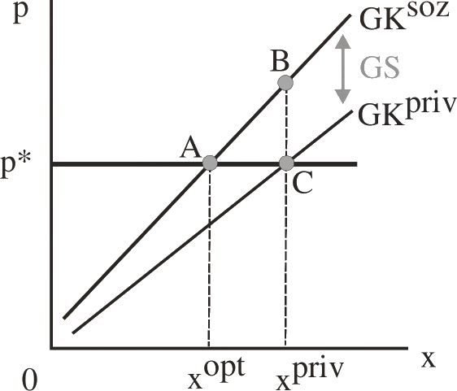{width="8cm"}

### Umwelt als Produktionsfaktor und Konsumgut {#umwelt-als-produktionsfaktor-und-konsumgut .unnumbered}

-   Für die folgende Diskussion der Politikmaßnahmen wird es sich als
    nützlich erweisen, die Externalität nicht in Abhängigkeit des
    Outputs, sondern als Funktion des Inputs „Umwelt" zu beschreiben.
    Dazu formulieren wir obiges Modell ein wenig um.

-   Die Chemiefirma produziert ihre Outputmenge x (unter anderem) durch
    Einleitung verschmutzender Abwässer s in den Fluss. Der Vorteil
    der Verschmutzung besteht in einer Kostensenkung im Vergleich zu
    einer anderen Entsorgung giftiger Abwässer. Der Gewinn der
    Chemiefirma ist durch
    $$\pi^{x}=p^{x} \cdot x-c(x, s)$$
    $C_{X}>0 \text { und } C_{S} \leq 0 C_{X}>0$ und $C_{S} \leq 0$
    gegeben.

    → Umwelt ist eine Input-Ressource

-   Die Kosten des Fischfangs hängen ebenfalls von der Verschmutzung der
    Gewässer ab. Je schmutziger der Fluss, desto teurer wird es, eine
    bestimmte Menge Fisch (y) zu fangen. Der Gewinn des Fischers ergibt
    sich aus
    $$\pi^{y}=p^{y} \cdot y-k\left(y_{1} s\right)$$ 
    $\text{mit} K_{y}>0 \text { und } K_{S}>0 \text{mit} K_{y}>0 und K_{S}>0$

-   Individuelle Gewinnmaximierung der Chemiefirma: Wie viel Umwelt wird
    verbraucht, d.h. welches Verschmutzungsniveau $s^{priv}$ wird die
    Chemiefirma wählen? $→ \max \pi^x$
    $$\frac{\partial \pi^{x}}{\partial s}=-\frac{\partial c(x, s)}{\partial s} \mid=0 \Rightarrow \text{ liefert, dass } s^{priv} = s^{priv}(x)$$ 
    Da der Preis für die Verschmutzung 0 ist, wird
    die Firma so lange verschmutzen, bis eine weitere Einheit
    Verschmutzung die Kosten der Produktion nicht weiter senkt
    (IST-Zustand). Umwelt ist hier sozusagen ein kostenloser Input für
    die Chemiefirma.[^9]

-   Kollektive Gewinnmaximierung (SOLL): Welches Verschmutzungsniveau
    $s^opt$ würde gewählt, wenn beide Firmen demselben Unternehmer
    gehören oder wenn ein wohlfahrtsmaximierender sozialer Planer
    entscheidet? Dazu maximiert man den Gewinn über beide Unternehmen
    und erhält bezüglich des Verschmutzungsniveaus: $\displaystyle \max _{S}(\underbrace{\pi^{x}+\pi^{-1}}_{=: \pi^{agg.}}$
    $$\frac{\partial \pi^{a g g}}{\partial s}=\overbrace{-C_{s}}^{> 0}-\overbrace{k_{s}}^{> 0}=0$$
    Was besagt diese Optimalbedingung?\
    $$ c_s = -k_S$$
    Grenzvorteil der Verschmutzung = Grenznachteil der Verschmutzung

-   Vergleicht man das Ergebnis der individuellen Gewinnmaximierung mit
    dem sozial optimalen Ergebnis, sieht man, dass die individuell
    rationale Lösung zu einer exzessiven Verschmutzung der Umwelt führt,
    da der Chemiebetrieb die Kostennachteile des Fischers
    vernachlässigt:

-   Graphische Darstellung (s. nächste Folie)

    -   Die $(-C_S)$-Kurve misst den Grenzvorteil der Chemiefirma aus
        einer weiteren Verschmutzungseinheit; die Verschmutzung wird
        ausgedehnt, bis dieser Grenzvorteil bei $s^{priv}$ Null wird.

    -   Die $(K_S)$-Kurve gibt den Grenznachteil der Fischerei an; das
        soziale Optimum ist erreicht, wenn bei $s^opt$ der Grenzvorteil
        der Verschmutzung diesem Grenznachteil entspricht.

    -   Der Wohlfahrtsverlust bei einer Laissez-Faire-Politik ist somit

    {width="6cm"}

-   Wir können diese Graphik auch anders interpretieren. Dazu lesen wir
    die Kurven nun von rechts nach links (statt wie bisher von links
    nach rechts). Eine Reduktion von $s$ entspricht einer Verbesserung
    der Umweltqualität. Ausgehend von $s^{priv}$ s gibt die
    $(-C_S)$-Kurve an, wie viel die Vermeidung einer marginalen
    Verschmutzung die Chemiefirma kostet (Grenzvermeidungskosten). Die
    $(K_S)$-Kurve misst dann entsprechend den Grenzvorteil des Fischers
    aus einer marginal saubereren Umwelt. Die sozial optimale Vermeidung
    ist erreicht, wenn die Grenzkosten der Vermeidung dem Grenzvorteil
    einer höheren Umweltqualität entsprechen.

### Ergebnis {#ergebnis .unnumbered}

-   Je nach Art der Externalität führt die Marktlösung nicht zu einem
    pareto-optimalen Ergebnis. Bei positiven Externalitäten wird zu
    wenig, bei negativen zu viel von einer Aktivität ausgeübt. 
    Individuelle und kollektive Rationalität fallen -- wie schon im Fall der
    öffentlichen Güter -- auseinander. Hier stellt sich die Frage, wie
    der Staat die Allokation verbessern kann, indem er die Externalität
    eliminiert (d.h. internalisiert).

-   Strategien zur Internalisierung (negativer) ext. Effekte:
    -   Definition von Eigentumsrechten (Kap 5.2)
    -   Auflagen, die einen maximale Ausübung der Tätigkeit vorgeben (Kap 5.4)
    -   Besteuerung der schädlichen Aktivität (Kap 5.5)
    -   Handelbare Zertifikate, deren Besitz die schädigende Aktivität
        gestattet (Kap 5.6)

## Eigentumsrechte und das Coase-Theorem

-   Letztendlich liegt der Grund für das Externalitätenproblem in
    fehlenden Eigentumsrechten.

-   Die Tatsache, dass eine Aktivität bei anderen zu Nachteilen führt,
    ist alleine noch kein Grund für Marktversagen. So erzeugt die
    Produktion typischerweise Nachteile bei denen, die dafür ihre
    Arbeitszeit hergeben. Der Schaden eines Arbeitnehmers besteht im
    Arbeitsleid, d.h. dass er in der Arbeitszeit nicht seiner
    präferierten Betätigung nachgehen kann. Dieser Schaden wird aber
    durch den Lohn (mindestens) ausgeglichen. Denn das Eigentumsrecht
    ist hier klar definiert. Der Arbeitnehmer entscheidet, ob er gegen
    die Kompensation seine Arbeitsleistung verkauft.

-   Das Externalitätenproblem tritt nur auf, wenn solche Eigentumsrechte
    nicht definiert sind.

-   Ronald Coase gibt folgendes einfache Beispiel: Rancher und Farmer
    nutzen dasselbe Land. So lange keine Eigentumsrechte für das Land
    festgelegt sind, verursachen Rinder, die frei herumlaufen, Schaden
    bei Farmern, weil sie deren Pflanzungen fressen und niedertrampeln.
    Definiert man dagegen durchsetzbare Eigentumsrechte für das Land
    kann man einzelne Parzellen verpachten, mit Zäunen versehen und die
    Externalität wird eliminiert.

-   Damit gibt es aber eine scheinbar einfache Lösung: die Festlegung
    von Eigentumsrechten

    ### Coase, Ronald Harry {#coase-ronald-harry .unnumbered}

>    b\. Dec. 29, 1910, Willesden, Middlesex, Eng.\
>    d. Sept. 2, 2013, Chicago\
>    British-born American economist, who was awarded the Nobel Prize for
>    Economics in 1991. Coase received a bachelor of commerce degree from
>    the London School of Economics in 1932 and a doctorate in economics
>    from the same school in 1951. After lectureships in various schools,
>    he taught at the London School of Economics (1935-51), the
>    University of Buffalo (New York, U.S.; 1951-58), the University of
>    Virginia, Charlottesville (1958-64), and the University of Chicago
>    (from 1964), where he became professor of economics in the law
>    school, taught at the Graduate School of Business, and was editor of
>    the Journal of Law and Economics from 1964 to 1982.\
>    Coase did pioneering work on the ways in which transaction costs and
>    property rights affect business and society. In his most famous
>    paper, \"The Problem of Social Cost\" (1960), he challenged the
>    classic logic of prohibiting behaviour that damages others. His work
>    was a call to legal scholars to pay attention to the importance of
>    an efficient marketplace and to negotiation rather than litigation.
>    The Royal Swedish Academy of Sciences cited Coase for this research
>    and also for \"pioneering the study of how property rights are
>    distributed among individuals by law, contract, and regulations,
>    showing that this determines how economic decisions are made and
>    whether they will succeed.\"\
>    [Encyclopaedia Britannica](http://www.britannica.com)

-   Wenden wir die Idee auf unser Problem des verschmutzenden
    Chemiebetriebs und des geschä- digten Fischers an.

-   Annahmen: keine Informationsoder Transaktionskosten, d.h. man kann
    kostenlos verhandeln und Verträge schreiben.

-   Fall 1: Eigentumsrecht an der Umwelt bei Fischer

    -   Der Staat gibt alle Eigentumsrechte an dem Fluss (Umwelt) dem
        Fischer. Wenn die Chemiefirma Abwässer in den Fluss einleiten
        will, muss sie dem Fischer die Rechte dafür abkaufen.

    -   Hat der Fischer einen Anreiz Verschmutzung zuzulassen?\
        → Ja, die erste (marginale) Einheit tut ihm nicht weh und 
        die Firma bietet Geld dafür 

    -   Bis zu welcher Menge sind beiderseitig vorteilhafte Kontrakte
        möglich?\
        → solange $-c_s \geq p \geq K_s$

    -   Gleichgewichtiges Verschmutzungsniveau: $$S^{opt}$$
    -   (Netto-)Gewinn aus dem Vertrag (im Vergleich zu einer
        Nullverschmutzung): $$\Delta ADB$$

    -   Vergleichen wir die Lösung mit dem sozialen Optimum, so sehen
        wir, dass die Definition der Eigentumsrechte und Verhandlungen
        gerade die optimale Allokation herbeiführen (IST=SOLL)

    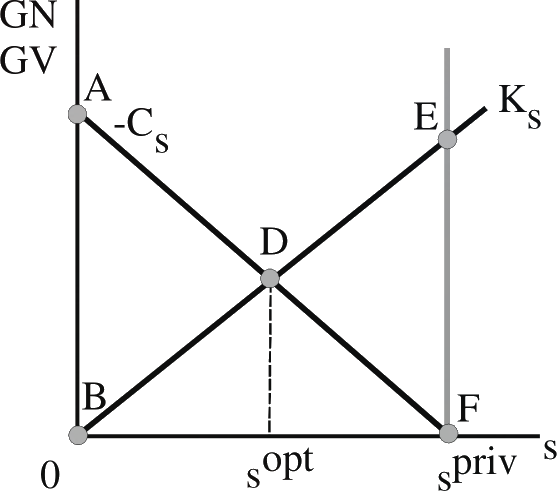{width="6cm"}

-   Fall 2: Eigentumsrecht an der Umwelt bei Chemiefirma

    -   Der Staat gibt nun alle Eigentumsrechte an dem Fluss (Umwelt) an
        die Chemiefirma. Wenn der Fischer einen saubereren Fluss will,
        muss er die Chemiefirma für die Reinigung der Abwässer
        entschädigen.

    -   Ohne jeden Vertrag würde die Chemiefirma im Umfang $s^{priv}$
        den Fluss verschmutzen.

    -   Das Verschmutzungsniveau, das sich nach Vertragsverhandlungen
        ergibt, ist wiederum $s^{opt}$. Überlegen Sie, warum dies so
        ist. Argumentieren Sie mit Grenzvorteil und Grenznachteil der
        beiden Parteien.

    -   Wie hoch sind volks- bzw. betriebswirtschaftlicher Gewinn?\
        v: Rente $\Delta DEF$ \
        b: abh. vom verhandlungsstatus jedoch nur bei einigugn auf $p^* \Delta Dp^* F$

-   Das Ergebnis ist das sogenannte Coase-Theorem:

    -   Effizienzthese: Bilaterale Verhandlungen führen bei durchsetzbaren
        Eigentumsrechten zu einer effizienten Internalisierung externer
        Effekte. → $S^{opt}$

    -   Invarianzthese: Die resultierende Allokation ist stets dieselbe 
        -- unabhängig davon, wem die Eigentumsrechte zugesprochen werden.
        → $S^{opt}$

-   Die Lösung, die das Coase-Theorem bietet, stößt schnell an seine
    Grenzen. Hier sind einige der oft diskutierten Probleme.

-   Problem 1: Transaktionskosten

    -   Ein Einwand gegen die Coase'sche Lösung besagt, dass
        Transaktionskosten für die Verhandlungen und die Durchsetzung
        der Verträge nicht Null sind.

    -   Statt vieler bilateraler Verhandlungen kann dann z.B. eine
        zentrale Lösung über den Staat billiger sein.

{width="5cm"}

-   Problem 2: Einkommenseffekte

    -   Gibt man z.B. dem Fischer das Eigentumsrecht, ist er effektiv
        reicher, als wenn die Chemiefirma das Eigentumsrecht erhält. Der
        Einkommenseffekt wird bewirken, dass seine Nachfrage nach
        sauberer Umwelt steigt (unter der Hypothese, dass reicheren
        Individuen die Umwelt stärker am Herzen liegt) und er der Firma
        einen höheren Preis abverlangt.

    -   Die resultierende Allokation ist immer noch effizient, aber
        nicht invariant.

    {width="5cm"}

    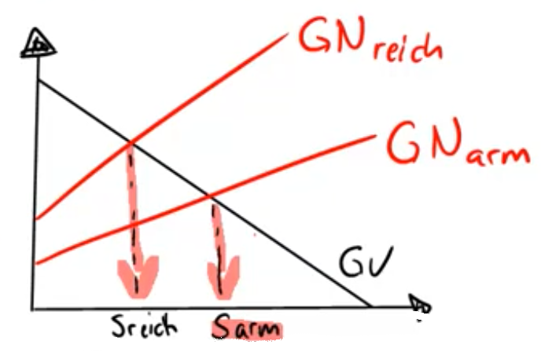{width="5cm"}

    ### Madonna {#madonna .unnumbered}

    Die Popsängerin will einen Flugplatz kaufen, damit sie ihn schließen
    kann. Wie der „Express" berichtet will Madonna den Flughafen von
    Crompton Abbass kaufen, weil sie sich über die Flugzeuge ärgert, die
    über ihr Herrenhaus Ashcombe Park in Wiltshire fliegen. Madonna sei
    sehr unglücklich darüber, dass es unweit ihres 14,3 Millionen
    Euro-Anwesens einen kleinen Flugplatz gibt, der noch dazu an
    Wochenenden von mehreren Tausend flugbegeisterten Zuschauern besucht
    wird. „Crompton Abbass ist vermutlich nicht viel mehr als 1,3
    Millionen Euro wert. Das ist doch Kleingeld für Madonna", sagte ein
    besorgter Flieger.\
    `Sächsische Zeitung, 11. Juni 2002, S 24`

-   Problem 3: Marktmacht

    -   Gibt man einer Institution (z.B. dem Fischer) das
        Eigentumsrecht, hat er das alleinige Recht, Lizenzen für
        Verschmutzung zu verkaufen. Falls es mehrere Nachfrager
        (Chemiefirmen) gibt, ist er Monopolist für solche Lizenzen.

    -   Werden die Lizenzen zu einem einheitlichen Preis gehandelt (und
        nicht über bilaterale Verhandlungen), tritt die Ineffizienz des
        Monopols auf: Die Lizenzmenge wird verknappt, um den Preis hoch
        halten zu können. Effizienzwie Invarianzthese gelten hier
        nicht mehr.

    -   In der nachfolgenden Graphik sehen Sie die Grenzerlöskurve des
        Fischers für Verschmutzungslizenzen. Der Fischer stellt mit
        $s^{mon}$ nur eine suboptimale Menge an Verschmutzung bereit,
        aus Effizienzgesichtspunkten wäre eine Ausweitung auf $s^{opt}$
        wünschenswert.\

    -   Der Wohlfahrtsverlust, der aus der Situation mit Marktmacht des
        Fischers gegenüber den Firmen entsteht, lautet.

{width="8cm"}

-   Problem 4: Öffentliche Güter

    -   Der wohl wichtigste Einwand gegen die Coase'sche Lösung stellt
        darauf ab, dass bei vielen Externalitäten zugleich ein
        Öffentliches-Guts-Problem vorliegt.

    -   Zwar ist die Einleitung von Abwässern für die Chemiefirma ein
        typisches privates Gut.

    -   Ein sauberer Fluss ist jedoch ein öffentliches Gut. Wenn der
        Fluss sauberer wird, profitiert nicht nur der Fischer, sondern
        alle Nutzer des öffentlichen Gutes (andere Fischer, Schwimmbäder
        am Fluss, der seltene Fischotter, \...).

    -   Wenn man die Eigentumsrechte an der Umwelt definiert (und sie in
        die falschen Hände legt), ergibt sich das
        Trittbrettfahrer-Problem. Wer von den Geschädigten stellt das
        öffentliche Gut bereit, indem er der Chemiefirma
        Verschmutzungsrechte abkauft?

## Umwelt als öffentliches Gut -- Verschmutzung als privates Gut

-   Erweitern wir nun unser Grundmodell, um diese Situation, die bei
    vielen wirtschaftspolitisch wichtigen Externalitätenproblemen
    relevant ist, zu erfassen.

-   Im Diagramm rechts oben sehen wir im Prinzip dasselbe Bild wie
    bisher. In Abhängigkeit der Emissionsmenge s geben die beiden Kurven
    den Grenzvorteil und den Grenznachteil der Verschmutzung an. Die
    Neuerung besteht darin, dass diese Kurven sich sowohl auf
    Emittentenwie auch Geschädigtenseite nun aus den Vorund
    Nachteilen mehrerer Parteien zusammensetzen.

    {width="12cm"}

-   Die Grenzvorteilskurve ergibt sich, indem man die individuellen
    Nachfragen der einzelnen Verschmutzer horizontal aggregiert. Zur
    Erinnerung: Verschmutzung s ist für jeden Emittenten ein privates
    Gut.

-   Die Grenznachteilskurve erhält man, indem man für jede
    Verschmutzungsmenge s die individuellen Grenznachteile aufsummiert.
    Zur Erinnerung: Für die Geschädigten ist die Verschmutzung ein
    öffentliches „Schlecht" (oder umgekehrt: saubere Umwelt ein
    öffentliches Gut); jeder konsumiert dieselbe Qualität der Umwelt.

-   Anwendung der Samuelson-Regel Die optimale Verschmutzungsmenge ist
    erreicht, wenn die Summe der Grenznachteile dem Grenzvorteil der
    letzten Verschmutzungseinheit entspricht:
    $\displaystyle \sum GN = GV$ der Verschmutzung.

-   Noch deutlicher wird die Samuelson-Regel sichtbar, wenn wir die
    Graphik von rechts nach links lesen. Im Optimum gilt, dass die Summe
    der Grenzzahlungsbereitschaften für eine Verbesserung der Umwelt den
    Grenzkosten der Emissionsvermeidung entspricht.

-   Politikaufgabe\
    Das entscheidende Politikproblem der Externalität besteht nun darin,

    1.  die Emissionen auf das effiziente Niveau zu reduzieren und
    2.  diese Reduktion effizient auf die Schädiger aufzuteilen.

-   Aufgabe 1: Effizientes Niveau der Emissionen Um das effiziente
    Niveau der Umweltverschmutzung zu bestimmen, muss der Staat im
    Wesentlichen die individuellen Grenznachteilskurven ermitteln.
    Diese Problematik bei der Bereitstellung öffentlicher Güter haben
    wir bereits in Kapitel 4 kennengelernt.

-   Wir nehmen daher im Folgenden dieses Problem als gelöst an und
    wenden uns Punkt (2) zu.

-   Aufgabe 2: Effiziente Aufteilung der Emissionen Der Staat kennt die
    optimale Verschmutzungsmenge $s^{opt}$. Wie sollte er die die
    Emissionsreduktion (bzw. die Erlaubnis zur Emission) effizient auf
    die Emittenten verteilen?

-   Graphische Überlegungen\

    -   In der nachstehenden Graphik sind die Grenzvorteilskurven der
        Verschmutzung exemplarisch für zwei Emittenten abgetragen. Die
        Besonderheit besteht nun darin, dass wir die Gesamtmenge der
        Emissionen auf $s^{opt}$ fixieren (also die Ordinate nach rechts
        beschränken) und nur noch die Aufteilung dieser Emissionsmenge
        auf die beiden Unternehmen untersuchen.

    -   Die Emissionen von Unternehmen 1 sind von links nach rechts, die
        von Unternehmen 2 von rechts nach links (beginnend in $s^{opt}$
        ) abgetragen -- wenn $U_1$ die Menge $s_1$ emittiert, so bleibt
        für U2 entsprechend der Rest
        $\mathrm{s}_{2}=\mathrm{s}^{\mathrm{opt}}-\mathrm{s}_{1}$.

    -   Die optimale Aufteilung ist in Punkt C erreicht, wo die
        Grenzvorteile der Emission in beiden Unternehmen gleich sind.

-   Überlegen Sie anhand der Auflagenlösung
    $\mathrm{S}_{1}=\mathrm{S}_{2}=1 / 2 \mathrm{~S}^{\mathrm{Opt}}$ in
    der Graphik, warum dies hier nicht optimal ist ($\rightarrow$
    nächstes Sub-Kapitel 5.4).\

    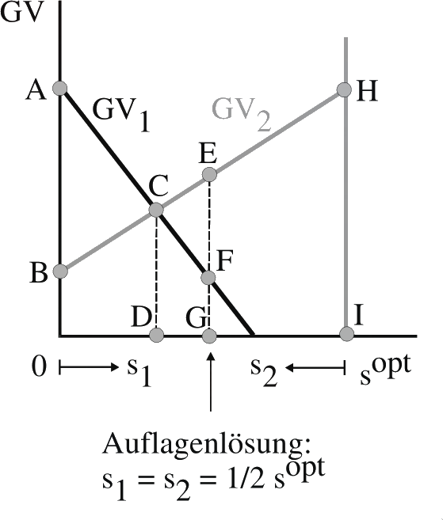{width="6cm"}

## Auflagenlösung

-   In Deutschland wurde Umweltpolitik traditionell durch
    Emissionsstandards (z.B. ‚TA Luft') betrieben. Dabei wird eine
    Maximalmenge an Emissionen vorgegeben und (von außen erst einmal
    willkürlich) auf die einzelnen Emittenten verteilt.

-   Wie wirkt diese Politikmaßnahme? Betrachten wir den einfachen Fall,
    dass jede der beiden Firmen genau die Hälfte der gesamten
    Emissionsmenge nutzen darf.

-   Diese Auflage ist unabhängig von den Kosten, die die Einhaltung
    dieser Standards bei den einzelnen Firmen verursacht. Im Vergleich
    zur optimalen Aufteilung entstehen bei dieser Politik exzessive
    Kosten und Wohlfahrtsverluste. Wie hoch sind diese Kosten? Wer
    gewinnt und wer verliert gegenüber einer optimalen Politik?

-   Um eine **effiziente** Lösung zu erreichen, müsste man die
    Vorteilskurven jedes Unternehmens kennen und für jeden Emittenten
    individuelle Emissionsstandards festlegen -- ein praktisch 
    undurchführbares Unterfangen. Empirie dazu:

    -   Tom Tietenberg (1985, S. 42f) zeigt in einer Übersicht über zehn
        empirische Arbeiten, dass die Auflagenlösung Kosten in Höhe des
        1,7-fachen bis zum 22-fachen der (geschätzten) Minimalkosten
        verursacht.[^10]

    -   Für Deutschland hat der Rat von Sachverständigen für
        Umweltfragen 1974 errechnet, dass ein 75%-iger Reinigungsgrad
        bei kommunalen Abwässern durch die Auflagenlösung um 50% teurer
        war als die kostenminimale Lösung. [^11]

-   In Deutschland wurde Umweltpolitik traditionell durch
    Emissionsstandards (z.B. ‚TA Luft') betrieben. Dabei werden den
    Firmen maximale Emissionsmengen vorgegeben.

## Besteuerung

-   Die Grundidee der Besteuerung ist die Emission mit einem Preis zu
    versehen. Hierbei passt sich über den Mechanismus des Marktes die
    Emissionsmenge entsprechend an. Denn auf Basis des Preises können
    die Unternehmen frei entscheiden, welche Menge sie emittieren
    möchten. (Im Vergleich dazu gibt man beim Zertifikatehandel (→ Kap
    5.6) eine effiziente Gesamtmenge vor, deren Einzelzertifikate sich
    am Markt frei von dem Firmen handeln lassen, worüber sich dann ein
    Gleichgewichtspreis einstellt.)

-   Eine Lösung besteht also in einer Besteuerung der Emissionen. In der
    Öffentlichkeit ist dieser Ansatz mit der Diskussion um die Ökosteuer
    populär geworden. In der ökonomischen Disziplin ist die Idee der
    Internalisierung externer Effekte bereits seit Pigous Beitrag (1920)
    bekannt.

    ### Pigou, Arthur Cecil {#pigou-arthur-cecil .unnumbered}

    b\. Nov. 18, 1877, Ryde, Isle of Wight, Eng.\
    d. March 7, 1959, Cambridge, Cambridgeshire\
    one of the most eminent British economists of the 20th century,
    noted for his studies in welfare economics. Educated at King's
    College, Cambridge, Pigou succeeded Alfred Marshall in the chair of
    political economy at Cambridge in 1908. It was primarily through his
    efforts that Marshall's ideas were disseminated and provided the
    leading theoretical basis for what subsequently became known as the
    Cambridge school of economics. Pigou's most significant and
    influential work was The Economics of Welfare (1920), in which he
    sought to explore the effects of economic activity upon the total
    welfare of society and its various groups and classes. Pigou applied
    his powers of economic analysis to a number of other problems,
    including tariff policy, unemployment, and public finance. He also
    served on the Royal Commission on Income Tax (1919-20) and on two
    committees on the currency (1918-19; 1924-25).
    [Encyclopaedia Britannica](http://www.britannica.com)

-   Grundidee Steuerlösung -- Preis regelt Menge

    -   Der Staat legt einen (beliebigen) Steuersatz t fest, der auf
        jede Emissionseinheit erhoben wird.

    -   Die Unternehmen können selbst entscheiden, ob sie eine
        Emissionseinheit vermeiden wollen oder lieber weiter emittieren
        (und dafür die Steuer zahlen).

    -   Unternehmen 1\
        Verschmutzungsmenge: solagen $GV_1 > t \rightarrow S_1^*$\
        Steuerbetrag: $S_1^* \cdot t$\

    -   Unternehmen 2\
        Verschmutzungsmenge: solagen $GV_2 > t \rightarrow S_1^*$\
        Steuerbetrag: $S_2^* \cdot t$\
          $$\left(S_{1}^{*}+S_{i}^{*}\right) = S^{opt}$$

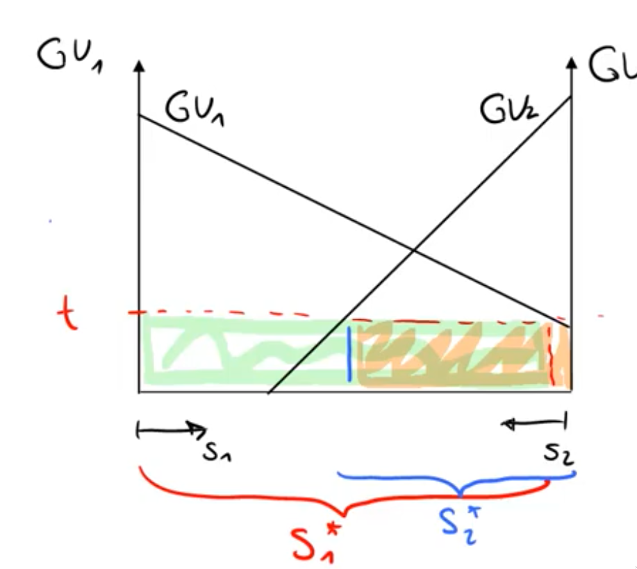{width="6cm"}

-   Eine Pigousteuer zielt nun auf einen Steuersatz t ab, bei dem die
    von beiden Unternehmen emittierte Gesamtmenge s1 + s2 gerade sopt
    entspricht.\

    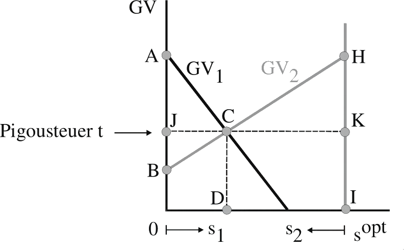{width="8cm"}

-   Vorteile der Steuerlösung

    -   Der Staat erhält ein Steueraufkommen in Höhe von

    -   Die Grenzvorteile der Unternehmen (bzw. ihre Grenzkosten der
        Vermeidung) gleichen sich an. Dieses Verfahren stellt also
        sicher, dass die jeweils nächste Emissionseinheit beiden
        Unternehmen denselben Vorteil verschafft.

    -   Dazu muss der Staat die Verläufe der individuellen
        Grenzvorteilskurven gar nicht kennen. Selbst wenn der Staat ein
        falsches Niveau für die Pigousteuer wählt, so dass das Ziel der
        gesamten Emission verfehlt wird, gilt immer noch, dass sich die
        Grenzvorteile der Unternehmen angleichen. Will der Staat das
        richtige Niveau $s^{opt}$ der Emissionen erreichen, kann er
        iterativ die Pigousteuer anpassen.

-   Implikation: Einheitlicher Steuersatz bei der Pigousteuer Dieses
    Resultat impliziert auch, dass man die Steuersätze bei der
    Pigousteuer nicht differenzieren sollte, da man sonst die
    effiziente Angleichung der Grenzvorteile verhindert (s. Beispiel
    $CO_2$-Steuer später)

-   Oft wird argumentiert, die Ökosteuer sei generell falsch. Denn
    entweder ist sie umweltpolitisch erfolgreich, dann erzielt man mit
    ihr aber kein Aufkommen. Oder der Staat erzielt ein Aufkommen,
    dann ist sie umweltpolitisch aber erfolglos. Der Umweltexperte der
    CDU-Landtagsfraktion im Sächsischen Landtag (und frühere Sächsische
    Kultusminister), Prof. Dr. Karl Mannsfeld, sagt z.B.: „Ein
    allgemeiner ökologischer Umbau des Steuersystems ist unrealistisch,
    da Ökosteuern langfristig dazu tendieren, ihre eigene
    Bemessungsgrundlage auszuhöhlen. Sie schaffen sich gewissermaßen
    selbst ab, wenn sie eine Wirkung erzielen." (Pressemitteilung der
    CDU-Landtagsfraktion, 18. Oktober 1999). Was halten Sie von der
    These?

-   Bemessungsgrundlage

    -   Um die steuerliche Belastung der Unternehmen zu mindern, kann
        man auch die Bemessungsgrundlage der Steuer verkleinern, ohne
        die Anreizwirkung zu eliminieren.

    -   Man kann jedem Unternehmen z.B. eine Emission von s gestatten,
        ohne dass diese Emission besteuert wird. Nur die darüber
        hinausgehenden Emissionseinheiten werden besteuert.

    -   Wie man an der Graphik sieht, hat sich durch die Verschiebung
        der Bemessungsgrundlage der Anreiz zur Emissionsreduktion nicht
        geändert; die optimale Allokation bleibt erhalten.

    -   Lediglich das Steueraufkommen des Staates hat sich auf MLCD von
        Unternehmen 1 und PNCD von Unternehmen 2 verringert.

    -   Wichtig ist nur, dass der Steuerpreis an der Grenze wirksam
        wird, d.h. dass s nicht zu groß ist.\

        {width="8cm"}

### Einwand 1 gegen die Pigousteuer: Nachverhandlungen mit Geschädigten {#einwand-1-gegen-die-pigousteuer-nachverhandlungen-mit-geschädigten .unnumbered}

-   Durch Nachverhandlungen kann es zu einer exzessiven Reduzierung von
    Emissionen kommen, die volkswirtschaftlich nicht erwünscht ist.

-   Zur Diskussion dieser These kehren wir zur Graphik aus Kapitel 5.1
    zurück, wo Grenzvorteil und Grenznachteil der Emission $s$
    dargestellt wurden.

    {width="10cm"}

-   Wird die optimale Pigousteuer $t$ implementiert, sind die
    Geschädigten bei $s^{opt}$ bereit, für eine marginale Reduzierung
    gerade t (Höhe des Grenzschadens) als Kompensation anzubieten.

-   Die Kosten des Verschmutzers für weitere Reduzierungen sind dann in
    diesem Punkt aber gerade Null. Zwar muss er Kosten in Höhe von t
    aufwenden, gleichzeitig verringert sich aber seine Steuerschuld um
    t durch die Zahlung der Geschädigten.

-   Die Grenzvorteilskurve der Emission verschiebt sich im Bereich
    $[0,s^{opt}]$ um $t$ nach unten, und der Schnittpunkt mit der
    Grenznachteilskurve des Geschädigten verschiebt sich.

-   Durch Nachverhandlungen zwischen den betroffenen Parteien kommt es
    zu einer Reduktion der Emissionen auf $s^{ver}$.

-   Dadurch entsteht ein Wohlfahrtsverlust von $\Delta HDG$

### Einwand 2 gegen die Pigousteuer: Totalbedingung verletzt {#einwand-2-gegen-die-pigousteuer-totalbedingung-verletzt .unnumbered}

-   Eine Pigousteuer garantiert zwar, dass die Marginalbedingungen
    erfüllt sind, jedoch nicht notwendigerweise auch, dass die
    Totalbedingungen gesamtwirtschaftlicher Effizienz eingehalten wird.

-   In anderen Worten:\
    durch die Internalisierung externer Effekte erhöhen die zusätzlichen
    Kosten der Besteuerung die Gesamtkosten derart, dass sie den Gewinn
    (hier die volkswirtschaftliche Rente) übersteigen. Die an die Steuer
    angepasste Produktionsmenge ist zwar optimal gegeben, dass
    produziert wird; stellt man aber die Produktion selbst auf den
    Prüfstand (also die Frage überhaupt noch produzieren ja/nein?), so
    ist dies gesamtwirtschaftliche möglicherweise zu verneinen.

### Einwand 3 gegen die Pigousteuer: Marktmacht {#einwand-3-gegen-die-pigousteuer-marktmacht .unnumbered}

-   Bei unvollkommenen Märkten kann eine Ökosteuer sogar zu einer
    Wohlfahrtsverschlechterung führen.

-   Dieser Punkt lässt sich leicht am Beispiel eines einfachen Monopols
    illustrieren: -- Der Monopolist produziert mit konstanten
    Grenzkosten $(GK)$. -- Jede Einheit Output erzeugt denselben
    marginalen Umweltschaden $(GS)$.

-   Ohne Pigousteuer realisiert der Monopolist die Menge $x^m$. .

-   Gegeben der Berücksichtigung des Grenzschadens wäre sozial optimal
    allerdings $GK+GS=GZB$ ($\rightarrow$ Punkt E), was auf $x^0$ mit
    einem $WFV$ der Höhe $ADE$ führt.

-   Wird eine Pigousteuer in Höhe des marginalen Umweltschadens GS
    erhoben, beträgt die gewinnmaximale Ausbringungsmenge im Monopol
    nun $x^1 (Opt’bed: GK+GS = GE \rightarrow \text{Punkt} \: C).$

-   Da die Ausbringungsmenge bereits in der Ausgangssituation zu klein
    war, erzeugt die Mengenreduktion infolge der Pigousteuer einen
    zusätzlichen Wohlfahrtsverlust im Umfang $BADC$.\

    {width="9cm"}

## Zertifikatslösung

-   Das Problem der Pigousteuer besteht darin, dass wir die
    Grenzvorteilskurven der Unternehmen nicht genau kennen, und daher
    nicht sicherstellen kann, dass die gewünschte Emissionsmenge auch
    erreicht wird (Beispiel: unelastische Grenzvorteilkurve)

-   Dieses Problem lässt sich vermeiden und gleichzeitig der Vorteil der
    Pigousteuer -- die effiziente Aufteilung der Emissionen --
    beibehalten, wenn man die Zertifikatslösung wählt.

-   **Kurz gesagt**: wir übergeben eine feste Anzahl an
    Emissionseinheiten und überlassen den Markt sich selbst. Heraus
    kommt ein Gleichgewichtspreis und eine effiziente Allokation.

-   Grundidee Zertifikatslösung -- Menge regelt Preis

    -   Der Staat gibt Zertifikate aus, die den Unternehmen, die ein
        solches Zertifikat besitzen, eine bestimmte Emissionsmenge pro
        Zeiteinheit gestattet.

    -   Da der Staat die Zahl der Zertifikate unmittelbar bestimmen
        kann, kann er auch sicherstellen, dass die bestimmte
        Emissionsmenge $s^{zert}$ (ab hier = $s^{opt}$) eingehalten
        wird.

    -   Die Aufteilung der Emissionen auf die Unternehmen ergibt sich
        dann aus dem Handel mit den Zertifikaten zwischen den
        Unternehmen.

    -   Nehmen wir zunächst an, dass der Staat die Zertifikate an die
        beiden Unternehmen verschenkt. Wie die Anfangsausstattung mit
        Zertifikaten aussieht, ist maximal von distributivem Interesse,
        wegen des Invarianzergebnisses des Coase-Theorems aber allokativ
        irrelevant.

    -   Jedes Unternehmen wird Lizenzen zukaufen, so lange der
        Grenzvorteil der Emission größer als der Lizenzpreis ist, und im
        umgekehrten Fall Lizenzen verkaufen.

    -   Der Gleichgewichtspreis pendelt sich gerade so ein, dass jede
        Lizenz von einer der Firmen genutzt werden. Es herrscht weder
        Angebotsnoch Nachfrageüberschuss und damit gleichen sich
        Grenzvorteile der Verschmutzung über alle Emittenten an.\

        {width="6cm"}

-   Die Vorteile der Zertifikatslösung liegen also darin, dass

    -   der Staat die Emissionsmenge genau steuern kann und

    -   eine effiziente Verteilung der Emissionen von selbst
        gewährleistet wird.

    -   Probleme:
        -  gerechte Aufteilung
        -  Planungssicherheit bei Unternehmen

-   Wenn der Staat darüber hinaus Aufkommen erzielen will, kann er die
    Anfangsausstattung mit Lizenzen auch verkaufen oder versteigern,
    statt sie zu verschenken. Er muss lediglich sicherstellen, dass
    der geforderte Preis nicht über dem Gleichgewichtspreis liegt.

-   Preisentwicklung europäischer CO$_2$ Zertifikate im ETS-Sektor
    (bis 2016) (mehr siehe Kap 5.7)\

    {width="7cm"}\

    Quelle: http://www.finanzen.net/rohstoffe/co2-emissionsrechte/historisch

### Vergleich von Steuerund Zertifikatslösung bei Unsicherheit {#vergleich-von-steuer--und-zertifikatslösung-bei-unsicherheit .unnumbered}

-   Bei der Einführung der Lizenzlösung wurde argumentiert, dass sich
    aufgrund von Informationsdefiziten des Staates mit der
    Steuerlösung das „gewünschte" Niveau der Emissionen nicht sicherstellen
    lässt. Das Argument greift etwas kurz, da bei Unsicherheit
    über den Verlauf von Grenzvorteil und Grenznachteil der Emissionen
    auch das „gewünschte", d.h. optimale, Niveau der auszugebenden
    Zertifikate von der unvollständigen Information betroffen ist.

-   Welches Instrument erweist sich also unter welchen Bedingungen als
    vorteilhaft?

-   Im Folgenden untersuchen wir daher die Wahl der Politikinstrumente
    -- Zertifikate versus Steuern -- bei Unsicherheit über den Verlauf
    der Grenzvorteile und Grenznachteile der Emissionen. Von der
    Aufteilung der Emissionsreduktion auf die Emittenten abstrahieren
    wir, da beide Verfahren zu einer kostenminimalen Allokation
    führen.

-   Fall 1: Unsicherheit über die Grenznachteile (Grenzumweltschäden)\

    {width="6cm"}

-   Fall 2: Unsicherheit über die Grenzvorteile der Emission

    -   Der Staat kennt nun die Grenzvorteile der Emittenten nicht.

    -   Die Grenzvorteilskurve kann die beiden Ausprägungen + $GV_+$ und
        $GV_-$ haben.

    -   Im Mittel erwartet die Politik die Grenzvorteile $GV_e$.

    -   Gegeben diese Erwartung würde die Politik bei der Steuerlösung
        den Steuersatz $t_e$ und bei der Lizenzlösung die Emissionsmenge
        $s_e$ wählen.

    -   Hat sich ex post z.B. die Grenzvorteilskurve $GV_+$ eingestellt,
        wäre bei der Pigoulösung der Steuersatz $t_+$ optimal gewesen,
        bei der Lizenzlösung die Emissionsmenge $s_+$.

    -   Bei der Steuerlösung verliert man durch die zu niedrige
        Ökosteuer $ABC$ an Renten.

    -   Bei der Lizenzlösung verliert man durch die zu niedrige
        Lizenzmenge $DAE$ an Renten.

    -   Ob die Fläche $ABC$ größer als die Fläche $DAE$ ist -- d.h. ob
        die Steuerlösung der Lizenzlösung unterlegen ist -- hängt von
        den Steigungen der beiden Kurven ab.

    -   Die Lizenzlösung ist der Steuerlösung überlegen, wenn die
        Grenzvorteilskurve flacher verläuft als die Grenznachteilskurve
        (und umgekehrt). Überprüfen Sie die These anhand horizontaler
        bzw. vertikaler Grenznachteils-kurven.

    -   Ergebnis: Bei Unsicherheit über die Grenzvorteilskurven der
        Emission hängt die Wahl des besten Politikinstruments von den
        Steigungen der Grenzvorteilsund Grenznachteilskurven ab.

## Fallbeispiel: Deutsche CO$_2$-Bepreisung

-   Die folgende Analyse bezieht sich auf die Studie Die Kosten von
    unterlassenem Klimaschutz für den Bundeshaushalt von Agora
    Energiewende (2018) [^12]

-   Die Bepreisung deutscher CO$_2$-Emssionen unterteilt sich in zwei
    Bereiche:\

    {width="9cm"}

    -   i\) den europäischen Emissionshandel (EU ETS), welcher i.W. die
        Bereiche Großindustrie und Großanlagen der Energiewirtschaft
        umfasst und

    -   ii\) den Nicht-ETS Bereich, der neben Kleinindustrie, klein und
        mittelgroßen Energieerzeugungsanlagen auch die Sektoren Verkehr,
        Gebäude und Landwirtschaft abdeckt. Quelle: Agora
        Energiewende (2018)

### EU ETS-Bereich {#eu-ets-bereich .unnumbered}

-   Etwa die Hälfte der nationalen CO$_2$-Emissionen unterliegen einem
    gesamteuropäischen Zertifikate-Handel. Ab dem Jahr 2021 werden jedes
    Jahr 2,2% der Zertifikate entnommen, um so im Jahr 2030 eine
    europaweite Reduktion der betroffenen Sektoren um 43% zu erreichen.
    [^13]

    {width="8cm"}

    Quelle: Edenhofer/Flachsland Eckpunkte einer CO$_2$-Preisreform für
    Deutschland (2018)

### Nicht-ETS Bereich {#nicht-ets-bereich .unnumbered}

-   In Sektoren, die nicht durch die EU ETS geregelt sind, sind
    EU-Mitgliedsstaaten gemäß der Europäischen
    Lastenteilungsentscheidung ESD verpflichtet nationale Anstrengungen
    zu unternehmen. Hier hat sich die Bundesrepublik Deutschland u.a.
    dazu verpflichtet, den CO$_2$-Ausstoß bis 2020 auf unter 86% des
    2005-Niveaus zu senken.

-   Dieses Ziel wurde bisher verfehlt, wie die folgende Graphik
    verbildlicht. In den Jahren 2013-2020 wird vermutlich ein Defizit
    i.H.v. 93 Mio t CO$_2$-Äquivalenten angehäuft (Stand 2018): Quelle:
    Agora Energiewende (2018)\

    {width="9cm"}

-   Als Reaktion darauf hat die Bundesregierung Ende 2019 ein
    sogenanntes ‚nationales Emissionshandelssystem (nEHS) mit
    Festpreissystem' für die Sektoren Wärme und Verkehr ab 2021
    beschlossen. Hierbei ist „der Preis pro Tonne CO$_2$ ist fix und
    politisch festgelegt"[^14] und steigt vom Jahr 2021 mit 25
    $\frac{\text{€}}{t \text{CO}_2}$ auf 55
    $\frac{\text{€}}{t \text{CO}_2}$ im Jahr 2025 an$\ldots$

    -   Bewerten Sie den Ausdruck ‚Emissionshandelssystem mit Festpreis'
        auf Basis der theoretisch erlangten Erkenntnisse!
        → Preis fixiert, also ist das Konstrukt eher eine Steuer

-   …und wird sich ab 2026 in einem Preiskorridor von mind. 55 und
    maximal 65 Euro/tCO$_2$ bewegen.

    -   Bewerten Sie den Einsatz eines Preiskorridors auf Basis der
        theoretischen Erkenntnisse!
        → Ziel: überührung in einen tatsächlichen Emissionshandel mit Zertifikaten.
        Allerdings gibt es immer noch Preisober -/untergrenzen

### Eine Überschlagsrechnung im Verkehrssektor {#eine-überschlagsrechnung-im-verkehrssektor .unnumbered}

-   Ein Liter Benzin erzeugt bei Verbrennung in einem Fahrzeug eine
    CO$_2$-Emission i.H.v 2,37kg.[^15]

-   Das bedeutet ca. 422 Liter Benzin sind verantwortlich für den
    Ausstoß einer Tonne CO$_2$.

-   Konsequenterweise bewegt sich der Preisaufschlag auf einen Liter
    Benzin durch die CO$_2$-Steuer in einem Korridor von 0,06 -- 0,14
    Euro/Liter (bei Grundlage von 25 bzw. 60 Euro/tCO$_2$).

-   Unterstellen wir mal, dass die volle Traglast der CO$_2$-Steuer bei
    den Konsumenten liegt.
    → Steuer wird in Form von Preiserhöhung komplett an den Konsumenten
    weiter gegeben

-   Bei einer Preiselastizität der Nachfrage von -0,25 in der kurzen
    bzw. -0.8 in der langen Frist [^16] bedeutet dies bei einer (groben)
    Preisschätzung von 1,30 Euro/Liter einen Mengenrückgang i.H.v.\

                          Kurze Frist   Lange Frist         
      ------------------- ------------- ------------- -- -- --
      25 Euro / tCO$_2$   -1,15%        -3,7%               
      60 Euro / tCO$_2$   -2,7%         -8,6%               

    Beispiel zur Berechnung: 0,06 Euro entspricht einem 4,6%-igen
    Preisaufschlag und ‚proz. Preisänderung · Elastizität' = 4,6% ·
    (-0,25) = -1,15%.

-   Üblicherweise tragen allerdings auch die Benzin-Produzenten einen
    Anteil an der Steuer, da sich ihr Nettopreis im Verhältnis der
    Angebotsund Nachfrage-Elastizitäten absenkt. Realiter dürfte der
    für den Konsumenten relevante Bruttopreis also weniger steigen als
    angenommen.

-   Der Verkehrssektor besteht zudem nicht nur aus Auto und LKW mit
    Verbrennungsmotor, sondern umfasst auch E-Fahrzeuge, Züge, Schiffe
    und Flugzeuge, die bereits (teils) effizienter sind.

-   Weiterhin handelt es sich um eine *ceteris paribus*-Analyse, d.h.
    wir unterstellen gleichbleibende Rahmenbedingungen in allen anderen
    Einflüssen (keine zeitlichen Trendverläufe, keine Preisoder
    Mengenschocks durch Entdeckung neuer Vorkommen, aber auch
    ausbleibender technologischer Fortschritt etc...)

-   Die Ergebnisse der obigen Tabelle sind daher eher als sehr
    optimistische Schätzung der Implikationen aus der aktuell
    beschlossenen Kohlenstoffdioxid-Besteuerung anzusehen.

-   Sie deuten jedoch darauf hin, dass die resultierende Reduktion
    allenfalls symbolischen Charakter hat, falls wir auf Basis der
    Eingangstabelle (Folie 5-50) im Verkehrsbereich einen
    Emissionsrückgang um 73t CO$_2$ bzw. 43% des 2017er Niveaus bis 2030 benötigen.

# Allmendegüter

### Literatur {#literatur-5 .unnumbered}

-   Giacomo Corneo, Öffentliche Finanzen: Ausgabenpolitik, Mohr Siebeck,
    Tübingen, 2003, Kapitel II.6.

-   Jean Hindricks und Gareth D. Myles. Intermediate Public Economics,
    MIT Press, Cambridge, MA, 2006, Kapitel 7.4.5.

-   Dietmar Wellisch, Finanzwissenschaft I -- Rechtfertigung der
    Staatstätigkeit, Vahlen, München, 1999, Kapitel 3. $$$$

## Einordnung

  -- ------ ------------------- --------------------------- -- --
            Ausschließbarkeit                                  
            Ja                  Nein                           
     Ja     Private Güter       Unreine öffentliche Güter      
     Nein   Mautgüter           Reine öffentliche Güter        
  -- ------ ------------------- --------------------------- -- --

-   Nachdem wir uns mit reinen öffentlichen Gütern in Kap 4 beschäftigt
    haben nun der Fall der *unreinen öffentlichen Güter*: Hier lässt
    sich zwar keine Ausschluss einzelner Nutznießer praktizieren,
    allerdings herrscht Rivalität im Konsum des entsprechenden Gutes.

-   Entscheidender Punkt: Jedes dieser Güter weist bei geringer Nutzung
    die Eigenschaften eines öffentlichen Gutes auf. Bei starker
    Inanspruchnahme behindern sich aber die Nutzer des Gutes im Konsum
    gegenseitig. Es entsteht ein externer Effekt.

-   Beispiele

    -   Allmendewiese engl. Tragedy of Commons"
    -   Wiese in der Schweiz, die durch zu viele Kühe, Ziegen, etc. übernutzt
    -   Straße mit Stau
        A2 am Freitagnachmittag (Stau = Überfüllungsexternalität)
    -   überlastete Websites (Fußball-Live-Ticker in der Schlussphase
        eines wichtigen Spiels)
    -   Wälder (Deforestation)
        wenn jemand ein paar Bäume fällt, ist das nicht schlimm;\
        wenn es alle machen, wird es ein Problem

-   Unterschied zu den externen Effekten wie in Kapitel 5 Hier entsteht
    der externe Effekt zwischen Nutzern desselben Gutes, während es im
    vorigen Kapitel um externe Effekte von Nutzern eines Gutes (oder
    Faktors) auf unbeteiligte Dritte geht. Wir behandeln hier also einen
    Spezialfall externer Effekte.

-   Beispiele\

    L3cm\| L3cm\| L3cm & Allmendeproblem & Externer Effekte\
    Autofahren & **Stau**: Jeder Autofahrer behindert etwas die anderen
    Autofahrer & **Umwelt**: Emissionen vermindern Luftqualität\
    Tennisplatz & **Zusätzliche Spieler** machen es schwieriger, freien
    Court zu finden & Lärmbelästigung der **Anwohner**\
    & **Beeinträchtigung Beteiligter** & **Beeinträchtigung
    Unbeteiligter**

## Das Allmendeproblem

-   Wir wollen zunächst untersuchen, welcher Art die allokativen
    Probleme bei unreinen öffentlichen Gütern sind. Wir werden zeigen,
    dass bei unreinen öffentlichen Gütern eine Bereitstellung ohne
    Ausschlussmechanismus zur Übernutzung des Gutes führt.

-   Betrachten wir das Problem am Beispiel von Überfischung bei
    allgemein zugänglichen Fischgründen. Dabei untersuchen wir hier nur
    das statische Problem und vernachlässigen den dynamischen Aspekt
    nachwachsender Ressourcen.

    {width="8cm"}

-   Die Zahl der Fischer sei $x$. Modelltheoretisch haben alle Boote
    eine gegebene Fangkapazität von 1, die sie auch immer voll
    ausschöpfen. Es genüge hier also die Zahl der Fischer zu betrachten.

-   Für Fische gibt es eine Nachfrage, die durch GZB gekennzeichnet ist.

-   Die Angebotskurve(n) im Detail:

    -   Sind nur wenige Fischer auf Fang (zwischen A und B), verändern
        sich der Zeitbedarf und damit die Kosten jedes einzelnen
        Fischers nicht, wenn ein weiterer Fischer ausfährt. Die DK-Kurve
        verläuft horizontal.

    -   Wenn die Zahl der Fischer aber hinreichend groß ist, spielt die
        Kapazitätsbeschränkung des Fischbestandes eine Rolle (ab B).
        Jeder zusätzliche Fischer macht es nun für die anderen Fischer
        schwieriger, ihr Boot voll zu bekommen. Der Zeitbedarf für jeden
        Fischer pro Fang steigt.

    -   Bis zu einem gewissen Maß ist dies in den direkt zurechenbaren
        Kosten des Fischer berücksichtigt (Teilstück BD) → für Fischer
        relevante Angebotsfunktion (ABD)

    -   Aus gesamtwirtschaftlicher Sicht unterschätzen die Fischer aber
        ihren eigenen Einfluss und erschweren sich die Arbeit
        gegenseitig stärker als sie eigentlich denken (Teilstück BCE)

        -   ökonomisch relevante Angebotsfunktion (ABCE)

-   Wie viele Fischer werden im Gleichgewicht ausfahren (IST)?
    $$ GZB = DK \rightarrow X_{\text{ist}}$$

-   Was wäre die effiziente Nutzung des Fischbestandes (SOLL)?
    $$ GK = GZB \rightarrow X_{\text{soll}}$$

-   Wohlfahrtsverlust

    -   Fehlender Ausschluss führt zur Überfischung des Gewässers: $x_{opt}
        < x_{ist}$.

    -   Der daraus resultierende Wohlfahrtsverlust beträgt

-   Ergebnis: Bei unreinen öffentlichen Gütern führt der fehlende
    Ausschluss zu einer exzessiven Nutzung der Güter.

### Überfischung im Nordatlantik {#überfischung-im-nordatlantik .unnumbered}

-   In den vergangenen 50 Jahren ist der Fang bevorzugter Nahrungsfische
    wie Kabeljau, Thunfisch, Schellfisch und Flunder im Nordatlantik um
    mehr als die Hälfte zurückgegangen.

-   Im Nordostatlantik gelten 40 von 60 Fischarten als bedroht.

-   Zu Beginn der 70er Jahre gab es in den EU-Gewässern noch 90 Prozent
    mehr ausgewachsene Fische als Ende der 90er Jahre.

-   Folge: Der Aufwand für den Fang einer gegebenen Menge Fisch hat sich
    in den letzten 50 Jahren verdreifacht, der Energieund
    Treibstoffaufwand hat sich verzehnfacht.

    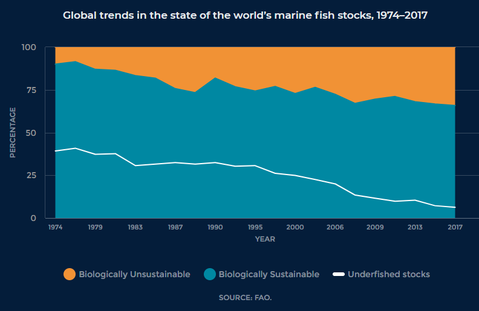{width="11cm"}

-   Anmerkung: Der exzessive Fang, der alleine aus dem
    Allmendeproblematik resultiert, wird noch durch staatliche
    Subventionierung der Fischereiflotten verstärkt. Weltweit
    subventionieren Staaten die Fischerei jährlich mit ca. 25-29 Mrd.
    \$. [^17]

    Davon entfallen ca. 15-30 Subventionen für Treibstoffe.

## Politikmaßnahmen bei unreinen öffentlichen Gütern {#politikmaßnahmen-bei-unreinen-öffentlichen-gütern .unnumbered}

-   Angesichts der Wohlfahrtsverluste stellt sich nun also die Frage,
    wie man die übermäßige Nutzung vermeiden kann.

    ### Nutzungs- oder Zugangsgebühren {#nutzungs--oder-zugangsgebühren .unnumbered}

    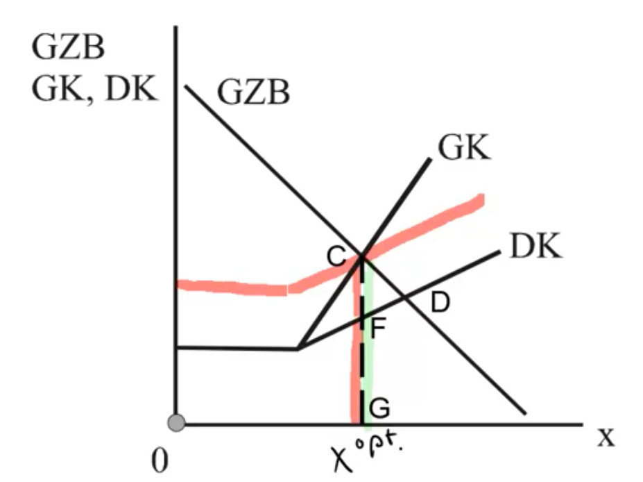{width="8cm"}

    -   Um die effiziente Nutzung zu erreichen, kann der Staat nun
        Nutzungsgebühren verlangen. Im Fall der Fischer wird dann z.Bsp.
        eine Lizenzgebühr verlangt.

    -   Dazu muss der externe Effekt, den der marginale Fischer allen
        anderen Fischern verursacht, internalisiert werden. Die Gebühr
        muss daher der Differenz zwischen Grenzund Durchschnittskosten
        im Optimum entsprechen.

    -   In der Abbildung ist der externe Effekt durch die Strecke $CF$
        gegeben. Wird eine Nutzungsgebühr in dieser Höhe erhoben, ist
        der Fischer $x^{opt}$ gerade der letzte, für den sich das
        Ausfahren lohnt.

    -   Denn seine Zahlungsbereitschaft beträgt $CG$. Die privaten
        Kosten sind FG; dazu kommen noch die Nutzungsgebühren in Höhe
        von CF. Daher sind die Kosten des marginalen Nutzers gerade
        gleich seiner Zahlungsbereitschaft: $CG = CF + FG$.

    -   Stellen Sie sich vor, ein weiterer Fischer $x^{opt}+1$ tritt
        doch in den Markt ein. Was passiert dann?
        → private Kosten + Gebühr > GZB
        $\quad$ → lohnt sich nicht

    ### Eigentumsrechte {#eigentumsrechte .unnumbered}

    -   Eine andere Lösung besteht darin, das unreine öffentliche Gut
        einfach dadurch zu einem privaten Gut zu machen, indem man
        Eigentumsrechte definiert.

    -   So könnte man im Falle des Gewässers die Rechte an eine dritte
        Partei geben, die den Fischern gegen Nutzungsentgelt die
        Fangrechte verkauft. Die Nutzungsgebühr ist dann ein effektiver
        Ausschlussmechanismus, der unter Wettbewerbsbedingungen zur
        optimalen Lösung führt.

    -   Nicht immer ist eine solche privatwirtschaftliche Lösung
        geeignet, um ein optimales Ergebnis zu erreichen. Denn oft
        bedeutet die Vergabe eines Eigentumsrechtes, dass man dem neuen
        Eigentümer eine Monopolstellung gewährt, die ebenfalls zu
        Wohlfahrtsverlusten führen würde. Überlegen Sie, welchen Preis
        pro Lizenz eine solche Firma setzen würde? Welche Einnahmen
        würde der Staat erzielen, wenn er die Eigentumsrechte
        versteigert?

    -   Mehr zur Frage der Eigentumsrechte: siehe Kapitel 5 → Coase
        Theorem

## Weitere Anwendungsfelder

### Beispiel 1: Straßennutzung {#beispiel-1-straßennutzung .unnumbered}

-   Bei dicht befahrenen Straßen kommt es ebenfalls zu „Crowding
    Externalities" und damit zu einer Übernutzung.

-   Jeder einzelne, der mit dem Auto in der Hauptverkehrszeit über die
    A39 von Braunschweig nach Wolfsburg (sog. Werks-Autobahn) fährt,
    orientiert sich bei seiner Entscheidung am erwarteten
    (durchschnittlichen) Zeitbedarf für diese Fahrstrecke.

-   Allerdings führt die Nutzung der Straße auch zu einem etwas
    langsameren Verkehrsfluss für alle anderen Nutzer der Brücke.

-   Die Grenz(zeit)kosten liegen also über den individuellen
    (durchschnittlichen) Kosten.

-   Formal entspricht die Analyse der Verkehrsstaus dem
    Überfischungsproblem. Lediglich werden die Vorund Nachteile hier
    in Zeiteinheiten erfasst.

    {width="6cm"}

-   Politikmaßnahme: Straßennutzungsgebühren, die idealerweise von der
    Verkehrsdichte abhängen.

-   Die EU-Kommission hat die Einführung Von Straßennutzungsgebühren
    vorgeschlagen, die explizit auf das ökonomische Konzept der sozialen
    Grenzkosten abstellen:

-   Wie gut sind die folgenden Systeme aus der Praxis geeignet, das
    Crowding-Problem zu lösen?

-   System I: Toll Collect in Deutschland Vor wenigen Jahren wurde die
    Lkw-Maut auf deutschen Autobahnen eingeführt.

    #### Der Kassierer fährt mit: So wird die kommende Lkw-Maut per GPS abgerechnet {#der-kassierer-fährt-mit-so-wird-die-kommende-lkw-maut-per-gps-abgerechnet .unnumbered}

>\[$\ldots$\] Lastwagen mit mehr als zwölf Tonnen zulässigem Gesamtgewicht müssen dann für jeden Kilometer bezahlen, im Schnitt 15Cent. Staus provozierende Kassen-Barrieren wie in Frankreich oder Italien soll es aber nicht geben. Die Bundesregierung hat sich für das automatische Erfassungssystem Toll Collect entschieden -- entwickelt von einem Konsortium unter Führung von Telekom und DaimlerChrysler, das rund eine halbe Milliarde Euro investieren wird (SZ vom 21.September 2002). Technische Basis von Toll Collect ist eine Kombination aus Satelliten-Navigation und Mobilfunk.  Fuhrunternehmer, deren Lastwagen oft auf Autobahnen unterwegs sind -- in Deutschland sind das bis zu 800.000 Brummis -- können eine so genannte On-board-Unit einbauen: ein autoradiogroßes Kästchen, das mit Hilfe des Global Positioning Systems (GPS) die Strecke verfolgt und den Standort permanent an die Gebührenzentrale nahe Bonn übermittelt. Hier wird die jeweils gefunkte Position mit digitalen Karten abgeglichen und festgestellt, ob der Lastwagen auf einer Autobahn, einer Landstraße oder im Stadtverkehr unterwegs ist. Da die On-Board-Unit zur Identifikation des jeweiligen Fahrzeugs die wichtigsten Daten wie Kennzeichen, Gewicht, Achsenzahl mitsendet, können Autobahnkilometer automatisch mit der Spedition abgerechnet werden. Aber auch Lastwagen ohne Online-Verbindung und seltene Nutzer wie ausländische Fahrzeuge müssen ... jeden Kilometer bezahlen. An Raststätten und Tankstellen, telefonisch oder übers Internet können dann unter Angabe der Fahrzeugdaten Tickets für den jeweiligen Streckenabschnitt gekauft werden. ... Otto Fritscher, „Der Kassierer fährt mit - So wird die kommende Lkw-Maut per GPS abgerechnet", Süddeutsche Zeitung, 28.9.2002.

→ Um das Allmendeproblem anzugehen, müsste sie also Zeitabhängig und auf entsprechend betroffene Streckcen ausgestaltet werden.

-   System II: Londoner Innenstadt

    #### Autofahrten in die Londoner Innenstadt sind werktags mautpflichtig

    London -- Es ist ein verkehrspolitisches Experiment ohne Beispiel.
    Zumindest nach dem ersten Tag sieht es so aus, als könnte es
    gelingen: Am Montag mussten Autofahrer, die in das Londoner Zentrum
    wollten, erstmals eine Maut von fünf Pfund, umgerechnet 7,50 Euro,
    bezahlen. Größere Proteste und das vielfach befürchtete Chaos
    blieben aus. Stattdessen war der Verkehr tatsächlich flüssiger als
    sonst an Werktagen. Bislang kamen in der Londoner Innenstadt die
    Autos langsamer voran als die Pferdekutschen vor 100 Jahren. (...)
    Das Londoner System funktioniert, weil die Verkehrsplaner von den
    S-Bahnen und Bussen ohne Schaffner gelernt haben: „Es kommt nicht
    darauf an, dass alle bezahlen, sondern nur darauf, dass das Risiko
    hoch genug ist, als Schwarzfahrer ertappt zu werden", heißt die
    Devise für Derek Turner, Londons obersten Straßenmeister. So ist es
    eine Maut ohne Maut-Häuschen. Angesichts der 180 Straßen, die in die
    Gebührenzone führen, wären Maut-Stellen wie an den italienischen
    Autobahnen zu teuer gekommen, und sie hätten den Verkehr erst recht
    zum Erliegen gebracht. Stattdessen können die Autofahrer per
    Telefon, SMS, Scheck oder an Kiosken bezahlen. Die Kontrolle
    übernehmen 700 Videokameras, die angeblich mit erstaunlicher
    Zuverlässigkeit Nummernschilder „lesen" können und in einen Computer
    einspeisen. Nachts prüft die Rechenanlage, ob es für die erfassten
    Schilder einen Zahl-Beleg gibt. (...) Gerd Zitzelsberger, „Das hohe
    C der Verkehrsführung", Süddeutsche Zeitung, 18.2.2003.

-   System III: 91 Express Lane in den USA

    -   Die "91 Express Lane" ist eine 10 Meilen lange, mautpflichtige
        Expressspur, die parallel zum kostenlosen Highway 91 im Orange
        County, Kalifornien verläuft.

    -   Die Gebühren sind zeitabhängig und liegen zwischen 1,70\$ nachts
        und 8,15 \$ in der nachmittäglichen

    -   Hauptverkehrszeit.

    -   Der Gebühreneinzug erfolgt elektronisch über Transponder, die im
        KfZ montiert sind.

Quelle: https://www.octa.net/91-Express-Lanes/Toll-Schedules/

## Optimale Nutzungsgebühren für unreine öffentliche Güter

-   Der in Geld bewertete Zeitaufwand $D K(x ; B)$ einer
    Einzeldurchfahrt hängt von der Zahl der Durchfahrten x und der
    Anzahl der Spuren $B$ ab: er ist steigend in der Anzahl an
    Durchfahrten $D K_{x}>0$, aber abnehmend in der Breite der Straße
    $D K_{B}<0$

-   Die Grenzzahlungsbereitschaft der Autofahrer ist wiederum durch )
    $GZB(x)$ angegeben.

-   Die Verbreiterung der Straße verursacht konstante Grenzkosten $c$.

-   Der soziale Planer maximiert die Konsumentenrente abzüglich der
    Kosten:
    $$\max _{x, B} \int_{u=0}^{x} GZB(u) d u-\underbrace{x \cdot D K(x ; B)}_{\text{aggr. Zeitaufwand}} -c \cdot B$$

-   Die Bedingungen erster Ordnung (Ableitung nach x und B) lauten

    -   $(x): GZB(x) - DK -xDK_x \mbeq 0$

    -   $(B):  -x DK_B - c \mbeq 0$

-   Die optimale Mauthöhe t ist also nichts anderes als der Wert $x \cdot DK_x$ der Ballungsexternalität
    $$ GZB = DK + x \cdot DK_x $$
-   was uns schlussendlich (und verklausoliert) wieder auf die die
    Samuelson-Regel führt:
    $$ - x \cdot DK_B = c$$
    $DK_B = $ marginale Zeitersparnis bei marginaler Verbreiterung der Straße

Samuelson-Regel:
$$\sum GZB \text { (fur Straßen Verbreiterung) }= GK \text { der Verbreiterug }$$

# Klubgüter

### Literatur {#literatur-6 .unnumbered}

-   Jean Hindricks und Gareth D. Myles. Intermediate Public Economics,
    MIT Press, Cambridge, MA, 2006, Kapitel 6. $$$$

-   Dietmar Wellisch, Finanzwissenschaft I -- Rechtfertigung der
    Staatstätigkeit, Vahlen, München, 1999, Kapitel 3.2.

## Einordnung der Klubgüter {#einordnung-der-klubgüter .unnumbered}

-   Bisher

    -   Reine öffentliche Güter keine Rivalität & kein Ausschluss (bzw.
        Ausschluss nicht erwünscht, da sich Nutzer des öffentlichen
        Gutes im Konsum nicht behindern)

        -   öffentliche Bereitstellung (da private Bereitstellung
            versagt)

    -   Unreine öffentliche Güter Rivalität & kein Ausschluss

        -   Korrektur des Marktfehlers durch den Staat

-   Das Problem bei den unreinen öff. Gütern liegt in der Übernutzung.
    Muss dafür aber unbedingt der Staat eingreifen oder können unreine
    öffentliche Güter in effizientem Umfang auch von Privaten
    bereitgestellt werden, wenn ihnen ein Ausschlussmechanismus für die
    Nutzung des Gutes zur Verfügung steht?
    → Ausschluss praktizieren um Rivalität zu vermeiden

-   Güter, bei denen es bei hinreichender Nutzung zu „Crowding" kommt
    und bei denen ein Ausschluss prinzipiell möglich ist, nennt man
    Klubgüter.

-   Denn in diesem Fall kann ein „Klub" das Gut bereitstellen.
    Eigenschaften eines solchen Klubs:

    -   Die Mitglieder teilen sich die Nutzung eines unreinen
        öffentlichen Gutes, wobei der Umfang des „Crowding" von der
        Nutzung (bzw. der Zahl der Nutzer im Klub) abhängt.

    -   Die Mitgliedschaft in einem Klub ist freiwillig (im Gegensatz
        z.B. zu staatlicher Zwangsfinanzierung über Steuern)

    -   Es gibt einen Ausschlussmechanismus, so dass Nicht-Mitglieder
        oder Nicht-Zahler von der Nutzung des Gutes ausgeschlossen
        werden können.

-   Die Idee der Klubs wurde von James Buchanan popularisiert \[J.M.
    Buchanan, „An Economic Theory of Clubs", Economica 32, 1965, 1-14\].

-   Beispiele:

    -   Tennisoder Golfverein
    -   Fitnessstudio
    -   Private Autobahnen
    -   Private Schulen und Hochschulen
    -   Gruppe von Leuten, die sich einen Netflix-Account teilt (s. später)

## Ein einfaches Modell der Klubgüter

-   Für ein einfaches Modell der Klubgüter betrachten wir eine
    Gesellschaft identischer Haushalte, die (zunächst) das Clubgut alle
    in fixem Umfang nutzen.

-   Der einzelne Haushalt hat die Nutzenfunktion $U(x,G,n)$ mit

    -   $x$ Konsum des privaten Gutes
    -   $G$ Konsum des Klubgutes (Alle Nutzer des Klubs konsumieren
        dieselbe Menge/Qualität)
    -   $n$ Zahl der Klubmitglieder

-   Der Nutzen des Haushalts steigt im Konsum der beiden Güter
    $\left[U_{x}, U_{G}>0\right]$ und sinkt in der Zahl der Mitglieder
    bei Crowding $\left[U_{n} \leq 0\right]$.

-   Die Kosten des Clubgutes C(G) werden unter den Mitgliedern
    gleichmäßig aufgeteilt $\left[\rightarrow \frac{C(G)}{n}\right]$ und
    sind ansteigend im Umfang des Gutes: $C'(G)>0$.

-   Der Preis des privaten Gutes ist auf 1 normiert.

-   Die Budgetrestriktion des Haushalts ist $M = x + \frac{C(G)}{n}$ mit
    exog. Haushaltseinkommen $M$.

### Das Maximierungsproblem des Klubs (SOLL) {#das-maximierungsproblem-des-klubs-soll .unnumbered}

-   Wie viele Mitglieder sollte der Klub aufnehmen? In welcher Qualität
    sollte das Klubgut bereitgestellt werden?

-   Versetzen wir uns in die Position des Klubs, der den Nutzen eines
    repräsentativen Klubmitglieds maximieren will.

-   Durch Verwendung der Budgetrestriktion erhalten wir:
    $$\max _{G, n} U\left(M-\frac{C(G)}{n}, G, n\right)$$

-   Die Bedingungen erster Ordnung lauten:
    \begin{align*}
    (G) \quad \frac{d U}{d G} &=U_{x} \cdot\left(-C^{\prime}(G)\right) \cdot \frac{1}{n}+U_{G} \mbeq 0 \\
    (n) \quad \frac{d U}{d n}&=U_{x} \cdot\left(-\left(-\frac{C(G)}{n^{2}}\right)\right)+U_{n} \mbeq 0
    \end{align*}

### Die optimale Qualität des Clubgutes {#die-optimale-qualität-des-clubgutes .unnumbered}

-   Durch Umstellen von (7.1) erhält man
    $$\frac{U_{G}}{U_{x}}=\frac{C^{\prime}(G)}{n} \Leftrightarrow n \cdot \frac{U_{G}}{U_{x}}=C^{\prime}(G)$$

-   Interpretieren Sie die Bedingung für die optimale Qualität:
    $$\text{Samuelson-Regel}$$

### Die optimale Mitgliederzahl des Clubgutes {#die-optimale-mitgliederzahl-des-clubgutes .unnumbered}

-   Durch Umstellen von (7.2) erhält man
    $$-\frac{U_{n}}{U_{x}}=\frac{C(G)}{n^{2}}=-\frac{d}{d n}\left(\frac{C(G)}{n}\right)$$

-   Interpretieren Sie die Bedingung für die optimale Mitgliederzahl:\
    Der Grenznachteil eines weiteren Clubmitgliedes (gemessen in Opportunitätskosten des Gutes $x$) = Grenzkosten der Pro-Kopf-Finanzierung

### Wettbewerb der Klubs (IST) {#wettbewerb-der-klubs-ist .unnumbered}

-   Wird die optimale Qualität an Klubgütern angeboten, wenn die
    einzelnen Klubs im Wettbewerb stehen?

-   Wir maximieren dazu den Gewinn eines einzelnen kompetitiven Klubs.

-   Sei $F$ der Mitgliedsbeitrag und $U^*$ das für den Haushalt optimale
    Nutzenniveau (das z.B. durch das Angebot der anderen Klubs bestimmt
    ist). Der gewinnmaximierende Klub betrachtet:
    $$\max _{G, n, F} \pi=\max _{G, n, F}[n \cdot F-C(G)] \text { u. d. NB. } U(M-F, G, n) \geq U^{*}$$

-   Bedingungen erster Ordnung: $$\begin{aligned}
                    \frac{\partial \pi}{\partial G}&=-C_{G}+\lambda \cdot U_{G}=0
                    \frac{\partial \pi}{\partial n}&=F+\lambda \cdot U_{n}=0 \\
                    \frac{\partial \pi}{\partial F}&=n-\lambda \cdot U_{x}=0 \mapsto \lambda=\frac{n}{U_{x}}
                \end{aligned}$$

    wobei $\lambda$ der Lagrangemultiplikator ist. Überprüfen Sie, ob
    die wettbewerbliche Lösung mit der Lösung in (7.1) und (7.2)
    übereinstimmt. Beachten Sie dabei, dass im kompetitiven
    Gleichgewicht alle Firmen Nullgewinn erzielen.
    \begin{align*}
    \text{ (I) }&C^{\prime}(G)+\frac{n}{U_{x}} \cdot U_{G}=0 \Rightarrow \frac{U_{G}}{U_{x}}=\frac{C^{\prime}(G)}{n}\\
    \text{ (II) }& F+\frac{n}{U_{x}} \cdot U_{n}=0 \quad \Leftrightarrow \quad \frac{C(G)}{n}+\frac{n}{U_{x}} U_{n}=0 \Leftrightarrow \frac{C(G)}{n^{2}}=-\frac{U_{n}}{U_{x}}
    \end{align*}

-   Ergebnis: Falls sich Klubs in hinreichender Zahl replizieren lassen,
    führt Wettbewerb unter den Klubs zum sozial optimalen Ergebnis.

## Anwendungsbeispiele {#anwendungsbeispiele .unnumbered}

-   Beispiel 1: Fitnessstudio

-   Wir betrachten ein Fitnessstudio mit n Mitgliedern und dem Gut $G$,
    was die Größe des Clubs (in Form von Trainingsfläche, Anzahl Geräte
    o.ä.) beschreibt. x sei das Numéraire in Geldeinheiten.

-   Die Kosten $C(G)$ seien proportional zur Größe, also p·G, und das
    Budget der Mitglieder $M$.

-   Der konkrete Nutzenfunktion sei gegeben durch
    $$U(x, G, n)=x \cdot G-n^{2}$$

-   Der Konsum des Klubguts trägt also positiv zum Nutzen bei,
    wohingegen eine Überfüllung des Fitnessstudios quadratisches Leid
    zufügt. (Oder möchten Sie gern mit 5.000 Leuten gleichzeitig in
    einem Studio sein?)

-   Aufstellen der Lagrange-Funktion liefert
    $$L(x, G, n, \lambda)=x \cdot G-n^{2}+\lambda \cdot\left(M-\frac{p G}{n}-x\right)$$

-   Die drei Bedingungen erster Ordnung inkl. Nebenbedingung führen auf
    ein Gleichungssystem, mithilfe dessen sich dieses Problem lösen
    lässt:

-   Lösung ist $x=\frac{M}{2}$ d.h. die Hälfte des Budgets sollte stets
    in privaten Konsum gesteckt werden.

-   Die andere Hälfte sollte in das Fitnessstudio investiert werden, das
    dann $n=\frac{M^{2} p}{8}$ Mitglieder zulässt und eine Größe von
    $G=\frac{M^{3}}{16}$ haben sollte.

-   Intuition:\

    -   Mitgliederanzahl n steigt mit dem marginalen Preis p der
        Bereitstellung -- klar, denn es benö- tigt mehr Mitglieder zum
        Amortisieren des Equipments.

    -   Die Nutzenfunktion suggeriert gleichgewichtige Präferenzen, was
        durch Überführung in eine Cobb-Douglas Nutzenfunktion
        $U(x, G, n)=x^{\alpha} \cdot G^{1-\alpha}-n^{2}$ modifiziert
        werden könnte.

-   Beispiel 2: Netflix-Account

-   Die Premium Variante des Serien-Onlinedienstes umfasst vier Accounts
    zu einem Preis von ungefähr 16 Euro pro Monat. (Genau genommen
    fünf, wenn man die Kindersicherung austrickst.)

-   Stellen Sie sich vor, Sie können die Zugangsdaten an $n-1$ Personen
    weitergeben und teilen sich die Kosten des Accounts mit ihnen
    gleichmäßig. In diesem Fall erfüllen Sie die Definition eines Clubs
    mit dem Gut Serie.

-   Allerdings können maximal vier Personen gleichzeitig den Account
    nutzen, was wiederum eine Friktion in Ihrem Serienkonsum darstellt
    und bei zu hoher Mitgliedsanzahl den Nutzen einschränkt.

-   Was ist nun also die optimale Anzahl an Personen, mit denen Sie den
    Account teilen sollten?

-   Der Content ist von Ihnen nicht beeinflussbar und daher geben wir
    die Auswahl an Serien als exogenen Wert $\bar{G}$ für das Gut $G$ in
    das Modell.

-   Den Nutzen modellieren wir als
    $U(x, \bar{G}, n)=x^{\alpha} \cdot\left(\frac{4 \cdot \bar{G}}{n}\right)^{1-\alpha}$
    unter der Nebenbedingung der Budgetrestriktion $M=x+\frac{P}{n}$.
    Der Parameter $(0,1)$ beschreibt hier die Präferenz, mit der Sie
    alle anderer Güter im Verhältnis zu Serien konsumieren. Die Anzahl
    $n \geq 4$ an Mitgliedern mindert den Nutzen und steht daher im
    Nenner des gewichteten Beitrags von $G$.
    $$-\frac{u_{n}}{U_{x}}=\frac{c}{n^{2}} \Rightarrow-\frac{x^{\alpha} \cdot(1-\alpha) \cdot\left(\frac{4 \bar{G}}{n}\right)^{-\alpha} \cdot\left(-\frac{4G}{n^{2}}\right)}{\alpha \cdot x^{\alpha-1} \cdot\left(\frac{4 \bar{G}}{n}\right)^{1-\alpha}}=\frac{D}{n^{2}}$$
    $$
    \Leftrightarrow \frac{(1-\alpha) \cdot \frac{(4 \bar{G})}{n^{-2-\alpha}}}{\alpha\left(\frac{4 \bar{G}}{n}\right)^{1-\alpha}}=\frac{\underline{P}}{n^{2}} \Leftrightarrow \quad \Leftrightarrow \quad x \cdot n=\frac{\alpha \cdot \underline{P}}{1-\alpha}
    $$

-   Gemäß der Optimalbedingung für die Anzahl an Klubmitgliedern wissen
    wir, dass und unter Einsetzen der Nebenbedingung $x=M-\frac{P}{n}$
    erhalten wir
    $$\left(M \cdot \frac{P}{n}\right) \cdot n=\frac{\alpha \cdot P}{1-\alpha} \Leftrightarrow M n=\frac{\alpha \cdot P}{1-\alpha}+\underline{P}=\frac{P}{1-\alpha} \quad \Leftrightarrow \quad n^{*}=\frac{P}{(1-\alpha) \cdot M}$$

-   Die optimale Anzahl an Netflix-Account-Mitgliedern ist also abhängig
    von

    -   dem Abo-Preis $P$: je teurer, desto mehr Mitglieder sind
        sinnvoll,

    -   dem Budget $M$: je größer das Budget, desto genervter ist man,
        dass wieder alle Zugänge blockiert sind und umso weniger
        Mitstreiter holt man sich ins Boot und

    -   der Präferenz $\alpha \in (0,1)$ für den alternativen Konsum: je
        wichtiger (höherer Wert) dieser ist, desto weniger stört Sie die
        Konkurrenz im eigenen Account (mehr Mitglieder). Zudem tendiert
        $n \rightarrow \infty$ für eine starke Präferenz
        $\alpha \rightarrow 1$ des Alternativgutes.

[^1]: Isoquante: Menge an N-K-Kombinationen, die ein festes Outputlevel
    $\bar{y}$ genereiren.

[^2]: Maß für \"lokale\" Nachfrageänderungen um wieviel Prozent ändert
    sich die Nachfrage, wenn der Preis um 1% Steigt?

[^3]: X-Ineffizienz beschreibt einen ineffizient hohen Einsatz an
    Produktionsfaktoren. Es werden also unnötig hohe Kosten generiert
    (teure Dienstwagen, goldene Wasserhähne, etc) weil der Anreiz zur
    Kostenminimierung verloren geht.

[^4]: Averch, H.A. und L.O. Johnson (1962): „Behavior of the Firm under
    Regulatory Constraint", American Economic Review 52, 1053-1069.

[^5]: Wir wollen hier nicht näher untersuchen, ob dies das einzige
    Marktgleichgewicht ist und welche Bedingungen
    (Marktzutrittskosten\...) erfüllt sein müssen, damit das natürliche
    Monopol Bestand hat. Ein natürliches Monopol liegt vor, wenn eine
    einzelne Firma im Markt einen Gewinn erzielen kann, aber bei zwei
    oder mehr Firmen jedes Unternehmen Verluste schreibt.

[^6]: Allmende (mittelhochdeutsch: „das allgemeine Land\"),
    Liegenschaften im Eigentum von Gemeinden. Auf den Dorfwiesen konnte
    jeder Dorfbewohner sein Vieh weiden lassen. Es lag Rivalität vor, da
    das Gras, welches durch das Vieh des einen Bauern gefressen wurde,
    nicht mehr von dem Vieh eines anderen Bauern genutzt werden konnte.

[^7]: J. Andreoni, „Impure Altruism and Donations to Public Goods: A
    Theory of Warm Glow Giving", Economic Journal 100, 1990, 464-477.

[^8]: Christopher Willoughby, Managing Motorization, Discussion Paper
    TWU-42, World Bank, Washington, DC, 2000.

[^9]: Wir nehmen hier einfach an, dass eine innere Lösung existiert.

[^10]: Tietenberg, Tom, Emission Trading, An Excersise in Reforming
    Pollution Policy, Resources for the Future, Washington, DC, 1985.

[^11]: images/20201217133517.png

[^12]: https://www.agora-energiewende.de/fileadmin2/Projekte/2018/Non-ETS/142_Nicht-ETS-Papier_WEB.pdf
    abgerufen am 15. September 2020

[^13]: Sechster Monitoring Bericht „Energie der Zukunft" vom BMWi

[^14]: https://www.bundesregierung.de/breg-de/themen/klimaschutz/co2-bepreisung-1673008
    Seite der Bundesregierung, abegrufen am 15. September 2020

[^15]: https://www.helmholtz.de/erde_und_umwelt/wie-viel-co2-steckt-in-einem-liter-benzin/

[^16]: DIW CO$_2$-Bepreisung im Wärmeund Verkehrssektor: Diskussion
    von Wirkungen und alternativen Entlastungsoptionen (2019)

[^17]: Quellen: American Association for the Advancement of Science,
    Massive Decrease in North Atlantic Fish, Press Release, February
    2002 (http://www.aaas.org/news/releases/fish ing.shtml); Süddeutsche
    Zeitung, "Nordatlantik völlig überfischt", Süddeutsche Zeitung,
    16.2.2002; Sumaila, U.R. et al. 2010: A bottom-up re-estimation of
    global fisheries subsidies, Journal of Bioeconomics 12, 201-225.

